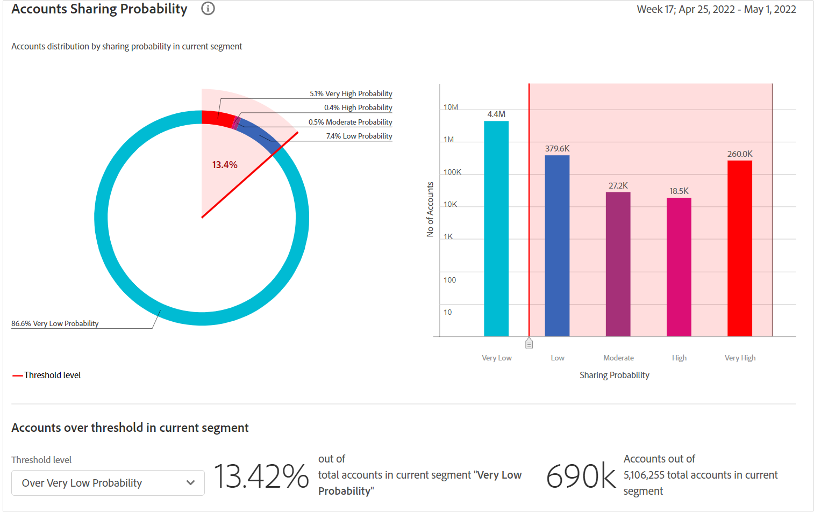

# ダッシュボード {#dashboard}

ダッシュボードは、アカウント共有の範囲と影響を大まかに把握できるように設計されたグラフとレポートの集まりにデータをまとめて集計します。 アカウント IQ の主要なレポートと指標を含む単一のページが提供されます。

*図：ダッシュボード*

## 平均共有スコア — 現在のセグメントの集計 {#aggregated-sharing}

集計共有スコアパネルには、アカウントとストリーミングのボリュームに関する共有の量と影響を要約した上部の行が表示されます。

値は、購読者による秘密鍵証明書の共有の規模を把握するのに役立ち、それに基づいて行動する必要性の尺度を提供します。

*図：平均共有スコアパネル — 現在のセグメントの集計*

次の 3 つの指標は、平均共有スコアの構成要素です。

### 共有レベル {#sharing-level}

共有レベルゲージは、選択した期間に、（定義されたセグメント内で）共有されたすべての購読者アカウントの割合を示します。

選択した期間に選択したプログラマチャネルの 1 つからストリーミングされた、選択した MVPD のセット内の各アカウントに対して計算された共有確率の平均に基づいて計算された値。

*図：共有レベル*

トレンドインジケーターは、の前の期間からの指標の値の変化の割合を示します。

### 共有アカウントからの使用 {#usage-from-shared-accounts}

このゲージは、定義されたセグメントおよび期間における、共有アカウントのすべての購読者アカウントの使用率を示します。 このゲージは、0～100%のスケールで（共有アカウントから）使用の範囲を示します。 これらの範囲（「低」、「中」、「高」、「異常」）は、業界平均に基づいています。

また、トレンドインジケーターも表示できます。これは、前の期間と比較した、共有アカウントからの使用の増加または減少を示しています。

*図：共有アカウントからの使用*

### 全体的な共有スコア {#overall-sharing-score}

全体的な共有スコアは、「共有レベル」や「共有アカウントの z 使用量」などの共有スコアの複合です。

業界と比較した場合の共有の相対的な影響を反映した値が提供されます。 目的はクレジットスコアと似ており、状況を 1 つの数字でまとめます。 しかし、この場合、数が多いほど、潜在的な害が大きくなります。

*図：全体的な共有スコア*

<!--### MVPDs in segment {#mvpd-in-segment}

It is a table of risk indices and accounts totals for the top MVPDs ranked by overall usage or account sharing.

-->

### MVPDs の業界全体の共有スコア {#top-mvpds}

次の表は、セグメント内の MVPD の異なる集計共有スコアの比較ビューを示しています。

>[!NOTE]
>
>この表は、セグメント内の MVPD で表されるデータではなく、比較の目的で業界全体のデータを使用します。

*図：全体スコア別のセグメントで上位の MVPD*

### チャネルおよび MVPD によるスコアの共有 {#sharin-score-by-channels-and-mvpds}

次の表は、現在のセグメント内の MVPDs に対して選択したチャネルの共有スコアの比較ビューを示しています。

*図：チャネルおよび MVPD によるスコアの共有*

### アカウント共有の確率 {#accounts-sharing-probability}

このグラフは、共有確率 5 分割の範囲を非常に低い (0 ～ 20 %) から非常に高い (80 = 100 %) に分割します。

>[!NOTE]
>
>棒グラフは対数スケールを使用します。

*図：異なる共有確率範囲の購読者アカウントの数と割合*

### 共有の確率レベル別のアカウント数と使用状況 {#number-of-accounts-usage-sharing-probability}

このパネルは、共有アカウントからの各キンタイルの関連使用量を使用して、共有確率の極めて低い (0 ～ 20 %) から非常に高い (80 ～ 100 %) までの範囲に分割されたアカウントの表形式の表示を提供します。

*図：様々な確率範囲に該当するアカウント、トレンドおよび使用の数*

