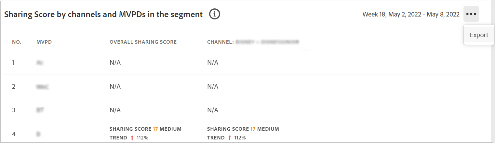
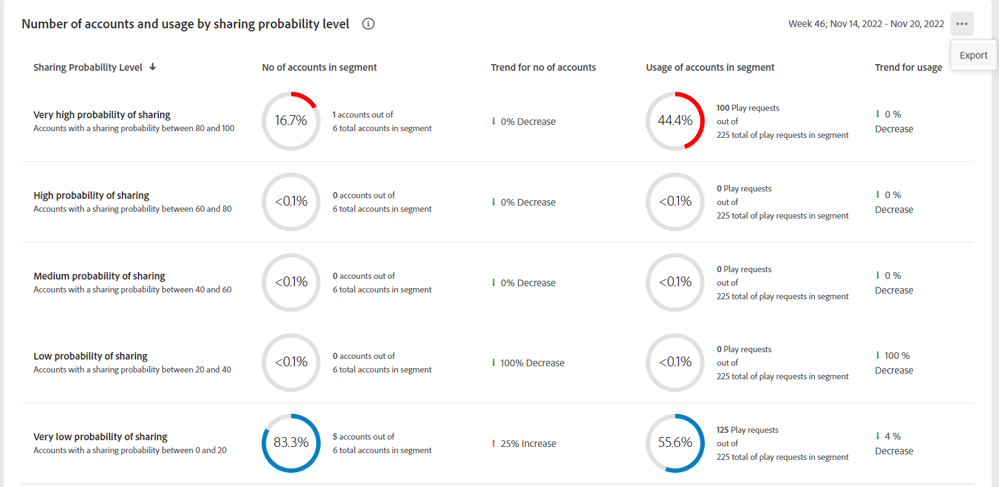
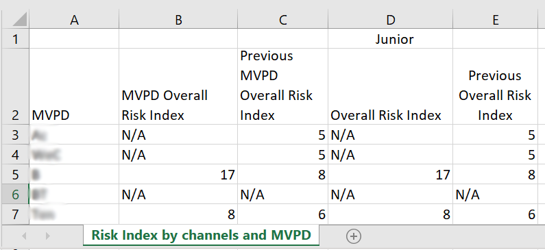

# セグメント内の MVPD およびチャネルの指標のエクスポート {#export-metric}

アカウント IQ のダッシュボードに、選択したセグメント内の購読者アカウントの資格情報共有の統計の表とグラフが表示されます。 共有パターンとスコアの表示に加えて、選択したセグメントの MVPD およびチャネルの購読者のアカウント使用状況指標と共有スコアを、これらのテーブルから書き出すこともできます。

選択したセグメント内の MVPD およびチャネルの指標をエクスポートするには、認証済みのプログラマーユーザーとしてログインした後に、次の手順を実行します。

1. 目的のセグメントを [セグメントの定義と期間の選択方法](/help/AccountIQ/howto-select-segment-timeframe.md) 評価のために [セグメントと期間](/help/AccountIQ/segments-timeframe.md) パネル。

1. 次のパネルのいずれかに移動します。

   * 選択した MVPD の業界レベルの共有スコア
      

   * セグメント内のチャネルおよび MVPD によるスコアの共有

      

   * 共有の確率レベル別のアカウント数と使用状況

      

1. 選択 **書き出し** オプションは、パネルの右上隅に表示されます。

データは CSV 形式で書き出され、ファイルがデバイス上にローカルにダウンロードされます。 目的の CSV ビューアおよびエディターを使用して、書き出されたレポートを開くことができます。

* 選択した MVPD の業界レベルの共有スコア

   

* セグメント内のチャネルおよび MVPD によるスコアの共有

   

* 共有の確率レベル別のアカウント数と使用状況

   

