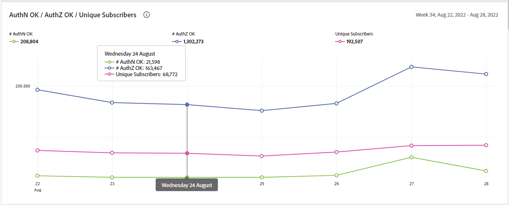

# 一般使用状況レポート {#general-usage-reports}

アカウント IQ レポートは、データを詳細に分析して分離できる基本的な分析ツールおよびレポートです [コホート](/help/AccountIQ/product-concepts.md#segmet-def)、異常値を特定し、アカウントの特性を把握します。

[ 一般的な使用状況レポート ] ページには、使用中のアカウントデバイスの数、検出された IP、およびそれぞれの郵便番号に基づいてサブグループ指標を分類するためのツールが用意されています。

<!--Divide the content in cohorts.

Content filters
device filters

segment and definition replicate to cohorts. Number of people and number of account that ......
content consumption.....-->

レポートはすべて、 [セグメントと時間枠](/help/AccountIQ/howto-select-segment-timeframe.md) パネル。 でしきい値（デバイス数、IP の数、郵便番号の数）を指定することで、選択を微調整し、さらに絞り込むことができます。 [スナップショットの概要 — しきい値を上回るアカウント](#snapshot-overview) パネル。

<!--To view General Usage Reports:

1. Select the desired MVPDs from the **MVPDs in Segment** option.

2. Select the desired programmer channels from the **Channels in Segment** Option.

3. Select an appropriate time frame from the **Granularity and time frame** option.

   Using the above options you have defined segments for your analysis. Based on your segment selection, following graphs and reports are displayed.

4. You can fine tune your selection and further narrow it down by specifying (number of devices, number of IPs, and number of zip codes) thresholds in [Snapshot Overview - Accounts above thresholds](#snapshot-overview) widget/panel.-->

## AuthN OK / AuthZ OK / Play リクエスト/ Unique Subscribers {#authn-authz-playreq-uniquesubs}

この折れ線グラフでは、定義したセグメントの選択した期間の AuthN OK、AuthZ OK、Play Requests、Unique Subscribers の値の時間の変化が表示されます。

+++プログラマ — **AuthN OK / AuthZ OK / Play リクエスト/ Unique Subscribers**

*図：AuthN OK / AuthZ OK / Play リクエスト/プログラマーユーザーの一意の購読者*

+++

+++MVPD- **AuthN OK / AuthZ OK /ユニーク購読者**

*図：AuthN OK / AuthZ OK / MVPD ユーザーの一意の購読者*

+++

x 軸は現在の時間枠内の単位を示し、y 軸はその期間の基本的な購読者のアクティビティ指標を示します。 折れ線グラフでは、セグメント選択パネルで選択した MVPD の購読者とチャネルの購読者に対して、次の値を比較できます。

* **AuthN OK**

   AuthN OK は、成功した認証の数です。 詳細および定義については、 [製品の概念：AuthN OK](/help/AccountIQ/product-concepts.md#authn-ok-def).

* **AuthZ OK**

   AuthZ OK は、正常に認証された数です。 詳細および定義については、 [製品の概念：AuthZ OK](/help/AccountIQ/product-concepts.md#authz-ok-def).

* **再生リクエスト**

   Play リクエストは、再生リクエストの数です。 詳細および定義については、 [製品の概念：リクエストの再生](/help/AccountIQ/product-concepts.md#play-requests-def)

   >[!NOTE]
   >
   >MVPD ユーザーは、再生要求の折れ線グラフを使用できません。

* **ユニーク購読者**

   ユニーク購読者は、成功したユニーク購読者の数です。 詳細および定義については、 [製品の概念：ユニーク購読者](/help/AccountIQ/product-concepts.md#unique-subscriber-def)

   >[!NOTE]
   >
   >プログラマーがAdobeTempPass （無料プレビュー）を使用している場合、ユニーク購読者の合計数には、ユニークデバイスの数も含まれます。

## スナップショットの概要 — しきい値を上回るアカウント {#snapshot-overview}

この追加フィルターを使用して分析とレポートを微調整し、様々な使用状況のしきい値を設定します。 目的の MVPD とチャネルを選択して分析用のセグメント（またはコホート）を定義したら、次のフィルターを使用して、購読者の行動を分析することもできます。

* デバイス数しきい値

* IP しきい値の数

* 郵便番号のしきい値の数

のしきい値を更新する場合 [アカウントセグメント — 選択したしきい値に基づく](#account-segments-basedon-segments) パネルでは、次の場所で影響を確認できます。

* [アカウントごとの 1 週間（または 1 ヶ月）のデバイス数](#devices-week-account)

* [アカウントごとの 1 週間（または 1 ヶ月）の場所](#locations-week-account)

* [アカウントごとの 1 週間（または 1 ヶ月）の IP](#ip-week-account)

* [アカウントセグメントの履歴表示](#account-segment-historical-view)

>[!NOTE]
>
>各しきい値のデフォルト値は 4 です。 つまり、一般的な使用状況ページは、4 台（および 4 台以上）のデバイスを使用し、異なる 4 つ（以上）の地理的な場所と 4 つ（以上）の異なる郵便番号からのコンテンツを消費する購読者の MVPD の分析を示します。

### アカウントセグメント — 選択したしきい値に基づく {#account-segments-basedon-segments}

この **アカウントセグメント — 選択したしきい値に基づく** パネルでは、デバイス数、IP 数、郵便番号数のしきい値 (1～10) を設定できます。

グラフには次の情報が表示されます。

* サブスクライバーアカウントの絶対数

* そのセグメントの合計購読者アカウント数のうち、割合

   を使用して、ある期間、X 個のデバイス、Y 個の IP、Z 個の郵便番号を使用して、（定義された）MVPDs 用のチャネルのコンテンツを使用します。

## アカウントごとの 1 週間（または 1 ヶ月）あたりのデバイス数 {#devices-week-account}

この **棒グラフ** では、購読者がデバイスを使用してコンテンツにアクセスする方法に関する使用状況に関するインサイトを提供します。

X 軸には「勘定科目数」がプロットされ、Y 軸には「デバイス数」がプロットされます。 アカウントごとに設定したデバイス数のしきい値に基づいて、1 週間の間に特定数のデバイスからコンテンツを消費した購読者アカウントの絶対数が示されます。

（デバイス数に固有の）バーにカーソルを合わせると、1 週間にチャネルコンテンツをストリーミングしている購読者のアカウント数（およびセグメント内の合計購読者アカウント数の割合）に関する情報が示されるラベルが表示されます。

また、グラフは次のマークも付けます。

* 設定したしきい値を示す赤い線。

* 1 週間（または 1 ヶ月）の購読者アカウントで使用される各デバイスの平均数を示す緑色の線。

しきい値のレベルと、1 つのアカウントで使用される様々なデバイスの週平均数を比較して、共有のレベルを判断できます。

また、設定したしきい値より多くのデバイス数を使用している購読者アカウントの割合も表示されます。

ドーナツグラフを使用すると、設定されたしきい値を超える（時間枠で）デバイスを使用して、チャネルコンテンツを消費している購読者アカウントの規模を一目で判断できます。

## アカウントごとの 1 週間（または 1 ヶ月）の場所 {#locations-week-account}

次に類似 [アカウントごとの 1 週間（または 1 ヶ月）あたりのデバイス数](#devices-week-account)「 Locations per week （または month） per Account 」指標を使用すると、様々な場所から購読者のアカウントの使用状況を分析し、パスワード共有をより詳細に識別できます。 X 軸には「勘定科目数」がプロットされ、Y 軸には「事業所数」がプロットされます。

この指標と [アカウントごとの 1 週間（または 1 ヶ月）あたりのデバイス数](#devices-week-account) および [アカウントごとの 1 週間（または 1 ヶ月）の IP](#ip-week-account) は、パスワード共有インスタンスをより正確に判断するのに役立ちます。その結果、真正なユーザーは、にカウントされなくなります。

セグメントを定義し、場所の数のしきい値を設定したら、グラフから次の項目を識別できます。

* （特定の）場所数 x1 週間にコンテンツを消費している購読者の数（および割合）。

* しきい値を超える場所からコンテンツを表示している、合計購読者アカウントの割合。

* 週別平均（アカウントごとの異なる場所の数）をしきい値と比較します。

## アカウントごとの 1 週間（または 1 ヶ月）の IP {#ip-week-account}

類似 [アカウントごとの 1 週間（または 1 ヶ月）あたりのデバイス数](#devices-week-account) および [アカウントごとの 1 週間（または 1 ヶ月）の場所](#locations-week-account)、 **アカウントごとの 1 週間あたりの IP 数** 」指標を使用すると、より正確に、より精度の高いパスワード共有を分析できます。

x 軸にはアカウント数がプロットされ、y 軸には IP 数がプロットされます。

（MVPD とチャネルを選択して）セグメントを定義し、IP 数のしきい値を設定したら、グラフから次の項目を識別できます。

* 1 週間にコンテンツを（特定の）x IP 数から消費している購読者の数（および割合）。

* しきい値より多くの IP アドレスからコンテンツを表示している合計購読者アカウントの割合。

* 週別平均（アカウントごとの異なる IP の数）をしきい値と比較します。

## アカウントセグメント — 履歴表示 {#account-segment-historical-view}

履歴ビューの棒グラフは、様々な期間での使用状況指標を比較するのに役立ちます。 また、次のような様々な使用指標をまとめてプロットします。 [アカウントごとの 1 週間（または 1 ヶ月）あたりのデバイス数](#devices-week-account), [アカウントごとの 1 週間（または 1 ヶ月）の場所](#locations-week-account)、および [アカウントごとの 1 週間（または 1 ヶ月）の IP](#ip-week-account).

* x 軸には期間がグラフ表示され、y 軸には加入者のアカウント、デバイス、ロケーション、IP の数がグラフ表示されます。

* オレンジ色のバーは、様々な期間のセグメントを示します。

* 折れ線グラフには、変更が [アカウントごとの 1 週間（または 1 ヶ月）あたりのデバイス数](#devices-week-account), [アカウントごとの 1 週間（または 1 ヶ月）の場所](#locations-week-account)、および [アカウントごとの 1 週間（または 1 ヶ月）の IP](#ip-week-account) しきい値に基づく期間全体の値。

* 青いバーは、ある期間の業界全体でのアクティブな購読者の合計数を表します。

* 特定の凡例を選択して、グラフの尺度を変更できます。

>[!MORELIKETHIS]
>
>* 選択したセグメントの上位 1000 人の購読者に関するレポートを書き出す方法については、を使用した一般使用状況レポートのフィルターを使用して説明します。 [上位 1000 件のアカウントのエクスポート](/help/AccountIQ/export-acc-information.md) オプション。

