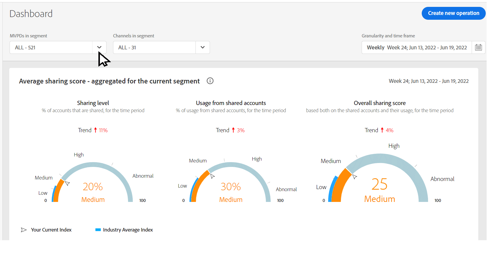

# 分離モードで共有レポートを表示 {#report-isolation-mode}

分離モードでは、MVPD（Xfinity など）はデバイスをまたいで購読者を一貫して識別しますが、やり取りするプログラマーに応じて、購読者を異なる方法で識別します。 一方、標準モードでは、MVPD は、プログラマーに関係なく、デバイスをまたいで購読者を一貫して識別します。

例えば、Isolation Mode MVPD（Xfinity など）の加入者 B が、同じデバイスを使用して 2 つの異なるプログラマが提供するコンテンツにアクセスすると、MVPD は、異なる識別子を 2 つの異なるアクセス試行に関連付けます。 したがって、これらのプログラマ（図の L と M）とアカウント IQ には、2 人の異なる購読者がコンテンツにアクセスしているように見えます。 ただし、Standard MVPD の場合、Subscriber B が 2 つの異なるプログラマが提供するコンテンツにアクセスすると、MVPD は両方のアクセス試行に対して 1 つのアクセス識別子を関連付けます。 分離モードでの MVPD（Xfinity など）は、加入者が異なるプログラマ間で同じデバイスを使用している場合でも、加入者を一貫して識別しません。

*図： Isolation Mode MVPD は、2 つではなく、4 つの異なるサブスクライバを識別します。*

データの歪みを管理する（異なるプログラマへのアクセスに基づいて異なるサブスクライバを識別するため）ために、分離モードは、プログラマに関して報告されるアクティビティを、そのプログラマのアプリケーションでのみ制限します。 例えば、上記の画像の分離モードの場合、プログラマー L は、ID X と Z を無視し、ID W と Y のアクティビティに基づくデータのみを見ます。

>[!IMPORTANT]
>
> プログラマ L は、L 以外のプログラマとのアクティビティにより、Subscribers A と B に関して収集された情報を共有できなくなるという欠点がある。

分離モードでは、共有スコアを取得するために行われたすべての計算と関連するすべての指標は、選択したプログラマーとチャネルに属するアプリケーションからストリーミングされるデバイスのアクティビティのみを使用して行われます。
共有スコアと確率は、現在選択されているチャネルから始まるストリームを使用してのみ計算されます。

指標を分離モードで表示するには、次の手順に従います。

1. 選択 **分離モード** から **セグメント内の MVPD** ドロップダウンオプションを選択し、「 **選択項目を適用**.

   

   *図：分離モードでの MVPD の選択*

1. 次の中から目的のチャネルを選択します。 **セグメント内のチャネル** ドロップダウンオプションを選択し、「 **選択項目を適用**. また、 [時間枠](/help/AccountIQ/product-concepts.md#granularity-def).

   >[!IMPORTANT]
   >
   >アカウント共有は、すべてのプログラマーのアプリケーションをまたいでストリーミングで測定する場合により関連性が高いので、分離モードでは、共有スコアが低く、指標のバリエーションが少なくなります。

   

   *図：分離モードでの確率ゲージの共有*

   上記のゲージでは、すべてのアカウントの 6%のみが共有され、コンテンツの 8%のみがその 8%で消費されていることを示しています。 したがって、チャネルは、分離モードでのスコアと他の MVPD のスコアを比較できます。 したがって、分離モードを使用して取得した情報は、他のデータとは異なる方法で解釈する必要があります。
