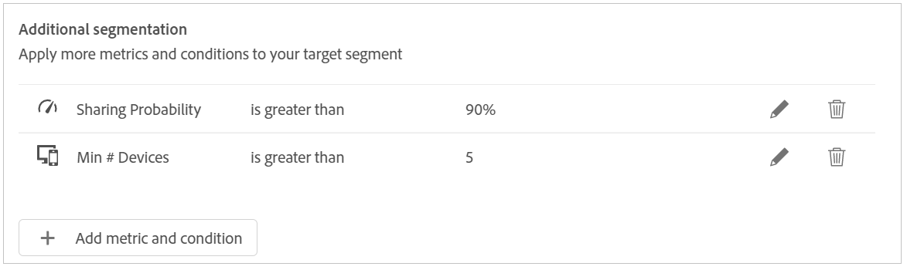

# ユーザーセグメントに対する操作の作成 {#operation-to-track-segment}

アカウント IQ の各レポートページには、 **新しい操作を作成** オプションを使用すると、購読者アカウントに対する様々な（一括）アクションを自動化（簡略化）できます。サンプルを指定し、アクションを定義し、それらのアクションの効果を記録および分析するルールを定義できます。 操作を作成するページで、操作を実行するユーザーグループのサンプルを定義し、将来の日付に操作を実行するようにスケジュールを設定できます。

操作を作成する手順は、次のとおりです。

1. レポートページやダッシュボードページでの分析用のセグメント（コホート）を定義します ( [セグメントと期間の定義](/help/AccountIQ/howto-select-segment-timeframe.md).

1. 選択 **新しい操作を作成** オプションは、任意のレポートまたはダッシュボードページで使用できます。 The **新しい操作を作成** ページが表示されます。

   
   *図：新しい操作を作成するページ*

1. 次の日： **新しい操作を作成** ページで、次の詳細をフォームフィールドに入力します。

   * [操作名](#operation-details) 操作の詳細
   * 操作を実行するセグメント。 [ターゲットセグメント](#segment) を使用してセグメントを絞り込む [追加のセグメント化](#additional-segmentation)
   * [セグメントタイプ](#segment-type) under [ターゲットセグメント](#segment)
   * [アクション](#action)
   * [有効化をスケジュール](#schedule)

1. [操作を保存します](#save-operation).

## 操作の詳細 {#operation-details}

+++プログラマ — 操作の詳細

で新しい操作の名前を指定します。 **操作名** 「操作の詳細」の下のフィールド。 例：*MVPD X の購読者に対する多要素認証の影響をテストする。「同時実行監視でのストリーム数を制限する」または「20 台以上のデバイスからチャネル「N」を表示する MVPD D の購読者を制限する」*&quot;.

+++

+++MVPD — 操作の詳細

で新しい操作の名前を指定します。 **操作名** 「操作の詳細」の下のフィールド。 例：*チャネル N のビューアに対する多要素認証の影響をテストする、「同時実行監視でのストリーム数を制限」または「20 台以上のデバイスからチャネル「N」を表示する購読者を制限」*&quot;.

+++

## ターゲットセグメント {#segment}

+++プログラマー — ターゲットセグメント

The **セグメント** ここでは、この操作で操作するユーザー、または操作のサンプルグループを定義します。 デフォルトのセグメントは、 **セグメント** 次を使用して選択しました： [セグメントと期間パネル](/help/AccountIQ/howto-select-segment-timeframe.md) 上記の手順 1 のメインレポートまたはダッシュボードページ。

<!--* The first segment entry in the **Segment** section, by default, shows the **segment** you selected in the step 1.

* The **segment evaluation period** is the time period of analysis you selected in step 1 from **Granularity and Timeframe** option.

*Figure: Segment and timeframe selection on the main page*-->

このセグメントは、作成される操作の影響を受ける購読者を定義します。 例えば、選択したセグメントで *チャネル「N Sports」を表示する「C」という名前の MVPD のすべての購読者アカウント*.

+++

+++MVPD — ターゲットセグメント

The **セグメント** ここでは、この操作で操作するユーザー、または操作のサンプルグループを定義します。 デフォルトのセグメントは、 **セグメント** 次を使用して選択しました： [セグメントと期間パネル](/help/AccountIQ/howto-select-segment-timeframe.md) 上記の手順 1 のメインレポートまたはダッシュボードページ。

<!--* The first segment entry in the **Segment** section, by default, shows the **segment** you selected in the step 1.

* The **segment evaluation period** is the time period of analysis you selected in step 1 from **Granularity and Timeframe** option.

*Figure: Segment and timeframe selection on the main page*-->

このセグメントは、作成される操作の影響を受ける購読者（特定のチャネルの閲覧者）を定義します。 例えば、（デフォルトの）セグメントには、次のものが含まれます。 *チャネル「N Sports」を表示するすべての購読者アカウント*.
+++

### 追加のセグメント化 {#additional-segmentation}

さらに、指標を追加してターゲットセグメントを絞り込むこともできます。 例えば、90%を超える共有の確率を別の指標として追加できます。 そのため、問題文は次のようになります。 *&quot;共有確率が 90%を超えるチャネル「N Sports」を表示している MVPD の&#39;C&#39;という名前の購読者アカウント用の操作を作成します&quot;*.

*図：追加のセグメント化*

さらに、デバイス数に別の指標を追加して操作を絞り込むと、更新された問題文は次のようになります。 *&quot;90 を超える共有スコアを持つチャネル「N Sports」を表示し、評価期間中に 5 台以上のデバイスを使用してコンテンツを表示している、MVPD 「C」という名前の購読者アカウント用の操作を作成します&quot;*.

*図：全体的な共有スコアとデバイス数指標を使用してセグメントの例を絞り込みました。*

これにより、ユーザーグループがより絞り込まれます。 そのため、指標と条件をさらに追加することで、操作するアカウントを定義するセグメントをさらに絞り込むことができます。

### セグメントタイプ {#segment-type}

セグメントタイプは、操作の評価期間中にセグメントが処理される方法です。

*図：セグメントタイプを使用して操作するセグメントの数を調整する*

<!--The segment type option allows you to further refine your segment based on the evaluation period (or time).

**Fixed number of accounts** 

When you select **Fixed number of accounts** segment type, then you need to specify an evaluation period as well.

By doing so, you are fixing the sample size for evaluation in terms of numbers. You are making Account IQ identify a specific set of users (that meet the criteria of defined evaluation period and segment metrics) to operate on. The analysis and graphs will be generated for this specific set of users only (identified initially) throughout the operation.

**Variable number of accounts**

When you select **Variable number of accounts** segment type, you do not limit the number of accounts in segment. The accounts which fall under the defined segment metrics are the part of the segment, and the number of accounts will change continuously during the course of operation.-->

>[!IMPORTANT]
>
>次のみを使用できます： **固定アカウント数** 現在のオプション。 選択するオプション **アカウントの変数数** は、今後のリリースで利用できるようになります。

<!--

you tell Account IQ in the beginning of the operation which number of accounts to operate on.

Account IQ system only has a segment definition, and during the operation it looks into all the accounts that fit that segments.

the number of accounts in segment is not limited, the accounts that fall under defined segment metrics will be part of the segment, and the no of accounts will change continuously, as there are no specific limitations - like an evaluation period in the past.When the segment is defined (which in this example is, subscriber accounts of MVPD 'C' who are viewing the channel 'N Sports' that have a sharing score above 80 and are using 10 different IPs) and we also identified a time period to evaluate a segment. This identifies X number of accounts as sample (for example 5000). How many devices they are using?
It identifies x-number of accounts (5000)...a very specific set of users that meet this criteria.
for every period that we schedule (within that operation) during that operation) we will look at those 5K users that are originally identified and we will present graph about them. How are the sharing scores coming up?u We identified a period. Are their sharing scores going up? Are there fewer of them who are meeting this definition?
Fixed versus variable is the way the treated in fixed or variable way.

1. we identified a fixed set of accounts.
2. we evaluate those specific accounts on criteria throughout the operation.

General idea independent of graph is that we will evaluate a set of accounts identified initially, for no of periods during operation and generate graphs against that.
Those are the 5000 users for which I will create graphs for for every period of the operation.

**Variable number of accounts**
We do not identify any initial set of accounts, we just have a segment definition.
Each period during the operation, we go and look into all the accounts that fit that segments.
If it is not a fixed segment, I won't initially evaluate it. I won't have an initial set of 5000. Instead at every period during the evaluation I will evaluate the segment then, and then I will produce graph about the next 3000 users.
the......will vary from period to period.

if not fixed segment, then I won't initially evaluate or have initial set of 5000, instead at every period during an operation and the.-->

## アクション {#action}

The **アクション** は、定義したセグメントに対して実行する操作を定義します。

次の 2 種類のアクションを実行できます。

* Account IQ と統合されたシステムを使用したアクション： **同時実行監視** <!--[Concurrency Monitoring](https://tve.helpdocsonline.com/concurrency-monitoring-introduction), or Adobe Target-->.

* アカウント IQ システムと統合されていない、アカウント IQ の外部のワークフローを作成および処理するアクション。 例えば、チャネルプログラマー「N」が MVPD「C」のすべての購読者に一括メールを送信するアクション。

>[!NOTE]
>
>操作を作成すると、アクションを指定し、その範囲を定義するだけでなく、これらの操作の効果の記録を開始できます。

## スケジュール{#schedule}

開始日と終了日を設定して、操作のアクティベーションをスケジュールできます。

>[!NOTE]
>
>開始日と終了日の精度は、を使用してセグメントを定義する際に、評価用に選択した精度と同じです **セグメントと期間パネル**（手順 1）。
>
>
>したがって、精度を「週」に選択した場合、開始日と終了日は週単位で表されます（例：第 14 週）。精度を「月」に選択した場合、開始日と終了日は月単位で表されます。

>[!IMPORTANT]
>
>開始日は、評価期間より後で、現在の日付よりも後にする必要があります。 同様に、終了日も開始日と現在の日付より後にする必要があります。

### 操作を保存します {#save-operation}

操作を保存すると、この操作で定義したセグメントが今後も保存されることを示すメッセージ画面が表示されます。 ただし、このセグメントに名前を付ける必要があります。

*図：保存操作とセグメント名の指定*

>[!NOTE]
>
>操作するセグメントと組み合わせて実行するアクションに基づいて、操作に名前を付けることをお勧めします。

<!--In future you can select this saved segment when defining a segment for your analysis on the main reports page. Moreover, the saved segment is also listed when you create an operation the next time.

*Figure: Saved segments in segment selector on Create new operations page* 

>[!IMPORTANT]
>
>When creating an operation, if you select a segment that was previously created then you cannot add new metrics to it and refine it.
>
>Adding new metrics creates a new segment, but you cannot modify an existing segment.-->

操作を作成すると、開始日から指定した終了日まで実行されます。

保存した操作の詳細は、メインで確認できます [運用](/help/AccountIQ/operations.md) ページに貼り付けます。

*図：新しく作成した操作が、メインの操作ページに表示されます。*
