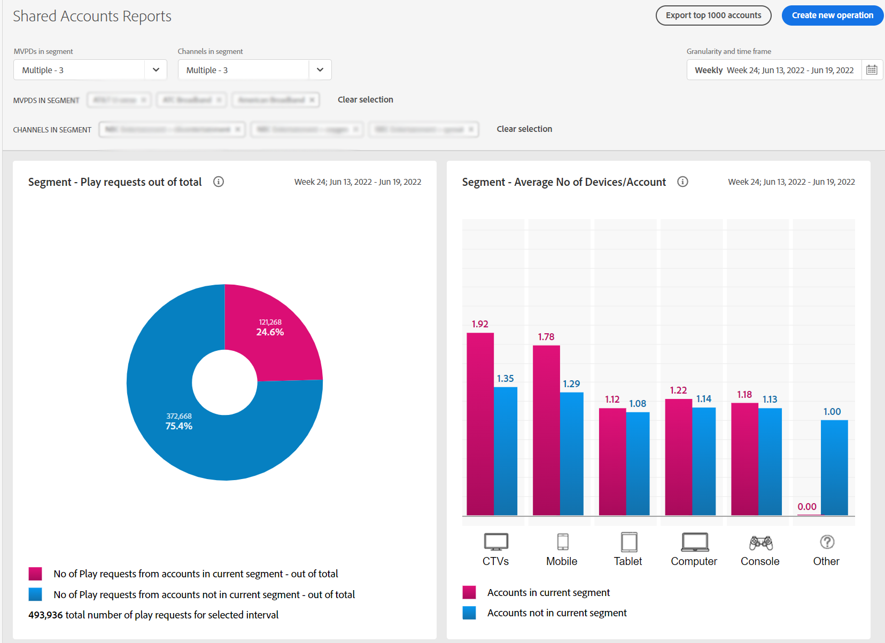

# 特定の MVPD のアカウント共有レポートを表示します <!--and programmer--> {#report-sp-mvpd}

アカウント IQ アプリケーションに [プログラマ](/help/AccountIQ/product-concepts.md#programmer-def)その後、特定の [MVPD](/help/AccountIQ/product-concepts.md#mvpd-def) 購読者。

Account IQ でレポートを表示するには、プログラマーとしてアプリケーションに正常にログインした後に、次の手順を実行します。

1. の手順を使用して、分析およびレポートの表示のための購読者セグメントを定義する際に、特定の MVPD を選択します。 [セグメントの定義方法](/help/AccountIQ/howto-select-segment-timeframe.md).

   >[!NOTE]
   >
   >1 つ、2 つ、または複数のチャネルを選択することも、上位 10 個のチャネルのデフォルト選択（スコア、使用状況、アカウントの共有）を選択することもできます。
   >
   >
   >ただし、 [最大 10 チャネル](/help/AccountIQ/limitations.md) を選択します。 [セグメントと時間枠パネル](/help/AccountIQ/segments-timeframe.md).

1. 左側のナビゲーションから目的のレポートページを選択します。

* [一般的な使用方法](/help/AccountIQ/general-usage-reports.md)

   
* [共有アカウント](/help/AccountIQ/shared-acc-reports.md)

   
* [使用パターン](/help/AccountIQ/usage-patterns.md)

   

* [ダッシュボード](/help/AccountIQ/dashboard.md) （ダッシュボードには、様々なレポートページから選択したグラフが表示されます）。

   

これらの各ページは、選択したセグメントのアクティビティを反映します。

