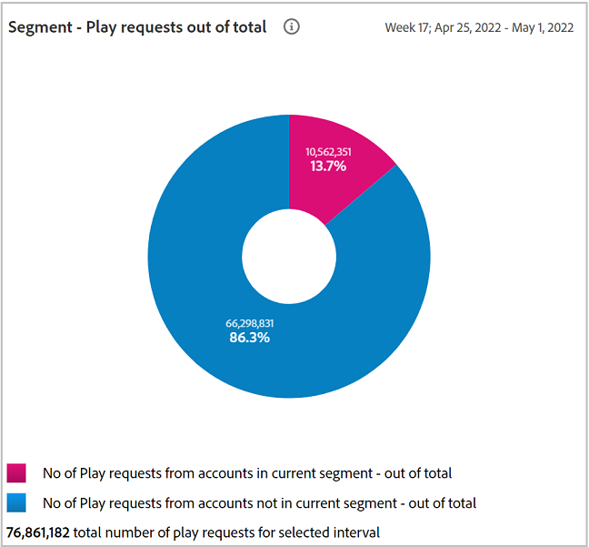

# 共有アカウントレポート {#shared-accounts-reports}

共有アカウントレポートでは、例えば、デバイス数やデバイスタイプなどの指標を、選択した範囲の共有の確率で分類します **中程度の確率で超過** および **低確率で** 現在のセグメントの

その後、これらの範囲はユーザー定義のしきい値として機能し、選択したしきい値に基づいてグラフが更新されます。

アカウント IQ は、定義されたセグメントのすべての購読者アカウントを、共有の確率に基づいて次の 5 つのカテゴリのアカウントに分類します。

* 非常に高い (80%～100%)
* 高 (60%～80%)
* モデレート (40% ～ 60%)
* 低 (20%～ 40%)
* 非常に低い (0%～ 20%)

## アカウント共有の確率 {#accounts-sharing-probability}

このドーナツグラフは、様々な確率カテゴリから購読者のアカウントの割合（および絶対数）を分類して表示します。

赤い線は、 [現在のセグメントのしきい値を超えたアカウント](#threshold-selector) パネル。

棒グラフは、共有確率の様々なカテゴリ（x 軸にプロット）の Y 軸の勘定数をプロットします。

赤い線はしきい値の範囲を示し、棒グラフで調整できます。 棒グラフで調整されたしきい値は、ドーナツグラフのしきい値の範囲に反映されます。

<!---->

### 現在のセグメントのしきい値を超えたアカウント{#threshold-selector}

このパネルでは、次の範囲を購読者アカウントのしきい値として選択できます（共有の確率に基づいて）。

* アカウント **非常に低い** 共有 **確率**

* アカウント **低い** 共有 **確率**

* アカウント **適度に過ぎる** 共有 **確率**

* アカウント **高い** 共有 **確率**

しきい値を選択すると、パネルには、セグメントで選択された MVPD のすべての購読者アカウントのうち、アカウントの割合（および数）が表示されます。

## セグメント — 合計からの再生リクエスト {#play-request-out-total}

ドーナツグラフは、セグメント内の購読者によっておこなわれた再生リクエストの割合（と数）を示します。およびを使用すると、定義したセグメントにない購読者によっておこなわれた再生リクエストを比較できます。

ドーナツグラフ上でカーソルを移動すると、様々な確率範囲からの購読者の割合と数も表示されます。

<!---->

## アカウントごとのデバイスのセグメント平均数{#avg-devices-account}

棒グラフは、現在のセグメントの購読者によって使用されている各デバイスタイプのデバイスの平均数と、現在のセグメントの購読者ではない購読者の数を示します。

## セグメント — 各アカウントの各期間の郵便番号 {#zip-codes-period-account}

このグラフは、ある期間に異なる場所のコンテンツを消費している購読者の数を示します。

拡大表示して、様々な位置をプロットするグラフの棒の詳細を絞り込むことができます。

<!---->

## セグメント — 地理的範囲/期間/アカウント {#geo-span-period-account}

この棒グラフには、地理的範囲の異なる範囲に関する加入者アカウントの数がマイル単位でプロットされます。 範囲は、その期間内に購読者がストリーミングした場所間の最大距離に基づきます。

<!--Total number of users ...

How many accounts are within 99 miles of each other.....and how many are apart. 

Based on points on the map.-->

地理的距離の範囲を表すバーを選択すると、範囲が拡張され、詳細が表示されます。

<!---->