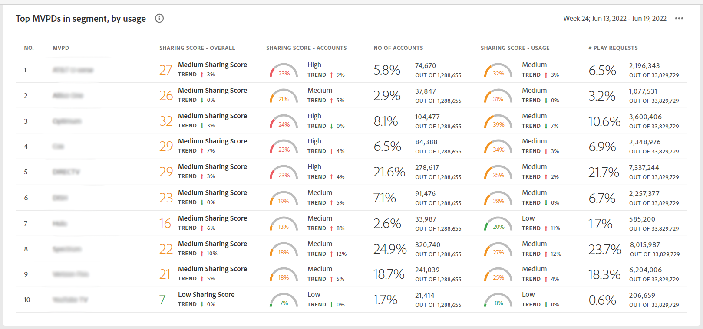

# 上位 10 件の MVPD のアカウント共有レポートを表示 <!--and Programmers--> {#view-top-10-mvpd-reports}

アカウント IQ は、( 定義済みの [セグメント](/help/AccountIQ/product-concepts.md#segmet-def)) の内容：

* アカウントを共有している購読者の最も高い割合

* 共有アカウントからの最大使用量の購読者

* 最も大きな規模（全体の共有スコア）を持つ購読者

>[!NOTE]
>
>セグメントからトップの MVPD のリストを取得する計算の基礎は、特定のプログラマーの MVPD だけでなく、ビデオストリーミング業界全体のデータです。

>[!NOTE]
>
>これらのレポートは、少なくとも 50,000 のアクティブな加入者アカウントを持つ MVPD のみが取得されると見なされます。

ログインしているプログラマーユーザーに対しては、次の 3 つのデフォルトの選択（上位 10 件の MVPD のレポートを表示する）を使用できます。

* [スコアの共有による上位 10 件の MVPD](#top-10mvpds-sharingscore)

* [使用別上位 10 件の MVPD](#top-10mvpds-usage)

* [アカウント別上位 10 件の MVPD](#top-10mvpds-accounts)

## スコアの共有による上位 10 件の MVPD {#top-10mvpds-sharingscore}

選択を使用する場合 **スコアを共有することによる上位 10 人の MVPD** セグメントを定義するには、Account IQ システムは、業界全体から 10 個の MVPD を識別し、最大 10 個の MVPD（および対応する指標）をその降順でリストします [全体的な共有スコア](/help/AccountIQ/product-concepts.md#overall-sharing-score)

チャネルのスコアを共有して、上位 10 件の MVPD のリストとレポートを表示するには：

1. 以下を使用： [セグメントと期間パネル](/help/AccountIQ/segments-timeframe.md)を使用して、 [セグメントの定義と期間の選択方法](/help/AccountIQ/howto-select-segment-timeframe.md) 評価用に。 この評価の場合は、 **スコアを共有することによる上位 10 人の MVPD** オプションが MVPD のリストから追加されました。

1. レポートページを [一般的な使用方法](/help/AccountIQ/general-usage-reports.md), [共有アカウント](/help/AccountIQ/shared-acc-reports.md), [使用パターン](/help/AccountIQ/usage-patterns.md)または [ダッシュボード](/help/AccountIQ/dashboard.md) （ダッシュボードには、様々なレポートページから選択したグラフが表示されます）。

これらの各ページは、アクティビティを反映しています。

## 使用別上位 10 件の MVPD {#top-10mvpds-usage}

選択を使用する場合 **使用別上位 10 件の MVPD** セグメントを定義するには、Account IQ システムは、業界全体から 10 個の MVPD を識別し、最大 10 個の MVPD（および対応する指標）をその降順でリストします [共有アカウントでの使用](/help/AccountIQ/product-concepts.md)

チャネルのスコアを共有して、上位 10 件の MVPD のリストとレポートを表示するには：

1. 以下を使用： [セグメントと期間パネル](/help/AccountIQ/segments-timeframe.md)を使用して、 [セグメントの定義と期間の選択方法](/help/AccountIQ/howto-select-segment-timeframe.md) 評価用に。 この評価の場合は、 **使用別上位 10 件の MVPD** オプションが MVPD のリストから追加されました。

1. レポートページを [一般的な使用方法](/help/AccountIQ/general-usage-reports.md), [共有アカウント](/help/AccountIQ/shared-acc-reports.md), [使用パターン](/help/AccountIQ/usage-patterns.md)または [ダッシュボード](/help/AccountIQ/dashboard.md) （ダッシュボードには、様々なレポートページから選択したグラフが表示されます）。

これらの各ページは、アクティビティを反映しています。

## アカウント別上位 10 件の MVPD {#top-10mvpds-accounts}

選択を使用する場合 **アカウント別上位 10 件の MVPD** セグメントを定義するには、Account IQ システムは、業界全体から 10 個の MVPD を、最大 10 個の MVPD（および対応する指標）のリストに、その降順で識別します [共有レベル](/help/AccountIQ/product-concepts.md)

上位 10 件の MVPD のリストとレポートをチャネルで共有されているアカウント数別に表示するには：

1. 以下を使用： [セグメントと期間パネル](/help/AccountIQ/segments-timeframe.md)を使用して、 [セグメントの定義と期間の選択方法](/help/AccountIQ/howto-select-segment-timeframe.md) 評価用に。 この評価の場合は、 **アカウント別上位 10 件の MVPD** オプションが MVPD のリストから追加されました。

1. レポートページを [一般的な使用方法](/help/AccountIQ/general-usage-reports.md), [共有アカウント](/help/AccountIQ/shared-acc-reports.md), [使用パターン](/help/AccountIQ/usage-patterns.md)または [ダッシュボード](/help/AccountIQ/dashboard.md) （ダッシュボードには、様々なレポートページから選択したグラフが表示されます）。

これらの各ページは、アクティビティを反映しています。

