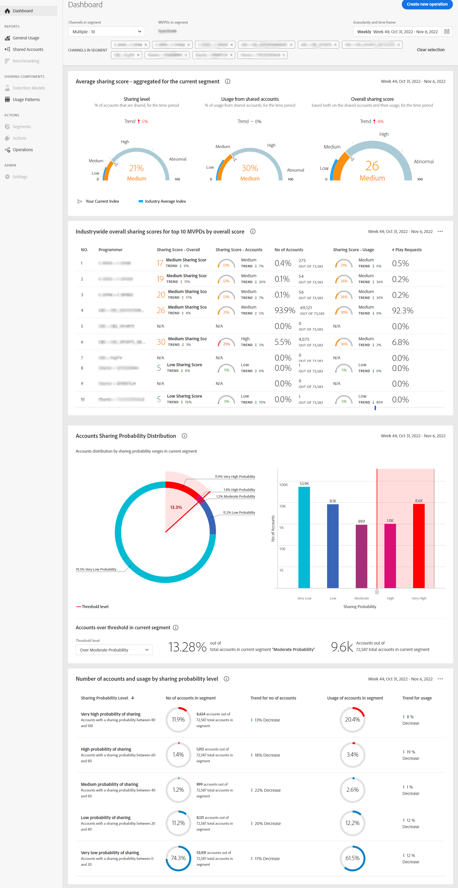

# 複数のプログラマーおよびチャネルのアカウント共有レポートを表示 {#viewreport-multiple-programmer-channel}

堅牢で拡張性の高い分析ツールであるアカウント IQ を使用すると、1、2、3 に関する統計だけでなく、特定の時点でより多くのプログラマーに関する統計を表示、分析、比較できます。

>[!NOTE]
>
>ただし、現時点では、セグメントおよびタイムフレームパネルから最大 10 個の個々のチャネル（またはプログラマ）を選択して、購読者共有の統計を表示できます。

複数のチャネルに関する購読者のアカウント共有の統計を表示するには：

1. 目的のセグメントを [セグメントの定義と期間の選択方法](/help/AccountIQ/howto-select-segment-timeframe.md) 評価のために [セグメントと期間パネル](/help/AccountIQ/segments-timeframe.md).

1. 左側のナビゲーションから目的のレポートページを選択します。

* [ダッシュボード](/help/AccountIQ/dashboard.md) （ダッシュボードには、様々なレポートページから選択したグラフが表示されます）。

   

   *図：複数のプログラマー向けのダッシュボードレポート*

* [一般的な使用方法](/help/AccountIQ/general-usage-reports.md)

* [共有アカウント](/help/AccountIQ/shared-acc-reports.md)

* [使用パターン](/help/AccountIQ/usage-patterns.md)

これらの各ページは、選択したセグメントのアクティビティを反映します。
