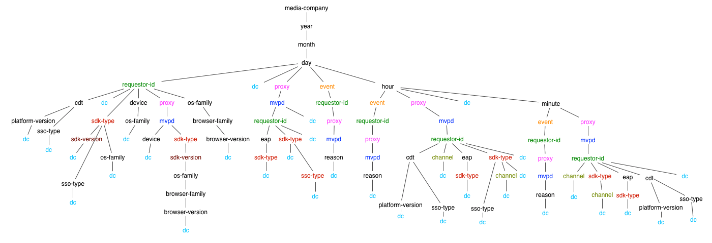

# エンタイトルメントサービス監視 API {#entitlement-service-monitoring-api}

>[!NOTE]
>
>このページのコンテンツは、情報提供の目的でのみ提供されます。 この API を使用するには、Adobeの現在のライセンスが必要です。 不正な使用は許可されていません。

## API の概要 {#api-overview}

Entitlement Service Monitoring(ESM) は WOLAP（Web ベース）として実装されています [オンライン分析処理](https://en.wikipedia.org/wiki/Online_analytical_processing){target=_blank}) プロジェクトです。 ESM は、データ・ウェアハウスがベースとする、ビジネス・レポート用の汎用 Web API です。 通常の OLAP 操作を RESTfully で実行できる HTTP クエリ言語として機能します。

>[!NOTE]
>
>ESM API は一般には利用できません。 可用性に関するご質問は、Adobe担当者にお問い合わせください。

ESM API は、基になる OLAP キューブの階層ビューを提供します。 各リソース ([ディメンション](#esm_dimensions) ディメンション階層で、URL パスセグメントとしてマッピングされている場合は、で（集計された）レポートが生成されます。 [指標](#esm_metrics) 現在の選択範囲の 各リソースは、親リソース（ロールアップ用）とそのサブリソース（ドリルダウン用）を指します。 スライスとダイシングは、クエリー文字列パラメータを使用して、特定の値または範囲に対する寸法を固定することで実現します。

REST API は、ディメンションパス、提供されたフィルター、選択した指標に従って、リクエストで指定された時間間隔（指定されない場合はデフォルト値にフォールバック）で使用可能なデータを提供します。 時間範囲は、時間ディメンション（年、月、日、時間、分、秒）を含まないレポートには適用されません。

エンドポイント URL のルートパスは、1 つのレコード内の全体的な集計指標と、使用可能なドリルダウンオプションへのリンクを返します。 API バージョンは、エンドポイント URI パスの末尾のセグメントとしてマッピングされます。 例： `https://mgmt.auth.adobe.com/*v2*` は、クライアントが WOLAP バージョン 2 にアクセスすることを意味します。

使用可能な URL パスは、応答に含まれるリンクを通じて検出できます。 有効な URL パスは、（事前に）集計された指標を保持する、基礎となるドリルダウン・ツリー内のパスをマッピングするために保持されます。 フォーム内のパス `/dimension1/dimension2/dimension3` は、これら 3 つのディメンションの事前集計を反映します（SQL と同じ） `clause GROUP` BY `dimension1`, `dimension2`, `dimension3`) をクリックします。 このような事前集計が存在せず、システムがその場で計算できない場合、API は 404（見つかりません）応答を返します。

## ドリルダウンツリー {#drill-down-tree}

次のドリルダウンツリーは、ESM 2.0 で使用可能な次元（リソース）を示しています。 [プログラマー] (#esm_dimensions) および [MVPDs](#esm_dimensions_mvpd).


### プログラマーが利用できるDimension {#progr-dimensions}



### MVPD が使用できるDimension {#mvpd-dimensions}


GET `https://mgmt.auth.adobe.com/v2` API エンドポイントは、次を含む表現を返します。

* 使用可能なルートドリルダウンパスへのリンク：

   * `<link rel="drill-down" href="/v2/dimensionA"/>`

   * `<link rel="drill-down" href="/v2/dimensionB"/>`

* すべての指標の概要（デフォルトの間隔での集計値）。クエリー文字列パラメーターが指定されていないので、以下を参照してください。


ドリルダウン・パスに従う（ステップ・バイ・ステップ）:
`/dimensionA/year/month/day/dimensionX` は次の応答を取得します。

* 「`dimensionY`&quot;および&quot;`dimensionZ`&quot;ドリルダウンオプション

* の各値の日別の集計を含むレポート `dimensionX`


### フィルター

日付/時間ディメンションを除き、現在の投影（ディメンションパス）に使用できるディメンションは、名前をクエリー文字列パラメーターとして使用してフィルタリングできます。

次のフィルターオプションを使用できます。

* **次と等しい** フィルターは、クエリー文字列内の特定の値にディメンション名を設定することで提供されます。

* **IN** フィルターを指定するには、同じ dimension-name パラメーターを異なる値で複数回追加します。dimension=value1\&amp;dimension=value2

* **等しくない** フィルターは「\!」を使用する必要があります 次元名の後に記号が追加され、&#39;\！が生成されます。=&#39; &quot;operator&quot;:ディメンション\!=値

* **次に含まれない** フィルターには&#39;\！が必要です=&#39;演算子は、セット内の値ごとに 1 回、複数回使用します。ディメンション\!=value1\&amp;dimension\!=値 2&amp;...

クエリ文字列内のディメンション名には、特別な使用方法もあります。ディメンション名が値のないクエリー文字列パラメーターとして使用されている場合、API はそのディメンションをレポートに含む投影を返すように指示します。

### ESM クエリの例

| *URL* | *同等の SQL* |
|---|---|
| /dimension1/dimension2/dimension3?dimension1=value1 | SELECT * from projection WHERE dimension1 = &#39;value1&#39; </br> GROUP BY dimension1, dimension2, dimension3 |
| /dimension1/dimension2/dimension3?dimension1=value1&amp;dimension1=value2 | SELECT * from projection WHERE dimension1 IN (&#39;value1&#39;, &#39;value2&#39;) </br> GROUP BY dimension1, dimension2, dimension3 |
| /dimension1/dimension2/dimension3?dimension1!=value1 | SELECT * from projection WHERE dimension1 &lt;> &#39;value1&#39; | </br> GROUP BY dimension1, dimension2, dimension3 |
| /dimension1/dimension2/dimension3?dimension1!=値 1&amp;ディメンション 2!=value2 | SELECT * from projection WHERE dimension1 NOT IN (&#39;value1&#39;, &#39;value2&#39;) | </br> GROUP BY dimension1, dimension2, dimension3 |
| 直接パスがない場合：/dimension1/dimension3 </br> しかし道はある/dimension1/dimension2/dimension3 </br> </br> /dimension1?dimension3 | SELECT * from projection GROUP BY dimension1, dimension3 |

>[!NOTE]
>
>これらのフィルタリング手法は、では機能しません。 `date/time` ディメンション。 フィルタリングする唯一の方法 `date/time` 次元は、 `start` および `end` クエリー文字列パラメーター（以下で説明）を必須の値に追加します。

次のクエリー文字列パラメーターは、API 用に予約された意味を持ちます（したがって、ディメンション名として使用できません。そうでない場合、そのようなディメンションではフィルタリングは使用できません）。

### ESM API 予約クエリー文字列パラメータ

| パラメータ | オプション | 説明 | デフォルト値 | 例 |
| --- | ---- | --- | ---- | --- |
| access_token | はい | IMS OAuth 保護が有効になっている場合、IMS トークンは、標準の認証ベアラートークンまたはクエリ文字列パラメーターとして渡すことができます。 | なし | access_token=XXXXX |
| dimension-name | はい | 任意のディメンション名 — 現在の URL パスまたは有効なサブパスに含まれる名前。値は等しいフィルターとして扱われます。 値を指定しない場合、指定したディメンションが現在のパスに含まれていない場合や現在のパスに隣接している場合でも、指定したディメンションが出力に強制的に含まれます | なし | someDimension=someValue&amp;someOtherDimension |
| 終了 | はい | ミリ秒単位のレポートの終了時間 | サーバーの現在の時刻 | end=2012-07-30 |
| 形式 | はい | コンテンツのネゴシエーションに使用されます ( 同じ効果ですが、パス「拡張」よりも低い優先順位です（以下を参照）。 | なし：コンテンツネゴシエーションは他の戦略を試みます | format=json |
| 制限 | はい | 返す行の最大数 | リクエストで制限が指定されていない場合に、サーバーが自己リンクで報告するデフォルト値 | limit=1500 |
| 指標 | はい | 返される指標名のコンマ区切りリスト。これは、使用可能な指標のサブセットをフィルタリングする（ペイロードサイズを減らす）と、（デフォルトの最適な投影ではなく）要求された指標を含む投影を返すように API を強制する両方に使用する必要があります。 | このパラメーターが指定されていない場合、現在の投影で使用できるすべての指標が返されます。 | metrics=m1,m2 |
| 開始 | はい | ISO8601 としてのレポートの開始時間。プレフィックスのみが指定されている場合、サーバーは残りの部分を入力します。例えば、start=2012 は start=2012-01-01になります。:00:00:00 | サーバーが自己リンクで報告した。サーバーは、選択された時間の精度に基づいて適切なデフォルトを提供しようとします | start=2012-07-15 |

現在使用可能な HTTP メソッドはGETのみです。 OPTIONS/HEAD方法のサポートは、今後のバージョンで提供される可能性があります。

## ESM API ステータス・コード {#esm-api-status-codes}

| ステータスコード | 理由フレーズ | 説明 |
|---|---|---|
| 200 | OK | 応答には、「ロールアップ」リンクと「ドリルダウン」リンク（該当する場合）が含まれます。 レポートは、リソースの属性としてレンダリングされます。ネストされた「レポート」要素/プロパティ。 |
| 400 | 無効なリクエスト | 応答本文には、リクエストの問題を説明するテキストメッセージが含まれます。 </br> </br> 400 Bad Request ステータスには、応答本文（プレーン/テキストメディアタイプ）に説明テキストが付属し、クライアントエラーに関する有用な情報を提供します。 無効な日付形式やフィルターが存在しないディメンションに適用されるなどの簡単なシナリオに加えて、大量のデータを即座に返したり集計したりする必要があるクエリに対する応答も拒否されます。 |
| 401 | 未認証 | ユーザーを認証するために適切な OAuth ヘッダーを含まないリクエストが原因です |
| 403 | Forbidden | 現在のセキュリティコンテキストで要求が許可されていないことを示します。これは、ユーザーが認証済みで、要求された情報へのアクセスが許可されていない場合に発生します |
| 404 | 見つかりません | 無効な URL パスが要求で指定された場合に発生します。 クライアントが 200 件の応答を提供する「ドリルダウン」/「ロールアップ」リンクに従う場合、この問題は発生しないでください |
| 405 | 許可されていないメソッド | リクエストでサポートされていないメソッドが使用されたことを示すシグナル。 現在はGETメソッドのみがサポートされていますが、今後のバージョンではHEADやOPTIONSが可能になる可能性があります |
| 406 | 許容不可 | サポートされていないメディアタイプがクライアントによってリクエストされたことを示すシグナル |
| 500 | 内部サーバーエラー | 「こんなことは起こらない」 |
| 503 | サービス利用不可 | アプリケーション内またはその依存関係内でエラーを示します。 |

## データ形式 {#data-formats}

データは次の形式で利用できます。

* JSON （デフォルト）
* XML
* CSV
* HTML（デモ用）

次のコンテンツネゴシエーション戦略は、クライアントが使用できます（優先順位はリスト内の位置によって決まります。まず最初に）。

1. URL パスの最後のセグメントに追加された「ファイル拡張子」:例： `/esm/v2/media-company/year/month/day.xml`. URL にクエリー文字列が含まれる場合、拡張機能は疑問符の前に付く必要があります。 `/esm/v2/media-company/year/month/day.csv?mvpd= SomeMVPD`
1. 形式クエリー文字列パラメーター：例： `/esm/report?format=json`
1. 標準の HTTP Accept ヘッダー：例： `Accept: application/xml`

「extension」とクエリパラメーターの両方で、次の値がサポートされます。

* xml
* json
* csv
* html

いずれかの戦略でメディアタイプが指定されていない場合、API はデフォルトで JSON コンテンツを生成します。

## ハイパーテキストアプリケーション言語 {#hypertext-application-language}

JSON および XML の場合、ペイロードは、以下に説明するように HAL としてエンコードされます。  <http://stateless.co/hal_specification.html>.

実際のレポート（「report」と呼ばれるネストされたタグ/プロパティ）は、次のようにエンコードされ、選択した/適用可能なすべてのディメンションと指標を含むレコードの実際のリストで構成されます。

### JSON

```JSON
 "report": [
  {
    "dimension1": "d1",
    ...
    "metric1": "m1",
    ...
  }, {
    ...
  }
]
```

### XML

```XML
 <report>
  <record dimension1="d1" ... metric1="m1" ... />
  ...
</report
```

XML 形式および JSON 形式の場合、レコード内のフィールド（ディメンションおよび指標）の順序は指定されませんが、一貫しています（順序はすべてのレコードで同じです）。 ただし、クライアントはレコード内のフィールドの特定の順序に依存しないでください。

リソースリンク（JSON の「自己」リリースと、XML の「href」リソース属性）には、現在のパスと、インラインレポートに使用されるクエリ文字列が含まれます。 クエリ文字列は、暗黙的および明示的なパラメーターをすべて表示し、ペイロードは、使用された時間間隔、暗黙的なフィルター（存在する場合）などを明示的に示します。 リソース内の残りのリンクには、現在のデータを掘り下げるために実行できる、使用可能なすべてのセグメントが含まれます。 ロールアップ用のリンクも提供され、親パス（存在する場合）を指します。 この `href` ドリルダウン/ロールアップリンクの値には、URL パスのみが含まれます（クエリー文字列は含まれないので、必要に応じてクライアントによって追加される必要があります）。 現在のリソースで使用（または暗黙）されるすべてのクエリー文字列パラメーターが、「ロールアップ」リンクや「ドリルダウン」リンクに適用されるわけではありません（例えば、フィルターはサブリソースやスーパーリソースには適用されません）。

例（という名前の指標が 1 つある場合） `clients` また、 `year/month/day/...`):

* https://mgmt.auth.adobe.com/esm/v2/year/month.xml

```XML
   <resource href="/esm/v2/year/month?start=2012-07-20T00:00:00&end=2012-08-20T14:35:21">
   <links>
   <link rel="roll-up" href="/esm/v2/year"/>
   <link rel="drill-down" href="/esm/v2/year/month/day"/>
   </links>
   <report>
   <record month="6" year="2012" clients="205"/>
   <record month="7" year="2012" clients="466"/>
   </report>
   </resource>
```

* https://mgmt.auth.adobe.com/esm/v2/year/month.json 

   ```JSON
       {
         "_links" : {
           "self" : {
             "href" : "/esm/v2/year/month?start=2012-07-20T00:00:00&end=2012-08-20T14:35:21"
           },
           "roll-up" : {
             "href" : "/esm/v2/year"
           },
           "drill-down" : {
             "href" : "/esm/v2/year/month/day"
           }
         },
         "report" : [ {
           "month" : "6",
           "year" : "2012",
           "clients" : "205"
         }, {
           "month" : "7",
           "year" : "2012",
           "clients" : "466"
         } ]
       }
   ```

### CSV

CSV データ形式では、リンクや他のメタデータ（ヘッダー行を除く）はインラインで提供されません。代わりに、選択メタデータがファイル名で指定され、次のパターンに従います。

```CSV
    esm__<start-date>_<end-date>_<filter-values,...>.csv
```

CSV にはヘッダー行が含まれ、その後の行としてレポートデータが含まれます。 ヘッダー行には、すべてのディメンションに続くすべての指標が含まれます。 レポートデータの並べ替え順は、ディメンションの順序に反映されます。 したがって、データが `D1` そしてそれから `D2`の場合、CSV ヘッダーは次のようになります。 `D1, D2, ...metrics...`.

ヘッダー行のフィールドの順序は、テーブルデータの並べ替え順を反映しています。


例：https://mgmt.auth.adobe.com/v2/year/month.csvを指定すると、 `report__2012-07-20_2012-08-20_1000.csv` 次の内容を含む


| 年 | 月 | クライアント |
| ---- | :---: | ------- |
| 2012 | 6 | 580 |
| 2012 | 7 | 231 |

## データの鮮度 {#data-freshness}

成功した HTTP 応答には、 `Last-Modified` 本文のレポートが最後に更新された時刻を示すヘッダー。 「Last-Modified」ヘッダーがない場合、レポートデータがリアルタイムで計算されます。

通常、粗大なデータは、細かい分類が必要なデータよりも頻繁に更新されません（分単位の値や時間単位の値など）。特に、ユニーク数など、小さな精度で計算できない指標では、毎日の値より最新である場合があります。

ESM の今後のバージョンでは、標準の「If-Modified-Since」ヘッダーを提供することで、クライアントが条件付き GET を実行できる可能性があります。

## GZIP 圧縮 {#gzip-compression}

Adobeでは、ESM レポートを取得するクライアントで gzip サポートを有効にすることを強くお勧めします。 これをおこなうと、応答のサイズが大幅に小さくなり、応答時間が短縮されます。 （ESM データの圧縮比は 20～30 の範囲にある。）

クライアントで gzip 圧縮を有効にするには、 `Accept-Encoding:` ヘッダーの内容を次に示します。

* Accept-Encoding:gzip, deflate


<!--
## Related Information {#related-information}

- [ESM Overview](/help/authentication/entitlement-service-monitoring-overview.md)
- [Degradation API Overview](/help/authentication/degradation-api-overview.md)
- [Understanding Server-side Metrics](/help/authentication/understanding-serverside-metrics.md)
-->