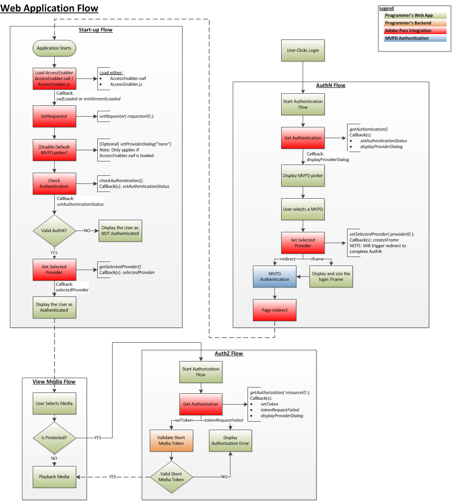

# JavaScript SDK クックブック {#javascript-sdk-cookbook}

>[!NOTE]
>
>このページのコンテンツは、情報提供の目的でのみ提供されます。 この API を使用するには、Adobeの現在のライセンスが必要です。 不正な使用は許可されていません。

## はじめに {#intro}

このドキュメントでは、プログラマーの上位レベルアプリケーションがAdobe Primetime Authentication Service との JavaScript 統合用に実装するエンタイトルメントワークフローについて説明します。 全体に、JavaScript API リファレンスへのリンクが含まれています。

また、 [関連情報](#related) の節には、一連の JavaScript コードサンプルへのリンクが含まれています。

## 権利付与フロー {#entitlement}

1. [前提条件](#prereq)
2. [起動フロー](#startup)
3. [認証フロー](#authn)
4. [認証フロー](#authz)
5. [メディアフローの表示](#logout)

</br>




## 前提条件 {#prereq}

**依存関係：**

- Adobe Primetime認証ライブラリ (AccessEnabler) を使用して、Adobe Primetime認証アカウントマネージャーと連携し、これを調整します。
- 有効なAdobe Primetime認証 requestorId を使用し、Adobe Primetime認証アカウントマネージャーに問い合わせて設定をおこないます。

コールバック関数を作成します。

- `entitlementLoaded`
</br>

**トリガー:** AccessEnabler が読み込まれ、初期化が完了しました。

- `displayProviderDialog(mvpds)`

  **トリガー:** `getAuthentication(),` ユーザーがプロバイダ (MVPD) を選択しておらず、まだ認証されていない場合にのみ、mvpds パラメーターは、ユーザーが使用できるプロバイダの配列です。

- `setAuthenticationStatus(status, errorcode)`

  **トリガー:**
   - `checkAuthentication()`毎回
   - `getAuthentication()` は、ユーザーが既に認証済みで、プロバイダーを選択している場合にのみ有効です。

  返されるステータスは成功または失敗です。エラーコードは、失敗のタイプを示します。

- `createIFrame(width, height)`

  **トリガー:** `setSelectedProvider(providerID)`、選択したプロバイダーが IFrame に表示するように設定されている場合にのみ表示されます。

  >[!NOTE]
  >
  >プロバイダは、その認証画面をリダイレクトまたは iFrame としてレンダリングするように構成されており、プログラマはその両方を考慮する必要があります。

- `sendTrackingData(event, data)`

  **トリガー:** `checkAuthentication(), getAuthentication(),checkAuthorization(), getAuthorization(), setSelectedProvider()`.  The `event` パラメーターは、発生したエンタイトルメントイベントを示します。 `data` パラメーターは、イベントに関連する値のリストです。
- `setToken(token, resource)`
  **トリガー:** `checkAuthorization()`および `getAuthorization()` リソースを表示するための認証が成功した後。   The `token` パラメーターは、短時間のみ有効なメディアトークンです。 `resource` パラメーターは、ユーザーが表示を許可されるコンテンツです。

- `tokenRequestFailed(resource, code, description)`
  **トリガー:**`checkAuthorization()`&#x200B;および`getAuthorization()`  認証に失敗した後。\
  The `resource` パラメーターは、ユーザーが表示しようとしたコンテンツです。 `code` パラメータは、発生したエラーの種類を示すエラーコードです。 `description` パラメーターは、エラーコードに関連するエラーを示します。

- `selectedProvider(mvpd)`

  **トリガー:** [`getSelectedProvider()`](#$getSelProv `mvpd` パラメーターは、ユーザーが選択したプロバイダーに関する情報を提供します。

- `setMetadataStatus(metadata, key, arguments)`

  **トリガー:** `getMetadata().`\
  The `metadata` パラメーターは、要求した特定のデータを提供します。キーパラメーターは、 `getMetadata()`要求、および `arguments` パラメーターは、に渡された辞書と同じです。 `getMetadata()`.


## 2.スタートアップフロー

**I. AccessEnabler JavaScript を読み込みます。**

**ステージングプロファイル用**

```JSON
<script type="text/javascript"         
src="https://entitlement.auth-staging.adobe.com/entitlement/v4/AccessEnabler.js">
</script>"
```

または…

**実稼動プロファイルの場合**

```JSON
<script type="text/javascript"         
src="https://entitlement.auth.adobe.com/entitlement/v4/AccessEnabler.js">
</script>"
```

**トリガー:** 初期化が完了すると、Adobe Primetime認証によって `entitlementLoaded()` コールバック関数。 これは、AccessEnabler を使用したアプリケーションの通信のエントリ・ポイントです。


**2.** 通話 `setRequestor()`プログラマのアイデンティティを確立するには、プログラマの `requestorID` と（オプション） Adobe Primetime認証エンドポイントの配列。

**トリガー:** なし（有効） `displayProviderDialog()` を呼び出す必要がある場合。


**三。** 通話 `checkAuthentication()` フルを開始せずに既存の認証を確認するには [認証フロー].  この呼び出しが成功した場合は、 `authorization flow`.  そうでない場合は、に進みます。 `authentication flow`.

**依存関係：** への呼び出しが成功しました `setRequestor()`（この依存関係は、後続のすべての呼び出しにも当てはまります）。

**トリガー:** `setAuthenticationStatus()` callback

</br>

## 3.認証フロー</span>


**依存関係：** への呼び出しが成功しました `setRequestor()`（この依存関係は、後続のすべての呼び出しにも当てはまります）。


通話 `getAuthentication()` 認証ステータスを取得するには OR を使用し、プロバイダーのトリガーフローを認証します。

**トリガー：**

- `displayProviderDialog()`（ユーザーがまだ認証されていない場合）
- `setAuthenticationStatus()` 認証が既に行われている場合

AccessEnabler の呼び出し時に、認証フローの完了に達する `setAuthenticationStatus()`次を使用 `isAuthenticated == 1`.

## 4.承認フロー {#authz}

**依存関係：**

- への呼び出しが成功しました `setRequestor()` （この依存関係は、後続のすべての呼び出しにも当てはまります）。
- 有効な ResourceID が MVPD に合意されました。 ResourceID は、他のデバイスやプラットフォームで使用されるものと同じで、MVPD 間で同じである必要があります。

通話 `getAuthorization()` をクリックし、要求されたメディアの ResourceID を渡します。 呼び出しが成功すると、ショートメディアトークンが返され、ユーザーがリクエストされたメディアを表示する権限を持っていることを確認します。

- 呼び出しが成功した場合：ユーザーに有効な AuthN トークンが割り当てられ、ユーザーはリクエストされたメディアを視聴する権限を持っています。
- 呼び出しが失敗した場合：Exception slowed を調べて、そのタイプ（AuthN、AuthZ など）を判断します。
- 呼び出しが AuthN エラーの場合は、AuthN フローを再起動します。
- 呼び出しが AuthZ エラーの場合、ユーザーはリクエストされたメディアを視聴する権限がなく、何らかのエラーメッセージがユーザーに表示される必要があります。
- その他のエラー（接続エラー、ネットワークエラーなど）が 次に、適切なエラーメッセージをユーザーに表示します。

メディアトークン検証ツールを使用して、成功した `getAuthorization()` を呼び出します。


**依存関係：** Short Media Token Verifier（AccessEnabler ライブラリに含まれる）

- 検証に合格した場合：ユーザーに要求されたメディアを表示または再生します。
- 失敗した場合：AuthZ トークンが無効だった場合、メディアリクエストを拒否する必要があり、エラーメッセージがユーザーに表示される必要があります。

## 5.メディアフローの視聴 {#logout}

- ユーザは、表示するメディアを選択する。
   - メディアは保護されていますか？
      - アプリは、メディアが保護されているかどうかを確認します。
         - メディアが保護されている場合、アプリは上記の認証 (AuthZ) フローを開始します。
         - メディアが保護されていない場合は、メディアの表示フローに進みます。
         - 再生メディア

## 訪問者 ID の設定 {#visitorID}

の設定 [Experience CloudvisitorID](https://experienceleague.adobe.com/docs/id-service/using/home.html) の値は、分析の観点から非常に重要です。 EC visitorID 値を設定すると、SDK はネットワーク呼び出しごとにこの情報を送信し、Adobe Primetime Authentication サービスはこの情報を収集します。 これにより、Adobe Primetime Authentication Service の分析データを、他のアプリケーションや Web サイトから取得した他の分析レポートと関連付けることができます。 EC visitorID の設定方法に関する情報は、を参照してください。 [ここ](https://experienceleague.adobe.com/docs/id-service/using/home.html?lang=en).


>[!NOTE]
>
>この機能のサポートは、JS SDK バージョン 3.1.0 以降で使用できます。

<!--
### Related Information (#related)

* [JavaScript SDK Overview](/help/authentication/javascript-sdk-overview.md)
* [JavaScript SDK API Reference](/help/authentication/javascript-sdk-api-reference.md)
* **JavaScript SDK Code Samples**
-->
