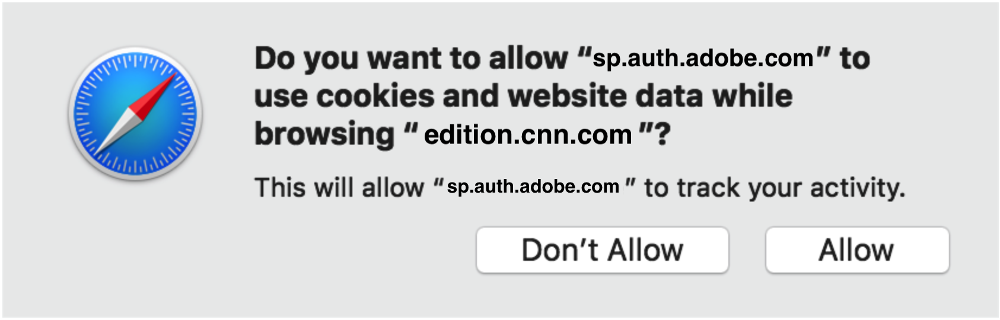

# Safari ブラウザーに対する JS SDK の制限 {#js-sdk-limitations-for-safari-browser}

>[!NOTE]
>
>このページのコンテンツは、情報提供の目的でのみ提供されます。 この API を使用するには、Adobeの現在のライセンスが必要です。 不正な使用は許可されていません。

<!--
>[!IMPORTANT] 
>
>We are strongly recommending [migration to AccessEnabler JavaScript SDK versions 4.x](http://tve.helpdocsonline.com/accessenabler-js-v4-migration-guide) in order to have a stable and predictable behavior on Safari browser.-->

## Safari 10 {#safari10}

**詳細**

* Safari 10 以降、デフォルトのブラウザープライバシー設定により、シングルサインオン (SSO)、シングルログアウト (SLO) およびパッシブ認証機能が動作を停止します。 シングルサインオン (SSO) とパッシブ認証は、複数のタブやブラウザーウィンドウ間の同じセッションでも機能しません。

* これらの変更は、AccessEnabler JavaScript SDK の次のバージョンのAdobe Primetime認証プロセスに影響を与え、また、影響を与えます：v2（バージョン 2.x）、v3（バージョン 3.x）、v4（バージョン 4.x）。

### 緩和策 {#mitigation-safari10}

* これらの制限を軽減するために、Safari 10 ブラウザーのプライバシー設定を変更し、「**常に許可**&quot; &quot;のオプション&#x200B;**Cookie と Web サイトデータ**」というエントリが追加されました。

  

## Safari 11 {#safari11}

**詳細**

>[!IMPORTANT]
>
>Safari 10 のセクションの上記の詳細は、Safari 11 の場合には、引き続き適用されます。

* Safari 11 以降、ブラウザーは [Intelligent Tracking Prevention](https://webkit.org/blog/7675/intelligent-tracking-prevention/)(ITP) メカニズム。クロスサイトトラッキングを防ぐためにヒューリスティックを使用する技術。 これらの発見的方法は、サードパーティ Cookie が保存され、ネットワーク呼び出しで再生される方法に影響します。つまり、ITP のメカニズムに応じて、Safari ブラウザーはクライアント — サーバーモデル通信でサードパーティ Cookie をブロックします。

* Adobe Primetime認証サービスは認証プロセスの一部として cookie を使用し、cookie に依存します **機能するために**. 認証プロセスが自動的におこなわれる状況（Temp Pass など）、または iFrames 機能や「refressless」機能を使用する実装では、Adobeの cookie はサードパーティ cookie と見なされ、デフォルトでブロックされます。 その他の場合、Safari は機械学習アルゴリズムを使用します。このアルゴリズムにより、すべてのAdobeの Primetime Authentication サービス Cookie がトラッキング Cookie としてフラグ付けされ、ITP のブロックの対象になる場合があります。

* 結論として、Safari 11 ブラウザーのユーザーは、特に複数のAdobePrimethime 認証が有効な Web サイトを使用している場合、Intelligent Tracking Prevention(ITP) メカニズムを有効にした後で、Adobe Primetime Authentication 有効な Web サイトで認証できない可能性があります。 したがって、ログインできないから予想よりも短い認証時間まで、ユーザーの認証エクスペリエンスは予期せぬもので未定義のものになる場合があります。

* これらの変更は、AccessEnabler JavaScript SDK の次のバージョンのAdobe Primetime認証プロセスに影響を与え、また影響を与えます：v2（バージョン 2.x）、v3（バージョン 3.x）。

### 緩和策 {#mitigation-safari11}

* AccessEnabler JavaScript SDK v3（バージョン 3.x）と AccessEnabler JavaScript SDK v4（バージョン 4.x）の両方で、必要な Cookie が見つからず、ユーザーの認証がブロックされた状況を識別するメカニズムが含まれています。 このような状況では、ライブラリは特定のエラートリガーコールバックを呼び出します。 [N130](/help/authentication/error-reporting.md#advanced-error-codes-reference):Adobe Primetime Authentication 対応 Web サイトに返され、問題を軽減できるアクションを実行するようユーザーに指示するシグナルとして使用されます。 このメカニズムを活用するには、Web サイトで [エラーレポート](/help/authentication/error-reporting.md) 仕様。

* AccessEnabler JavaScript SDK v2（バージョン 2.x）の場合、ライブラリに上記のメカニズムが提供されないので、Adobe Primetime Authentication が有効になった Web サイトは、ユーザーに問題を軽減するためのアクションを指示するタイミングを通知できません。

* 前述の問題を軽減できるアクションのリスト **3 つのバージョンすべてに適用されます** AccessEnabler JavaScript SDK のサポート。

* 条件 [N130](/help/authentication/error-reporting.md#advanced-error-codes-reference) error コールバックを実装者の Web サイトが受け取る場合は、次の方法で、Intelligent Tracking Prevention(ITP) を無効にし、サードパーティ Cookie を有効にするようにユーザーに指示する必要があります。

* Mac OS X High Sierra 以降の場合：**クロスサイトトラッキングを防ぐ**&quot; &quot;のオプション&#x200B;**Web サイトトラッキング**」というエントリが追加されました。

  

* Mac OS X Sierra 以前の場合：**常に許可**&quot; &quot;のオプション&#x200B;**Cookie と Web サイトデータ**」というエントリが追加されました。

  

## Safari 12 {#safari12}

**詳細**

>[!IMPORTANT]
>
>Safari 10 および Safari 11 のセクションの上記の詳細は、Safari 12 の場合でも、すべて同じです。

この節では、の互換性の問題について詳しく説明します。 **AccessEnabler JavaScript SDK バージョン 4.x** (Safari 12)

>[!NOTE]
>
>AccessEnabler JavaScript SDK バージョン 2.x および AccessEnabler JavaScript SDK バージョン 3.x の場合、両方とも認証プロセスにサードパーティ cookie を使用し、Safari 11 以降の ITP およびサードパーティ cookie のため、ユーザーの認証エクスペリエンスは予期せず、ログの記録不可能、予期しない期間。

### Safari 12 上の AccessEnabler JavaScript SDK v4（バージョン 4.x）の認定機能 {#certified-functionality-of-accessenabler-javacscript=sdk-v4}

* **認証** バージョン 4.0 以降、AccessEnabler JavaScript SDK は認証プロセスにサードパーティ cookie を使用しなくなるので、ユーザーのブラウザーでサードパーティ cookie が無効になっている場合でも、ユーザー操作を利用するフローは常に機能します。

>[!NOTE]
>
>ログインポップアップを開いたり、MVPD ログインページとやり取りするには、ユーザーがサイトとやり取りする必要があります。

* **認証/プリフライト/ユーザーメタデータ** ユーザーが既に認証されている場合、操作は完全に機能します。

### Safari 12 での AccessEnabler JavaScript SDK v4（バージョン 4.x）の既知の問題 {#known-issues-of-accessenabler-javascript-sdk-4}

* SSO および SLO

   * Safari 10 以降、Safari で localStorage が実装される仕組みにより、JS SDK は、共通のドメイン iFrame を介してログイン状態を共有できなくなりました。 つまり、AccessEnabler JavaScript SDK を使用するすべてのサイトにログインする必要があります。 また、ログアウトでは、複数のサイトにわたる認証トークンは削除されないので、ユーザーはAdobe Primetime Authentication が有効になっている各 Web サイトからログアウトする必要があります。

* 一時パス

   * 一時的なパスの場合、AccessEnabler JavaScript SDK は個別化メカニズムを使用して、認証トークンを特定のデバイス（ブラウザーインスタンス）にロックします。 追跡を防ぐように設計された Safari 12 の新しいメカニズムにより、個別化メカニズムで計算および使用するフィンガープリントが生成されました。 **は、同じ IP アドレスを持つすべてのユーザーで同じになります**. 個別化のためにクライアント IP を考慮に入れていますが、同じパブリック IP アドレスを共有するユーザーに影響が及ぶ場合もあります。 これらのユーザーに対して、同じ個別化 ID を計算し、一時パスがそれに結び付けられます。 つまり、このようなユーザーが一時パスを使用すると、他のユーザーはそのパスにアクセスできなくなります。 これは、特に、企業のユーザー、教育機関、または NAT を使用する複数のユーザーや、インターネットにアクセスする共通のプロキシを持つその他の組織に影響を与えます。

>[!NOTE]
>
>この問題は、ユーザーの操作の結果として実装者が Temp Pass を使用する場合にのみユーザーに影響します。それ以外の場合は、Temp Pass 認証が **自動フロー** 下

* 自動フロー

   * JS SDK 4.0 を使用している場合、Safari 12 では、ユーザーの操作がなく、自動モードで試行された認証フローは成功しません。今後の JS SDK 4.1 では、自動フローの問題がすべて修正されました。

この問題の影響を受ける使用例：

* 自動 TempPass（自由プレビュー）認証 — このようなフローでは、SDK は N130 エラーをスローします。

* パッシブ認証（警告なしで失敗） — ユーザーはこの MVPD を選択し、資格情報を入力するように求められます。

### 緩和策 {#mitigation-safari12}

**SSO および SLO**

これらの書き込みの現時点では、使用可能な既知の緩和策はありません。 Appleが Safari 12(`https://webkit.org/blog/8124/introducing-storage-access-api`) ですが、現在の実装は localStorage には適用されず、cookie にのみ適用されます。 また、API を使用するにはユーザー操作が必要です。使用すると、次のような権限ダイアログが表示されます。

この時点で、これらの Safari の要件/プロンプトは UX の要件と一致せず、他のブラウザーとは異なり、SSO が共通のドメイン localStorage にトークンを保存すると「正常に機能」するという一貫した動作はありません。

**一時パス**

個別化の問題を軽減し、ユーザーの操作を可能にするために、 **[プロモーション一時パス](/help/authentication/promotional-temp-pass.md)** インタラクティブな方法で、ユーザーに関する少なくとも 1 つの追加情報（電子メールアドレスなど）を提供します。

## Safari 13 {#safari13}

**詳細**

>[!IMPORTANT]
>
>Safari 10 から Safari 12 までのセクションの上記の詳細は、Safari 13 の場合には、まだ適用されます。

Safari 13 以降、ブラウザーでは [Intelligent Tracking Prevention](https://webkit.org/blog/7675/intelligent-tracking-prevention/) (ITP) の場合、クロスサイトトラッキングを防ぐために、サードパーティ Cookie をトラッキング Cookie としてフラグ設定する過程で、このメカニズムの背後にある発見的方法をより厳格にします。

前の節で説明したように、Adobe Primetime Authentication Service では、実装者が AccessEnabler JavaScript SDK v2（バージョン 2.x）と AccessEnabler JavaScript SDK v3（バージョン 3.x）を使用する場合、認証プロセスの一部としてサードパーティ cookie を使用し、使用します。 ユーザーと関係者 ( プログラマーの Web サイトやAdobe) とのやり取りについて「学ぶ」ためにしばらく時間をかけて ITP が初めて「知る」ときの Safari ブラウザーの旧バージョンと比較すると、Safari 13 ブラウザーは、クライアント — サーバーモデル通信で cookie の追跡と見なされるサードパーティ cookie をブロックします。

最後に、Safari 13 ブラウザーのユーザーは、AccessEnabler JavaScript SDK、v2（バージョン 2.x）または v3（バージョン 3.x）の古いバージョンを使用しているAdobe Primetime Authentication が有効な Web サイトで新しい認証を開始できない可能性が高くなります。 この問題は、必要なすべてのAdobeの Primetime Authentication サービス Cookie が ITP によってブロックされ、その結果、サービスが認証要求を満たせなくなることが原因で発生しています。

AccessEnabler JavaScript SDK v4（バージョン 4.x）ライブラリは、認証プロセスにサードパーティ Cookie を使用しないので、Safari 13 の変更による操作への影響はありません。

### 緩和策 {#mitigation-safari13}

まず第一に、我々は強く推薦する **AccessEnabler JavaScript SDK バージョン 4.x への移行** Safari ブラウザーで安定した予測可能な動作を実現する。

次に、AccessEnabler JavaScript SDK v3（バージョン 3.x）の場合、必要な Cookie が見つからず、ユーザー認証がブロックされた状況を識別するメカニズムがライブラリに含まれています。 このような状況では、ライブラリは特定のトリガーコールバック ([N130](/help/authentication/error-reporting.md#advanced-error-codes-reference)) に返されます。これは、問題を軽減できるアクションを実行するようユーザーに指示するシグナルとして使用されるために、Adobe Primetime Authentication 対応 Web サイトに渡されます。 このメカニズムを活用するには、Web サイトで [エラーレポート](/help/authentication/error-reporting.md) 仕様。

AccessEnabler JavaScript SDK v2（バージョン 2.x）の場合、ライブラリに上記のメカニズムが提供されないので、Adobe Primetime Authentication が有効になった Web サイトは、ユーザーに問題を軽減するためのアクションを指示するタイミングを通知できません。

条件 [N130](/help/authentication/error-reporting.md#advanced-error-codes-reference) error コールバックを実装者の Web サイトが受け取る場合は、次の方法で、Intelligent Tracking Prevention(ITP) を無効にし、サードパーティ Cookie を有効にするようにユーザーに指示する必要があります。

* Mac OS X High Sierra 以降の場合：**クロスサイトトラッキングを防ぐ**&quot; &quot;のオプション&#x200B;**Web サイトトラッキング**」というエントリが追加されました。

  

* Mac OS X Sierra 以前の場合： t をチェックします。彼は&quot;**常に許可**&quot; &quot;のオプション&#x200B;**Cookie と Web サイトデータ**」というエントリが追加されました。

  
