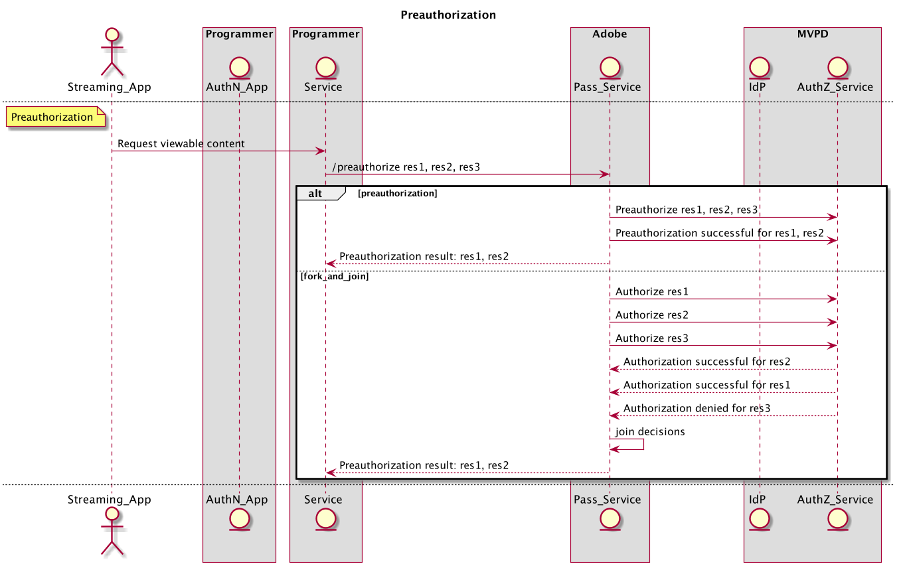

# REST API クックブック（サーバー間） {#rest-api-cookbook-server-to-server}

>[!NOTE]
>
>このページのコンテンツは、情報提供の目的でのみ提供されます。 この API を使用するには、Adobeの現在のライセンスが必要です。 不正な使用は許可されていません。

## 概要 {#overview}

このクックブックドキュメントの目的は、サーバー間アーキテクチャを使用してAdobe Primetime認証を実装する際のベストプラクティスを詳しく説明することです。  これには、基本的な要件、フローの実装、および実稼動環境と運用に関する一般的な考慮事項が含まれています。

## コンポーネント {#components}

作業中のサーバー間ソリューションでは、次のコンポーネントが関係します。

| タイプ | コンポーネント | 説明 |
| --- | --- | --- |
| ストリーミングデバイス | ストリーミングアプリ | ユーザーのストリーミングデバイス上に存在し、認証済みビデオを再生するプログラマーアプリケーション。 |
| | \[ オプション\] AuthN モジュール | ストリーミングデバイスにユーザエージェント（Web ブラウザ）がある場合、AuthN モジュールは MVPD IdP でのユーザ認証に対して応答可能です。 |
| \[ オプション\] AuthN デバイス | AuthN アプリ | ストリーミングデバイスにユーザエージェント（Web ブラウザ）がない場合、AuthN アプリケーションは、Web ブラウザを使用して別のユーザのデバイスからアクセスするプログラマの Web アプリケーションです。 |
| プログラマーインフラストラクチャ | プログラマーサービス | ストリーミングデバイスをAdobe Passサービスとリンクし、認証と承認の決定を取得するサービス。 |
| Adobe基盤 | Adobe Pass Service | MVPD IdP および AuthZ サービスと統合され、認証と承認の決定を提供するサービスです。 |
| MVPD Infrastructure | MVPD IdP | ユーザーの ID を検証するために、資格情報ベースの認証サービスを提供する MVPD エンドポイントです。 |
| | MVPD AuthZ サービス | ユーザーの購読、親の制限などに基づいて認証の決定を行う MVPD エンドポイント。 |

フローで使用される追加の用語は、
[用語集](/help/authentication/glossary.md).

## 流れ {#flows}

### 動的クライアント登録 (DCR)

Adobe Passは、DCR を使用して、プログラマーアプリケーションまたはサーバーとAdobe Passサービス間のクライアント通信を保護します。 DCR フローは、別々の、依存する、前提条件のフローで、 [動的クライアントの登録](/help/authentication/dynamic-client-registration.md).

### 認証 (authN)

認証フローは、ユーザが MVPD に対して自分自身を識別し、ユーザが有効なアカウントを持っているかどうかを判断するのに使用されます。

1. ユーザーがストリーミングデバイスアプリを起動し、保護されたコンテンツのログインまたは表示を試みます。
2. ストリーミングデバイスアプリは、デバイスが既に認証されているかどうかを判断するために、プログラマーサービスにリクエストを送信します。
3. プログラマーサービスが、DCR を使用してアプリを登録します。
4. プログラマーサービスは、Adobe Passサービスを呼び出すことで、ストリーミングデバイス authN のステータスを確認します **checkauthn** API.
5. 例えば、 **checkauthn** 呼び出しは、ユーザーデバイスが認証されたステータスを返すので、アプリは認証フローに進むことができます。
6. 例えば、 **checkauthn** 呼び出しにより、ユーザーデバイスが認証されていないというステータスが返された場合、アプリはユーザーのリクエストがログインするのを待つ必要があります。
7. ユーザが直接ログインを要求する（例：ログインボタンを選択する）か、間接的にログインする（例：未認証の場合は保護されたコンテンツを選択する）と、Streaming Device アプリは Programmer Service に対してユーザ認証を開始する要求を行う。 プログラマーサービスは、Adobe Passサービスを呼び出して、一意の登録コード (regcode) を要求し、受け取ります **regcode** API.
8. また、Programmer Service は、 Adobe Pass Service を呼び出して、現在の MVPD および属性のリストを取得します **config** API. 注意：この API は、フロー内で早く呼び出し、キャッシュすることもできます。
9. Programmer Service は、ストリーミングデバイスアプリに regcode を返し、手順\#7でリクエストされた処理済みの MVPD リストを返します。 注意：処理される MVPD リスト形式は、プログラマーによって指定され、フィルタリングして特定の MVPD を明示的に許可またはブロックできます（例：allow — または block-lists）。
10. が、選択または必要に応じて AuthN デバイス（「2 番目の画面」）と異なる場合（つまり、ストリーミングデバイスは User Agent をサポートしていません）、AuthN アプリケーションにアクセスするための regcode と URI を表示する必要があります。 ユーザーが AuthN デバイスのユーザーエージェントに URI を入力して AuthN アプリケーションを起動し、そのアプリケーションに regcode を入力します。 ストリーミングデバイスが AuthN デバイスと同じ場合、regcode を AuthN モジュールにプログラムで渡すことができます。
11. AuthN モジュールは、MVPD ピッカーを表示することで、MVPD を使用してユーザ認証を開始します。 ユーザーが MVPD を選択すると、AuthN モジュールがを呼び出します。 **認証** regcode を使用します。この regcode は、User Agent を MVPD IdP にリダイレクトします。 ユーザーが MVPD で正常に認証されると、ユーザーエージェントはAdobe Passサービスを通じてリダイレクトされ、正常な認証が regcode で記録された後、AuthN モジュールにリダイレクトされます。
12. ストリーミングデバイスが AuthN デバイスと異なる場合、AuthN デバイスは、ユーザーに正常な認証メッセージを表示し、続行する手順（例：「成功」）を表示する必要があります。 これで、ゲームコンソールに戻って\[...\]&quot;を続行できます。 ストリーミングデバイスが AuthN デバイスと同じ場合、ストリーミングデバイスは認証の完了をプログラムで検出する場合があります。

次の図に、認証フローを示します。

### 認証 (authZ)

承認フローは、要求されたコンテンツにユーザーがアクセスする資格があるかどうかを判断するために使用されます。

1. ユーザーが Streaming Device アプリで保護されたコンテンツを表示しようとするたびに、Streaming Device アプリは Programmer Service を呼び出し、コンテンツを識別し、ストリームの開始に必要な権限と情報を要求します。
1. プログラマーサービスがAdobe Pass **許可** リソース ID と他の必須パラメーターを渡す API。 Adobe サービスは、リソース ID を使用して MVPD AuthZ サービスを呼び出し、その後 Programmer Service に渡される承認決定を受け取ります。 この認証決定は、設定可能な期間、Adobe Pass Service によってキャッシュされます。 後続の場合 **許可** Programmer Service からAdobe Pass Service への呼び出し。有効である限り、キャッシュされた値が返されます。
1. 認証が付与された場合、Programmer Service はAdobe Passを呼び出す必要があります **/tokens/media** 署名されたメディアトークンを返す API。 プログラマーサービスは、メディアトークン検証ライブラリ (JAR) を使用してメディアトークンを検証する必要があります。 有効な場合、Programmer Service は権限と、手順\#1でリクエストされたストリーム（ストリーム URL など）を開始するために必要なを返します。
1. 認証が拒否された場合、 **許可** 呼び出しは、エラーコードと説明を Programmer Service に返します。 プログラマーサービスは、エラーコードと説明（またはプログラマが変更したメッセージ）をステップ\#1のリクエストに返す必要があります。

次の図に、認証フローを示します。

### ログアウト

ログアウトフローを使用すると、ユーザーは、アプリケーションに現在関連付けられている ID を削除できます。

1. ユーザーがログアウトを要求すると（つまり、アプリケーションに関連付けられている現在の MVPD アカウントをデバイスから削除する）、Streaming Device アプリは Programmer Service を呼び出してデバイスをログアウトします。
1. プログラマーサービスは、Adobe Passを呼び出す必要があります。 **ログアウト** API.

次の図に、ログアウトフローを示します。

### \[ オプション\] 事前認証（プリフライト）

事前認証を使用すると、ユーザーがアクセスできるリソースを一連のリソースからすばやく特定できます。  この呼び出しの結果は、通常、個々のユーザーの UI をカスタマイズするために使用されます。

1. ユーザーが認証されると、ストリーミングデバイスは、プログラマーサービスを呼び出して、ユーザーがストリーミングを受ける資格のあるコンテンツを要求できます。

1. プログラマーサービスは、Adobe Passを呼び出す必要があります。 **事前に許可** リソース ID のリストを含む API。これは、通常、ユーザーがストリーミングに使用できるチャネルを表す単純な文字列です。 *注意：現在、* ***事前に許可*** *の呼び出しは、リストを 5 個のリソース ID に制限するように設定されています。 リソースが 5 つ以上必要な場合は、* ***事前に許可*** *呼び出しは、MVPDs からの同意を得て、5 つ以上のリソースを受け入れるように設定することもできます。 実装者は、* ***事前に許可*** *MVPD リソースとプログラマーへの応答時間の両方を呼び出し、呼び出しの使用を慎重に構築する。*

1. The **事前に許可** 呼び出しは、ユーザーが関連するチャネルに対して権限を持っているかどうかを示す要求内の各リソース ID に対する TRUE または FALSE 値を含む JSON オブジェクトを使用して、Programmer Service に応答します。 *注意： MVPD が指定されたリソース ID に対する回答を提供しない場合（例：ネットワークエラーやタイムアウトが原因）、値はデフォルトで FALSE に設定されます。*

1. プログラマーサービスでは、 **事前に許可** 応答を呼び出して、ストリーミングデバイスに対するプログラマー定義のカスタム応答を作成します。通常は、使用権限に基づいてユーザーに対する表示をパーソナライズします。

次の図に、事前認証フローを示します。

### \[ オプション\] メタデータ

メタデータは、MVPD によって共有されるユーザ情報を取得するために使用できます。
例えば、ユーザー ID、郵便番号などがあります。

1. ユーザーが認証されると、Programmer Service はAdobe Passを呼び出すことができます **usermetadata** 認証済みユーザーに関する情報をリクエストする API。

1. 応答には、特定のユーザーが使用できるすべてのメタデータが含まれます。 特定のフィールドは、プログラマー/MVPD 統合ごとに個別に設定されます。

次の図に、事前認証フローを示します。

## 環境と機能要件{#environments}

プログラマーは、少なくとも 2 つの環境を作成する必要があります。1 つは実稼動用、もう 1 つはステージング用です。

### 実稼動

実稼動環境は、大規模なスパイクや予期しないスパイク（ライブスポーツ、ニュース速報など）に対して適切に利用可能で拡大可能である必要があります。

Adobe Passサービスは、米国内を地理的に分散した複数のデータセンターで実行されます。  Adobe Passサービスから最適な応答時間（つまり待ち時間が最も短い）を実現するには、プログラマーも地理的に分散した同様のサービスインフラストラクチャを作成する必要があります。

Adobeがトラフィックを再ルーティングする必要がある場合、Programmer サービスは DNS キャッシュを最大 30 秒に制限する必要があります。 この問題は、データセンターが利用できなくなった場合に発生する可能性があります。

プログラマーは、実稼動環境のパブリック IP 範囲を提供する必要があります。 これらは、アクセス用にAdobe Passインフラストラクチャ内の IP の許可リストに入力され、Adobeの Fair API 使用ポリシーで管理されます。

### ステージング

ステージング環境は最小限に抑えることができますが、すべてのシステムコンポーネントとビジネスロジックを含める必要があります。 実稼動環境と同様に機能し、実稼動環境以外でのリリースのテストを可能にする必要があります。 ステージング環境は、プログラマーが使用するAdobe Passテスト環境に接続し、必要に応じてAdobeに接続して、テストやトラブルシューティングを支援できるのが理想です。

### 機能要件

Programmer サービスは、フローを実行するデバイスに対する正確なデバイス識別情報を渡す必要があります。 さらに、Programmer サービスは、フローを実行するデバイスの IP（x-forwarded-for ヘッダー内）と、接続元ポート（デバイス情報フィールド内）を渡す必要があります。

    **X-Forwarded-For : \&lt;client _ip=&quot;&quot;>**
    
    ここで、\&lt;client _ip=&quot;&quot;> はクライアントのパブリック IP アドレスです。
    
    
    
    ヘッダーは、**regcode**および**authorize**の呼び出し時に追加する必要があります
    
    例：
    
    POST/reggie/v1/{req\_id}/regcode HTTP/1.1
    
    X-Forwarded-For:203.45.101.20
    
    
    
    GET/api/v1/authorize HTTP/1.1
    
    X-Forwarded-For:203.45.101.20

プログラマーサービスは、個々の MVPD または統合アプリ（デバイス IP、ソースポート、デバイス情報、MRSS、ECID などのオプションデータなど）で必要なデータと形式を送信する必要があります。 <!--Please see the documentation for [Passing Device and Connection Information Cookbook](http://tve.helpdocsonline.com/passing-device-information-cookbook)-->.

プログラマーサービスは、キャッシュ時に authN と authZ の TTL を尊重し、通知時に authN または authZ セッションを無効にする必要があります。

プログラマーは、Adobeと共有される証明書を維持する必要があります。

<!--
## Related Information {#related}

* [REST API Reference](/help/authentication/rest-api-reference.md)
* [Glossary of Terms](/help/authentication/adobe-pass-glossary.md)
-->
