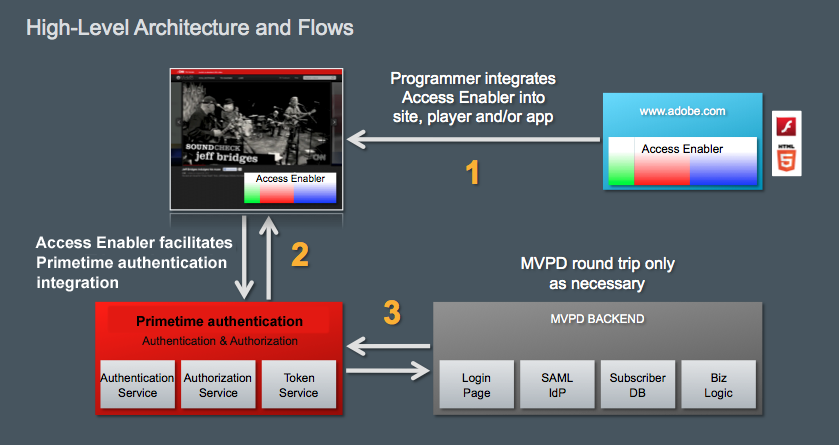

# Adobe Primetime認証と TV Everywhere について {#about-auth-tve}

>[!NOTE]
>
>このページのコンテンツは、情報提供の目的でのみ提供されます。 この API を使用するには、Adobeの現在のライセンスが必要です。 不正な使用は許可されていません。

## TV Everywhere について {#about-tve}

今日のテレビ視聴者は、いつでも場所や場所でオンラインにすることができ、ペイテレビのコンテンツにアクセスする能力が彼らと一緒にそこにあることを期待しています。 さらに、オーディエンスは、次のようなインターネット対応デバイスの幅が拡大し続けているので、コンテンツを閲覧します。

* ノートパソコン
* タブレット
* スマートフォン
* Web サイト
* Federated Apps
* ゲームコンソール
* セットトップボックス
* スマートテレビ

TV Everywhere は、Pay TV 購読者が既に支払っている同じコンテンツを、複数のデバイスをまたいで、家の内外でアクセスする能力をサポートする業界の動きです。 従来のリニアテレビでは、テレビ視聴の大部分が依然として行われていますが、消費の増加は、時間シフトされたコンテンツ、オンラインビデオ、代替画面です。 その結果、今日のビデオ配信市場は混乱状態にあり、TV Everywhere は、プログラマー、有料テレビプロバイダー、有料テレビ加入者の利益を合わせるソリューションとして浮上しています。

TV Everywhere の技術的な目標は、Pay TV の顧客が既に購読しているコンテンツに、すべてのデバイスとプラットフォームでアクセスできるようにすることです。

TV Everywhere のビジネス目標は次のとおりです。

* **既存の顧客関係を維持し、新しい顧客関係を有効にする**
* プログラマーやコンテンツ所有者が最も広いオーディエンスにリーチし、プレミアムコンテンツからより多くの価値を引き出すことを許可する
* ビューアとの直接オンラインインタラクションによりブランドを拡張

## TV の至る所での課題 {#tve-challenges}

TV Everywhere の機会と共に、挑戦が来ます。 これらの中心には権利が付与されています。 ビューアが購読コンテンツにアクセスする前に、誰かがそのアクセス権を持っているかどうかを判断する必要があります。

ユーザーが有料テレビプロバイダーのサブスクリプションを持っているか。 該当する場合、その購読にはリクエストされるコンテンツが含まれますか。 エンタイトルメントは、顧客の識別データと顧客のアクセス権限を持つ有料テレビオペレーターなので、プログラマーやコンテンツ所有者が直接決定するのは特に困難です。

権限以外にも、次のような関連する技術および統合の課題が多数あります。

* 包括的なマルチデバイス戦略の策定と実現
* プログラマーと有料テレビプロバイダー間の無数の関係の調整
* 不正アクセスや利用規約の不正使用を防ぐ
* Web サイトやアプリをまたいだユーザーに対して、一貫性のあるフラストレーションのない認証エクスペリエンスを提供する
* アフィリエイト契約に追いつくための迅速な市場投入時間の維持
* 複数の統合に関連するコストの管理

これらの課題は、複数のペイテレビプロバイダーの認証システムとプログラマーとの間の複雑で直接的な統合を、リソースを大量に消費し、時間と技術的な高度さを必要とする、パフォーマンスと維持を可能にします。

解決策は？ **Adobe® Primetime 認証**.

## Adobe Primetime認証の概要 {#authentication-intro}

Adobe Primetime認証を使用すると、プログラマーと有料テレビプロバイダーは、Adobe Primetime認証 API を使用して、次のようなエコシステム全体にアクセスするために、簡単な統合をおこなうだけで済みます。

* Turner Broadcasting(TBS、TNT、CNN)、Fox Broadcast Networks、Hulu などのプログラマー

* 米国でトップの有料テレビプロバイダー。全米有料テレビ世帯の 90%以上を占めます

さらに、Adobe Primetime認証は、ユーザー認証と認証を簡単かつ安全にするフレームワークを提供します。

*図 1:Adobe Primetime認証を通じて接続するプログラマーとペイテレビのプロバイダーの一部だけ…*

Adobe Passは、プログラマーとペイテレビのプロバイダー間の権利付与トランザクションを安全に仲介し、購読コンテンツに対するビューアのアクセスを容易にします。 言い換えれば…

**Adobe Primetime認証を使用すると、適切な顧客が適切なコンテンツに簡単かつ迅速にアクセスできます。**

**Adobe Primetime認証とは**

* **プログラマー** 最高の収益を得るために、最も幅広いオーディエンスにリーチし、ペイテレビプロバイダ（「MVPDs」や「マルチチャネルビデオプログラミングディストリビュータ」とも呼ばれる）と簡単に統合したいと考えている人。 プログラマーは、Adobe Primetime認証を使用して、クライアントプラットフォームとは無関係に、すべての主要プロバイダーにわたってビューアを認証できます。

* **有料テレビプロバイダ/MVPD** 複数のプログラマーとの間の無痛な接続を求め、オンラインでのサブスクリプションコンテンツへのアクセスを促進し、より高い顧客満足度を求める

* **テレビのお客様に有料を支払う** ユーザーは、既に購読しているコンテンツに容易にアクセスできるように、その場所を問わず、追加料金なしでアクセスできます。 シングルサインオンでは、クライアントのダウンロードや繰り返しログインを必要とせずに、Web やモバイルアプリをまたいだ安全なビューア認証を提供し、優れたユーザーエクスペリエンスを提供します。

の場合 **プログラマー** Adobe Primetime認証には次の機能があります。

* 複数の直接統合を伴う手間を省き、トップペイテレビプロバイダとの統合と即時接続が容易
* コンテンツに対して最も幅広いオーディエンスをサポートすることで、サブスクリプション（ライセンス）と広告収益の両方を最適化
* 認証を保護し、許可されたユーザー/デバイスに対してのみプレミアムコンテンツへのアクセスを許可
* プレーヤーと DRM プラットフォームに依存しない、オープンで柔軟なフレームワーク。再生は、iOS、Android、Windows 8、ゲームコンソール、セットトップボックスなど、様々なプラットフォームでおこなわれます。
* DRM テクノロジーとの互換性 (AdobeFlash Access®や再生準備完了®など )。
* シングルサインオン (SSO) の認証と承認をサポートし、独自のシステムでの最初の認証後に再度ログインする必要がなくなります。

の場合 **有料テレビプロバイダ/MVPD** Adobe Primetime認証には次の機能があります。

* コンテンツ所有者との統合が容易になり、1 つの統合を使用して複数のプログラマーと迅速に接続
* 複数のプラットフォームやデバイスでコンテンツを表示する際の、スムーズでブランド化されたエクスペリエンスをサポートし、顧客エンゲージメントを強化
* 認証を安全に行い、許可されたユーザー/デバイスのみにプレミアムコンテンツへのアクセスを許可し、（オプションで）世帯アカウントごとに接続できるデバイスと同時ストリームの数を制限します。

の場合 **テレビのお客様に有料を支払う** Adobe Primetime認証には次の機能があります。

* **TV が至る所に！**

このペーパーの残りの部分では、Adobe Primetime認証の技術的な概要を説明します。  以下の多くはプログラマー統合に焦点を当てていますが、ペイテレビプロバイダにも適用される一般的な情報と具体的な情報の両方があります。 このドキュメントでは、Adobe Primetime認証が TV Everywhere のソリューションとして機能するセキュリティと整合性についても説明します。 このペーパーの後の詳細については、Adobe担当者にお問い合わせいただくか、情報提供依頼フォームにご記入ください [ここ](https://www.adobe.com/).

## 建築用構築ブロック {#arch-building-blocks}

 次に、認証と承認の一元的な権利付与トランザクションを示します。 認証とは、特定のユーザーが既知の顧客であることを有料テレビプロバイダーに確認するプロセスです。 認証とは、Pay TV プロバイダーが、認証済みユーザーが特定のリソースに対する有効な購読を持っていることを確認するプロセスです。
Adobe Primetime認証は、次の基本コンポーネントで構成されています。

* クライアントコンポーネント（次のいずれか）:

   * Access Enabler：プラットフォーム固有のライブラリでは、使いやすい API と、権限付与フローを実装するためのコードサンプルを提供します。
   * クライアントレス API - RESTful Web サービスは、Web ページのレンダリング機能（ゲームコンソール、セットトップボックスなど）を持たないプラットフォームに対して、エンタイトルメントフローエンドポイントを提供します。

* Adobeがホストするバックエンドサーバ
* メディアトークン検証ツール
* 安全で中央に位置する Exchange（トークン）

基本的に、Adobe Primetime認証は、3 つのコンポーネント (Access Enabler、Adobeがホストするバックエンド・サーバ、メディア・トークン検証ツール ) と、交換（トークン）の中央項目で構成されます。

### クライアントコンポーネント {#client-components}

* Access Enabler
* クライアントレス API

#### Access Enabler {#access-enabler}

完全にサポートされるプラットフォーム (Web、iOS、Android、Windows 8 など ) では、プログラマーは、Access Enabler クライアントコンポーネントを介してAdobe Primetime認証を操作します。 このコンポーネントは、顧客とのすべての認証および承認のやり取りを容易にします。  Access Enabler は、システム上でローカルに実行されます。 ユーザーがプログラマーのサイトまたはアプリケーションにアクセスしてコンテンツを要求すると、Adobeがホスト/維持する Access Enabler コンポーネントがバックグラウンドにサイレントで読み込まれます。

Access Enabler は実際の使用権限のワークフローを処理し、プログラマはユーザー・インタフェースを実装し、Access Enabler とやり取りする上位レベルの Web ページまたはプレーヤー・アプリケーションに対する責任を維持します。 これらのやり取りは、Access Enabler API で定義される関数とコールバックの非同期システムを介して行われます。

Access Enabler API を使用して簡単に実装できる基本的な権限フローは次のとおりです。

* 要求者（プログラマー）ID の設定
* 特定の有料テレビオペレーター（「ID プロバイダー」）に対するユーザー認証を確認/取得する
* 特定のリソースのユーザー認証を確認/取得する
* ユーザーのログアウト

Access Enabler には、次のサービスも用意されています。

* 特定のクライアントの登録ステータス、ドメイン、およびそのリソース/チャネルを含む、プログラマーからのクエリを検証します。
* ユーザーがプロバイダーを選択した有料テレビオペレーターのリストを作成するデータを提供します。 このリストは、要求元のプログラマーに対しても検証され、適切に定義されます。
* これにより、Pay TV オペレーター固有の認証および承認ワークフローが開始されます。
* 不要なリクエストトラフィックを最小限に抑えるために、プログラマーのリソース/チャネルごとに成功した認証応答をキャッシュします。
* これは、明示的なデバイス登録など、各有料テレビオペレーターに固有の事前定義済みのワークフローに対して設定できます。

Access Enabler は、Web サイトやプレーヤアプリケーションに応じて、次の形式を取ることができます。

* SWFランタイムが実行できるFlash Playerファイル
* ブラウザーによって直接実行された JS ファイル
* サポート対象のプラットフォーム (iOS、Android、Windows 8 など ) 用のネイティブ Access Enabler

#### クライアントレス API {#clientless-api}

クライアントレス API アプローチは、Web ブラウザをサポートしない（MVPD での認証に必要な）「スマートデバイス」（ゲームコンソール、セットトップボックス、スマートテレビ）向けです。  クライアントレスアプローチでは、スマートデバイスアプリは、2 つ目の画面（ブラウザー）アプリで実行される認証以外のすべての認証に対して、RESTful Web サービス API を通じてAdobe Primetime認証と直接通信します。 つまり、Access Enabler のクライアント側ライブラリは使用されません。 代わりに、スマートデバイスアプリの開発者は、Adobe Primetime認証 Web サービス API を直接使用して、権限付与フローを実装します。

### Adobeがホストするバックエンドサーバ {#adobe-backend-servers}

Adobe Primetime認証バックエンドサーバー。Adobeがホストします。

* Adobe Primetime認証とオペレーター間のサーバー間通信が必要な有料テレビプロバイダーとの間で、認証および承認ワークフローをプロビジョニングします。
* プログラマーのサイトとアプリケーションの構成を維持します。
* ダウンロード可能な Access Enabler コンポーネント・ファイルをホストします。
* クライアントレス API 統合用の RESTful Web サービスエンドポイントを指定します。
* 認証および認証トークンを生成する（場合によってはストアも）。

### トークンとメディアトークン検証ツール {#tokens-media-token-verifier}

Adobe Primetime認証エンタイトルメントソリューションは、認証/承認ワークフローの正常な完了時に取得される特定のデータの生成を中心としています。 これらのデータはトークンと呼ばれます。 寿命は限られており、クライアント上のプラットフォームに依存する場所、または Clientless API ソリューションの場合はAdobeサーバーに安全に保存されます。 有効期限が切れたら、認証ワークフローや認証ワークフローの再開を通じてトークンを再発行する必要があります。

認証/承認ワークフロー中にAdobe Primetime認証が発行するトークンは 3 種類あります。 2 つは「長期間有効」で、ユーザーの視聴エクスペリエンスの継続性を提供します。 3 つ目は、短時間のみ有効なトークンで、不正を軽減するための業界のベストプラクティス（不正にはストリームリッピングなどの悪用が含まれる場合）のサポートを提供します。 有効期間 (「TTL」) の値は、プログラマーと有料テレビプロバイダーの間の契約に基づいて設定されます。プログラマーは、関係するすべてのユーザーに最も役立つ値に同意します。

#### （長期間有効）認証トークン {#long-lived-auth-token}

認証の成功は、お客様がAdobe Primetime認証を使用して Pay TV アカウントに正常にログインした場合に発生します。 次に、Adobe Primetime認証により、要求元のデバイスに結び付けられた長期間有効な認証 (AuthN) トークンが生成され、（有料テレビプロバイダーに応じて）ユーザーを匿名で識別するグローバルに一意の識別子 (「GUID」) が生成されます。

* Adobe Primetime認証では、Adobe Primetime認証を使用するすべてのアプリケーションで AuthN トークンを使用できる場所に安全に保存します。 Access Enabler の統合の場合、トークンはクライアント側で安全に保存されます。  Adobe Primetime認証では、AuthN トークンを使用して、ユーザーに代わって以降の認証クエリをおこないます。
* いつでも 1 つの AuthN トークンのみが保存されます。 新しい AuthN トークンが発行され、古いトークンが既に存在する場合は常に、新しいトークンは既存の格納された値を上書きします。

#### （長期間有効）認証トークン {#long-lived-authriz-token}

認証が成功すると、Adobe Primetime認証によって、長期間有効な認証 (「AuthZ」) トークンが作成されます。 このトークンは、リクエストデバイスと特定の保護されたリソース（チャネル、シリーズ、エピソードなど）に関連付けられているので、移動できません。

* Adobe Primetime認証では、AuthZ トークンと、他のリソースの他の認証トークンが安全に保存されます。  AuthN トークンと同様に、Access Enabler を使用するプラットフォームでは、トークンはクライアント上にローカルに保存されます。クライアントレス API を使用するプラットフォームでは、トークンはAdobe Primetime認証サーバーに保存されます。
* 長期間有効な AuthZ トークンの有効期間 (TTL) は、通常、有料テレビプロバイダーとプログラマーの間の具体的な契約に応じて、日から週の範囲で定義されます。
* 一定の時間で、1 つのリソースにつき 1 つの AuthZ トークンのみが保存されます。 異なるリソースに関連付けられている限り、複数の認証トークンを保存することができます。 新しい認証トークンが発行され、同じリソースに古い認証トークンが既に存在する場合は常に、新しいトークンは既存のキャッシュされた値を上書きします。
* Adobe Primetime認証では、長期間有効な AuthZ トークンを使用して、実際の表示アクセスに使用される短時間有効なメディアトークンを作成します。

#### 短時間のみ有効なメディアトークン {#short-lived-media-token}

Adobe Primetime認証で AuthZ トークンが生成されると、そのトークンを使用して、Exchange 時の改ざんを防ぐために、Adobeによって署名され、暗号化された、単一使用の短時間有効なメディアトークンが生成されます。

* 短時間のみ有効なトークンの TTL ( デフォルト：5 分 ) が設定され、トークンを生成するサーバーとトークンを検証するサーバーとの間でクロック同期の問題が発生するようになっています。
* 短時間有効なトークンは、保護されたリソースへのアクセスを提供する前に埋め込みサイトに公開されるので、プログラマーは、Access Enabler 統合用のメディアトークン検証機能、または Clientless API 統合の場合はトークン検証サービスを使用してトークンを検証する必要があります。

#### メディアトークン検証ツール {#media-token-verifier}

プログラマーは、Media Token Verifier Library を既存のアプリケーションサーバーに統合し、ビデオストリームが実際に起動される前に、Verifier が最終的なユーザー検証を実行できるようにします。 メディアトークン検証ライブラリは、次を定義します。

* トークンから情報（トークンが有効かどうか、トークンが発行された時刻、その他の関連データなど）を取得するトークン検証 API
* トークンが実際にAdobeから来たことを検証するために使用されるAdobe公開鍵
* Verifier API の使用方法と、ライブラリに含まれるAdobe公開鍵を使用して元を検証する方法を示すリファレンス実装

*図 2:Access Enabler 統合におけるAdobe Primetime認証エコシステムの概要アーキテクチャ*

## Adobe Primetime認証との統合 {#integrate-auth}

Pay TV プロバイダーか Programmer かにかかわらず、 Adobe Primetime認証との統合プロセスには、アクティブな参加が必要になります。 これらの各プロセスについて、以下で説明します。

### 有料テレビプロバイダーのプロセス

Adobe Primetime認証に関する Pay TV プロバイダの主な責任は、要求ユーザが実際にプログラマーのコンテンツにアクセスする資格を持つ既知のサブスクライバであることを検証することです。 高レベルでは、Adobe Primetimeを新しい有料テレビプロバイダーと統合するための認証プロセスには、次の手順が必要です。

1. プロバイダーは、Adobe Primetime認証に関する非開示契約 (NDA) に署名します。
1. プロバイダーは、Adobeと認証システムの仕様を提供します。 最も簡単な統合をおこなうには、Pay TV オペレーターに認証用の SAML ベースの ID プロバイダー (IdP) を設け、認証用に SOAP アクセスプロトコルを使用して通信できるようにすることをお勧めします。
1. プロバイダーは、サーバーとAdobe Primetime認証サーバー間の接続を確立します。 これには、エンドポイントの提供や IP のリスト登録が含まれます。
1. 事前認定リリースおよび QE。
1. 実稼動版リリースと QE.

Adobe Primetime認証は、プログラマー向けの既存の統合に代わる場合がありますが、これは通常、有料テレビプロバイダーには必要ありません。 Adobeは、プロバイダーの技術チームと連携し、既存の統合のニーズに合わせてAdobe Primetime認証を設定します。 「標準」の統合と最小限のサポート要件（ドキュメントと基本的な E メールサポート）を想定し、Pay TV プロバイダーの統合は無料でおこなえます。 プロバイダーが大幅なサポートやエスカレーションされたタイムラインを必要とする場合は、サポート料が請求される場合や、プロバイダーが Synacor などのアドビのソリューションに精通したサードパーティと連携する場合があります。

Adobe Primetime認証では、次のように、Pay TV プロバイダーのビジネスロジックの効率的な処理もサポートしています。

* Adobeは、自己完結型で、許可のリクエストを受け取ったときにオペレーターが適用できるビジネスロジックに対して、オペレーターが承認リクエストを受け取ったときに、ビジネスロジックの強制を支援するために必要なデータを提供します。 このデータには、リクエストをおこなうユーザーの一意のデバイス ID と、デバイスの IP アドレスが含まれますが、これらに限定されない場合があります。
* Adobeの操作や、ユーザーソリューションによる特定の処理を必要とするビジネスロジックの場合、Adobeは各有料テレビプロバイダのカスタムプロパティを維持できます。 これらのオペレーター固有の設定/ポリシーには、最上位ワークフローの特定のポイントで開始できる、事前定義済みのワークフローの有効化が含まれます。 カスタムプロパティのサポートの詳細については、Adobe担当者にお問い合わせください。

Adobeはまた、詐欺制限サービスを提供します。 詳しくは、Adobe担当者にお問い合わせください。

### プログラマープロセス {#programmer-process}

Adobe Primetime認証を正しく統合するには、次のような主要な権限付与プロセスの処理で、Adobe Primetime認証と連携するように、プログラマーがメディアプレーヤーアプリケーションまたは Web ページを設定する必要があります。認証、認証、ログアウト。

Adobe Primetime認証との統合を開始する前に、プログラマーは次の事項をおこなう必要があります。

* Web サイトの一部として、またはスタンドアロンアプリケーションとしてのメディアプレーヤーを含む、既存のオンラインビデオプラットフォーム
* コンテンツ管理システム
* 配信メカニズム。サードパーティのコンテンツ配信ネットワーク (CDN) を含む場合と含まない場合があります。

プログラマーは、Adobe Primetime認証を使用して TV Everywhere サービスを提供する際に、いくつかの統合タスクを実行する必要があります。 次のタスクが含まれます。

* Adobe Primetime認証の Access Enabler ライブラリを Web ページやメディアプレーヤーに統合する、または Web に対応していない「スマートデバイス」に対するクライアントレスアプローチを使用した統合の実装
* Adobe Primetime認証トークン検証コンポーネントをビデオストリーミングワークフローに統合するサーバー側の作業
* Web サイトまたはアプリへのアクセスワークフローの UI の作成 ( 実際のログイン処理など、この一部の要素は Pay TV オペレーターが提供し、一部の要素はAdobe Primetime認証の一部としてオプションで使用できます )

この論文では、プログラマプロセスの概要を示し、Adobeは統合の正式な開始に関する追加のガイダンスを提供します。

#### 要求者（プログラマ）の設定 {#requester-prog-setup}

##### Adobeへの登録 {#registering}

最初の手順として、プログラマーは、AdobeまたはAdobe認証済みパートナーに登録し、Adobe Primetime認証で使用するドメインを指定する必要があります。 プログラマは、一意の要求元 ID を受け取ります。この ID は、プログラマが Access Enabler とやり取りするセッションごとに、Adobe Primetime認証に提供されます。

##### 初期アクセスイネーブラ統合のセットアップ {#access-enabler-int-setup}

コンテンツへのアクセスを要求するお客様は、事前に、Access Enabler というAdobe Primetime認証クライアントコンポーネントを、既存のメディアプレーヤーアプリまたは Web ページに統合する必要があります。 これをおこなう方法には、様々なオプションがあります。

* Flashのバージョン (AccessEnabler.swf) は、Web ページのFlashベースのビデオプレーヤーに埋め込むことも、直接HTMLに埋め込むこともできます。 SWFとの通信は、ActionScriptまたは JavaScript でおこなえます。 ベース API はActionScriptですが、完全な JavaScript ラッパーライブラリを使用できます。
* Flash以外のデバイスでは、次の操作が可能です。
   * HTML5/JavaScript バージョン、AccessEnabler.js を使用し、JavaScript API を使用して通信する、または
   * ネイティブの Access Enabler ライブラリ (iOS、Android、Windows 8 など ) を使用する

##### 初期クライアントレス API 統合のセットアップ {#clientless-api-int-setup}

コンテンツへのアクセスを要求するユーザーは、事前に、Clientless API を使用して RESTful Web サービス呼び出しをメディアプレーヤーアプリに実装し、ユーザーの Pay TV Provider へのログインを処理する「セカンドスクリーン」アプリケーションを設定する必要があります。

#### 認証と承認の処理 {#auth-authr-handling}

お客様がプログラマーに保護されたリソースを初めて要求すると、プログラマーは、お客様に選択する有料テレビプロバイダのリストを提示します。 プロバイダーを選択すると、ユーザーは初期ユーザー認証のためにそのオペレーターにリダイレクトされます。 認証が成功すると、Adobe Primetime認証は、選択した有料テレビプロバイダーと通信し、指定したリソースへのアクセスを許可します。 これらのプロセスの詳細は以下のとおりです。

*図 3:プロバイダー選択 UI の例*

>[!NOTE]
>
>* 認証は、サービスプロバイダー（または「SP」）としてのAdobe Primetime認証と、ID プロバイダー（または「IdP」）としての有料 TV プロバイダーとの間の SAML 交換としておこなわれます。
>* 認証では、Adobe Primetime認証 (SP) と有料テレビプロバイダー (IdP) との間のバックチャネル（サーバー間）Web サービス交換が使用されます。

##### Access Enabler を使用したプログラマーとの通信

Access Enabler とプログラマーの Web ページまたはプレーヤーアプリとの間の双方向通信チャネルは、完全に非同期のパターンに従います。 プログラマは、Access Enabler API で公開されたメソッドを使用して、Access Enabler にメッセージを送信します。 Access Enabler は、Access Enabler ライブラリに登録されたコールバックを介して応答します。

* 認証トークンがローカルシステムで見つからない場合は、承認リクエストが最初に自動的に認証をリクエストします。 認証が成功すると、顧客のトークンがローカルに保存されるので、一定期間ログインし直す必要がなくなります。 Adobe Primetime認証エンタイトルメントソリューションを通じて、他のコンテキスト（有料テレビプロバイダの Web サイトや別のプログラマーを通じて）で正常に認証された場合、Access Enabler はローカルトークンにアクセスし、追加の認証を実行する必要はありません。
* お客様が特定のリソースを要求すると、プログラマは Access Enabler を介して Pay TV プロバイダに対して認証を要求します。 認証を確認（または開始）した後、Access Enabler は (Adobe Primetime認証を通じて )Pay TV プロバイダに問い合わせ、お客様がリソースを表示する資格があるかどうかを判断します。 Adobe Primetime認証は、Pay TV プロバイダーとの通信を処理して認証を取得します。 プログラマは、要求を Access Enabler に送信し、応答を処理するだけで済みます（認証の成功または失敗）。 認証が成功すると、認証トークンがクライアントシステムに保存され、コールバックが短時間のみ有効なメディアトークンを受け取ります。

##### クライアントレス API を使用したプログラマーとの通信 {#progr-comm-clientless-api}

プログラマーのアプリとAdobe Primetime認証の間の通信は、RESTful Web サービスを介して行われます。  Adobe Primetime認証エンドポイントへのすべての API 呼び出しに対してセキュリティプロトコルが適用されています。  セキュリティ要件については、クライアントレス API のドキュメントを参照してください。

##### SAML Web ブラウザー SSO ベースの認証を使用したサンプルワークフロー {#sample-wf}

1. 閲覧者がサイト (dummy1.com) に移動し、権利が付与されているコンテンツにアクセスしようとします。
1. ビデオページ/プレーヤーが adobe.com から Access Enabler を読み込み、ユーザーの操作を求められると、要求されたコンテンツの認証を求めます。
1. Access Enabler が実行され、リクエスト元とリクエストが検証されます。
1. Access Enabler は、ローカル・ストア内の有効な認証トークンを確認します。 有効な認証が見つかった場合、Access Enabler は短時間有効なメディアトークンを生成します（手順 14 を参照）。
1. 要求されたリソースに対する有効な認証が見つからず、有効な認証トークンが存在する場合、Access Enabler は、ユーザーが認証された Pay TV プロバイダで認証要求を開始します。 Adobeサーバは、Pay TV プロバイダとの認証要求/応答交換をプロビジョニングします。
1. 有効な認証トークンが見つからない場合は、Access Enabler がユーザーに対して有料テレビプロバイダの入力を求めます。 (SAML Web ブラウザーの SSO ベースの認証をサポートするプロバイダーの選択は、SAML ベースの認証トリガーを選択します。 非 SAML プロバイダーの場合、Adobeは同様のカスタムワークフローを処理します )。
1. Access Enabler は、ブラウザをAdobeの SAML SP（サービスプロバイダ）サービスに移動し、適切なすべてのパラメータを渡します。
1. SAML SP は、IdP メタデータに示された SAML Web ブラウザープロファイルを使用して、ユーザーの Pay TV プロバイダーで適切な SAML IdP（ID プロバイダー）を呼び出します。 これにより、ユーザーが認証を受ける IdP（有料テレビプロバイダー）サイトに効果的に移動します。
1. 認証が成功すると、ユーザーはAdobeの SAML SP にリダイレクトされ、SAML 応答で認証 GUID を渡します。
1. Adobeの SAML SP は、認証 GUID が保存されるサーバー側でセッションを作成し、元のプログラマーページに戻します。 （サーバ・セッションは、AuthN トークンの Access Enabler の取得時に削除されます）。
1. Access Enabler は、認証 GUID をAdobeのサーバから取得し、Adobe Primetime認証で保持されるデバイス ID を持つトークンに含めます。 FlashDRM がデバイス上にある場合、これは、GUID のFlash AccessID へのバインドを有効にし、認証トークンを返すデバイス API(Flash Playerの DRM コンポーネント ) を通じておこなわれます。 それ以外の場合は、HTML5 ベースのストレージを使用するか、特定のネイティブコンポーネントを使用して、HTTPS 経由で JS API を介してこれがおこなわれます。
1. 認証トークンは、Access Enabler が Pay TV プロバイダに対する認証要求を行う際に使用します。 Flash Access対応デバイスでは、結果の認証トークンがデバイスにバインドされるように、リクエストは常にFlash AccessAPI を通じておこなわれます。 非Flash Accessデバイスでは、クライアントからサーバーへの安全な通信に HTTPS が使用されます。
1. 認証が成功すると、Adobe Primetime認証は長期間有効な認証 (「authZ」) トークンを作成し、Access Enabler に渡します。Access Enabler はこのトークンをローカルシステムに保存します。
1. Access Enabler は authZ トークンを使用して、実際の表示アクセスに使用する短時間のメディアトークンを作成します。 セキュリティを確保するために、これらの短時間のみ有効なトークンは、別のAdobe Primetime認証コンポーネントであるメディアトークン検証ツールで検証される必要があります。

*図 4:認証と認証の Access Enabler のワークフロー*

##### 権限付与ユーザーインターフェイスの指定 {#entitlement-ui}

プログラマーは、Web サイトやアプリへのアクセスワークフロー用に、独自の UI を作成する必要があります。 実際のログインプロセスなど、一部の要素は有料テレビプロバイダーから提供され、一部の要素はAdobe Primetime認証の一部としてオプションで使用できます。 少なくとも、プログラマは以下を行います。

* **プロバイダー選択インターフェイスを実装します** これにより、新しいユーザーが有料テレビプロバイダーを特定し、初めてログインできます。 Access Enabler は、開発時に、お客様が有料 TV プロバイダを選択し、ログイン処理を開始できるようにする基本的なユーザー・インタフェースを提供します。 実稼動環境の場合、プログラマーは独自のプロバイダーセレクターダイアログを実装する必要があります。 一部の有料テレビプロバイダーは、ログイン用に独自のサイトにリダイレクトし、iframe 内にログインページを表示する必要があります。 お客様がこれらのプロバイダーの 1 つを選択した場合に備えて、この iframe を作成するコールバックを実装する必要があります。
* **保護されたリソースを識別します。** 保護されたリソースとは、アクセスに対する認証が必要なリソースです。 これらのリソースを提供する際、Programmer インターフェイスは、表示前に認証の必要性を示す必要があります。 認証が成功すると、リソースが認証されたことがインターフェイスに表示されます。
* **有料テレビプロバイダの一覧を作成および管理します** を使用して、指定したプロバイダーに対するユーザーアクセスを制御します。
* **ユーザーが認証されたことを示します。** プログラマーは、保護されたリソースを識別するために使用される手段の一部として、顧客の認証状態を示す必要があります。 プログラマは、Access Enabler に問い合わせて、お客様が既に認証済みかどうかを確認できます。

#### シングルログアウトのサポート {#single-logout-support}

ほとんどの場合、プログラマーは、単純な API 呼び出しを介してユーザーログアウトを処理します。 logout() 呼び出しは、現在のユーザーをログアウトするために、次の方法で Primetime 認証を実行します。

* すべての AuthN および AuthZ トークンを削除しています
* そのユーザーのすべての認証および認証情報をクリアしています
* プロバイダーとのユーザーの認証セッションをクリアする Pay TV プロバイダー固有のワークフローを開始する（例えば、SAML 認証要求プロトコルを使用して認証が行われた場合、ログアウトは SAML Single Logout プロトコルを使用しておこなうことができます）。

ユーザーは、トークンの期限が切れるまでマシンをアイドル状態のままにしておくと、セッションに戻ってログアウトを正常に開始できます。 Adobe Primetime認証では、すべてのトークンが削除され、Pay TV プロバイダーに対してもセッションを削除するよう通知します。

Adobe Primetime認証と統合されていないサイトからログアウトが開始された場合、Pay TV プロバイダーは、ブラウザーのリダイレクトを通じてAdobe Primetime認証の Single Logout サービスを呼び出すことができます。

## 基本的な権利付与フローを超えた追加機能 {#beyond-basics}

基本的な権限フローは、起動、認証、承認、ログアウトです。  Adobe Primetime認証が成長し、発展するにつれて、多くの機能が追加され、基本的なフローに追加されています。  これには次が含まれます。

* **ユーザーメタデータ** - MVPD とプログラマー間の契約に応じて、MVPD は、Zipcode、最大評価、チャネル ID などのメタデータを安全に交換できます。 メタデータを使用すると、親の規制、スポーツイベントの地域の凍結期間など、様々な使用例を利用できます。
* **一時的な無料アクセス**  — プログラマーは、保護されたコンテンツへの一時的な無料アクセス（日々のプログラミングの短いサンプル、大きなイベントの無料表示など）を提供できます。
* **プロキシ MVPD** - MVPD は、Adobe Primetime認証との独自の統合を管理し、関連する「ProxyedMVPDs」のグループに代わってエンタイトルメントプロセスを管理できます。

## セキュリティ {#security}

この節では、Adobe Primetime認証インフラストラクチャのセキュリティと整合性について説明します。

### トークンセキュリティ {#token-security}

Adobe Primetime認証の主な目的の 1 つは、不正なユーザーやコンテンツ集約者によるコンテンツ使用権限データに対する攻撃にシステムが確実に耐えられるようにすることです。 したがって、最も重要な認証トークンデータの生成と使用を保護し、ワークフロー内の様々なレベルでデータアクセスを保護する。 Adobe Primetime認証アーキテクチャは、トークンの内容を安全に維持し、トークンが発行先のデバイス上に残るように設計されています。

* **長期間有効な AuthN および AuthZ トークンセキュリティ**  — 長期間有効なトークンはすべて、Adobe Primetime認証サーバーによってデジタル署名されます。 ただし、デジタル署名は、生成、保護、検証の方法が異なるデバイス ID を使用する点で、プラットフォームごとに異なります。 どのような場合でも、クライアント側の検証では、デジタル署名が損なわれず、トークンの整合性が維持されていることを確認します。 Access Enabler は、検証済みのトークンを、実行中の環境に固有の場所に安全に保存します。 デバイス ID の検証が失敗した場合、認証セッションは無効化され、トークンがリセットされ、ユーザーに対して再度ログインするよう求められます。
* **短時間のみ有効なメディアトークンのセキュリティ**  — 短時間のみ有効なメディアトークン（コンテンツアクセスの前の最後の手順で生成）は、Adobeによって署名され、交換時の改ざんを防ぐために暗号化されます。 短時間のみ有効なメディアトークンには、追加のAdobe Primetime認証コンポーネントであるメディアトークン検証ツールによる追加の検証手順も必要です。 短時間のみ有効なトークンの TTL はデフォルトで 5 分に設定されており、必要に応じて短くすることができます。 短時間のみ有効なメディアトークンはキャッシュされません。認証 API が呼び出されるたびに、新しいトークンがサーバーから取得されます。

### プラットフォーム固有のデバイスセキュリティ {#platform-sp-security}

Adobe Primetime認証で使用されるセキュリティ対策はプラットフォームによって異なりますが、すべて堅牢で最新の状態になっています。

* **Flash対応デバイス** -Flash Player10.1 以降またはAIR 2.5 以降がデバイス上にある場合、Adobe Primetime認証はFlash PlayerDRM 機能を保護に使用します (Flash Accessとも呼ばれます )。 Flashは、より高いレベルの保護を提供します。Flashベースのトークンのデバイスバインディングを強く保証することは、ほとんどの場合、有効期間が長くなり、ユーザーは頻繁にログインする必要がなく、通常はユーザーエクスペリエンスがスムーズになることを意味します。
* **ブラウザー 5 対応デバイスでのHTMLー内エクスペリエンス**-HTML5 ブラウザー機能を含む非Flashデバイスでは、Adobe Primetime認証は、ブラウザーベースの統合を制限する別の手段を提供します。 ただし、HTML5 のデバイスバインディングはそれほど強くないので、通常は、HTML5 プラットフォームのトークンの有効期間 (TTL) は短くなります。
* **家庭内および外部デバイスのネイティブアプリサポート** -Adobeは、各 OS(iOS、Android、Windows 8 など ) ごとにネイティブ SDK を提供し、 これにより、HTML5 ソリューションに対するセキュリティが強化されました。 これらの SDK は、ネイティブの API を使用してデバイス ID を取得し、それをAdobe Primetime認証サーバーに安全に渡します。
* **クライアントなし** - Adobe Primetime認証は、安全な通信に HTTPS プロトコルを使用します。 さらに、スマートデバイスからのすべての呼び出しは、デジタル署名される必要があります。

## FAQ {#faqs}

**TV Everywhere とは**
TV Everywhere と呼ばれる業界の動きは、有料テレビの顧客が、パソコン、タブレット、スマートフォン、ゲーム機、セットトップボックス、「スマート」テレビなど、様々なインターネット接続機器で既に購読しているプレミアムコンテンツにアクセスできます。 このイニシアチブの課題は、認証プロセスをできるだけ簡単かつ手間のかかるものにすることで、顧客が、非常に困難な障壁や複数のログインを伴わずに、購読コンテンツにスムーズにアクセスできるようにすることです。

**Adobe Primetime認証とは何ですか？また、TV Everywhere とはどのように関連していますか？**
Adobe Primetime認証は、シンプルで安全な方法でユーザーのコンテンツに対する権利をスムーズに検証することで、あらゆる場所で TV をコンセプトから現実に引き継ぎます。 Adobe Primetime認証は、プログラマーとペイテレビの両方のプロバイダーに必要なビジネスルールに基づいて、迅速なバックエンド統合を可能にするホスト型サービスです。 これは、すべての関係者に対する迅速な市場投入、不正を防ぐためのより安全な環境、優れた顧客体験を意味し、より多くのプラットフォームにわたってより多くの人々が利用できるテレビコンテンツを提供します。

**Adobe Primetime認証はどのように提供/配信されますか？**
Adobe Primetime認証は、Software as a Service(SaaS) モデルを通じて提供されます。 これにより、エンドユーザー、プログラマー、ペイテレビの各プロバイダー間でより安全な通信が可能になり、コンテンツに対する使用権限を検証できます。 このサービスのコアコンポーネントには、クライアント側 Access Enabler（または一部のデバイス用のクライアントレス API）と、ホストされているAdobe Primetime認証サーバーが含まれます。 Access Enabler は、プログラマの Web ページまたはプレーヤアプリケーションに読み込まれる小さなファイルです。 Adobe Primetime認証サーバーと通信し、様々な有料テレビプロバイダーの認証システムに接続が組み込まれています。 また、Adobe Primetime認証では、Web に対応しない「スマートデバイス」（スマートテレビ、セットトップボックス、ゲームコンソールなど）に対して、クライアントレス API アプローチを統合に提供しています。 クライアントレスアプローチは、RESTful Web サービスを提供し、開発者はこれらのデバイスにAdobe Primetime認証エンタイトルメントフローを実装できます。

**Adobe Primetime認証は、他の TV Everywhere ソリューションとどのように異なりますか。**
Adobe Primetime認証は、代替の TV Everywhere ソリューションと比べて、明確なメリットがあります。 個々のプロバイダーとの直接統合では、ユーザーがサイトからサイトへとインターネット経由で移動する際に、単一の永続的なログイン (SSO) を柔軟に提供することはありません。 Adobe Primetime認証も驚くべき市場浸透を示しています。プログラマーがAdobe Primetime認証と統合すると、米国の 90%以上の世帯に対応するペイテレビのオペレーターと直ちに連携します。 さらに、Adobe Primetime認証では、Flashランタイムに組み込まれた独自のセキュリティ機能（利用可能な場合）を活用して不正を軽減し、また、SDK を提供することで、Flashが利用できないモバイルや社内デバイス向けのネイティブアプリに同じ TV Everywhere 機能を組み込めます。 最後に、Adobe Primetime認証はスタンドアロンサービスとして利用できますが、TV Everywhere コンテンツの配信、保護、収益化に関連する他のAdobe製品やサービス (Primetime やAdobe Analyticsを含む ) と緊密に統合するオプションも提供します。

**Adobe Primetime認証のセキュリティはどの程度ですか？**
Adobe Primetime認証アーキテクチャの第 1 の優先事項は、認証された閲覧者のみが確実に認証され、プレミアムコンテンツへのアクセスが許可されるようにすることです。 Adobe Primetime認証は、表示デバイスへのアクセスを緊密に結び付け、特定の世帯のストリーム、セッション、デバイスを制限するのに役立ちます。

**Flash Playerは必要ですか？**
AdobeFlash Player11.x 以降は、最も厳格なデバイスバインディングセキュリティに必要です。 ただし、TV Everywhere のAdobe Primetime認証は、プレーヤーとプラットフォームに依存せず、Silverlight やHTML5 などの再生アプリケーションとの統合が可能です。 また、Adobe Primetime認証では、Flash Playerが利用できないiOS、Android、Xbox などのデバイスをネイティブでサポートしています。  最後に、Adobe Primetime認証では、Web ページ（ゲームコンソール、スマートテレビ、セットトップボックス）をレンダリングできないデバイスに対して、クライアントレスアプローチを提供します。

**Adobe Primetime認証ではどのデバイスをサポートしていますか？**
Adobe Primetime認証は、ブラウザー内表示エクスペリエンス用のHTML5 web キットを備えたほぼすべてのデバイスでサポートされています。 さらに、Adobe Primetime認証では、iOS、Android™、Windows 8 など、様々なデバイス固有のプラットフォーム向けに、ネイティブソフトウェア開発キット (SDK) を引き続き展開しています。 Adobe Primetime認証は、Web に対応していない一部のデバイス（スマートテレビ、セットトップボックス、ゲームコンソールなど）を部分的にサポートしています。 を介して使用することができます。

**Adobe Primetime認証は、TV Everywhere の新しい標準をサポートしていますか？**
Adobe Primetime認証は **CableLabs OLCA （オンラインコンテンツアクセス）** [仕様](https://www.cablelabs.com/specifications)：オンラインソースから Pay TV の顧客にビデオを配信するための技術要件とアーキテクチャを提供します。 Adobeは、2011 年 6 月に共同の CableLabs 社間テストプロジェクトに参加し、サービスプロバイダの実装のテストプロセスに合格しました。 Adobe Primetime認証は、認証用の OLCA 仕様に対して検証（完全およびテスト）されます。 承認コンポーネントは完了しましたが、テスト検証は CableLabs テスト環境のリリースを待っています（ETA 2011 年 11 月）。

Adobeは、 **OATC (Open Authentication Technical Consortium)** そして、その団体の一部として、部会の仕様書作成プロジェクトのいくつかに参加している。

**Adobe Primetime認証はフェデレーテッド ID 管理/シングルサインオン (SSO) をどのように処理しますか？**
Adobe Primetime認証を使用すると、Adobe Primetime認証と参加する Pay TV オペレーター間のバックチャネル（サーバー間）通信を使用して、シングルサインオン (SSO) 認証と認証をお客様に提供できます。 したがって、Adobe Primetime認証では、Pay TV オペレーターがその認証を保持できる限り、初回認証後に再度ログインする必要はありません。 通常、この制限は 30 日に設定されます。 これを実現するために、Adobe Primetime認証は、お客様に認証トークン用の共通ドメインを提供します。 この認証状態情報は、特定のペイテレビオペレーターと統合されているすべての参加サイトで利用できます。

現在、Adobe Primetimeの Pay TV オペレーターとの認証統合のほとんどでは、主要な認証標準の 1 つである SAML プロトコルが使用されています。 Adobe Primetime認証は、SAML アーキテクチャでプロキシサービスプロバイダーとして機能し、SAML 認証応答をAdobeの共通ドメインのセキュアトークンとして保持します。 Adobe Primetime認証は SAML 2.0 に準拠しています。

Adobe Primetime認証は、通常、この時点で SAML SSO ソリューションで使用されますが、Adobe Primetime認証アーキテクチャは、プログラマー統合からプロトコルの詳細を抽象化します。 したがって、OAuth 2.0 に基づくプロトコルやカスタムプロトコルなどの新しいプロトコルのサポートを、時間の経過と共に追加できます。

**TV Everywhere のAdobe Primetime認証は、エンドユーザーにとっていくらですか。**
エンドユーザーがAdobe Primetime認証を使用する場合、追加のコストはかかりません。

>[!NOTE]
>
>**次の手順：** 詳しくは、Adobe担当者にお問い合わせいただくか、情報提供依頼フォームに記入してください [ここ](https://www.adobe.com/cfusion/mmform/index.cfm?name=adobepass_rfi).
