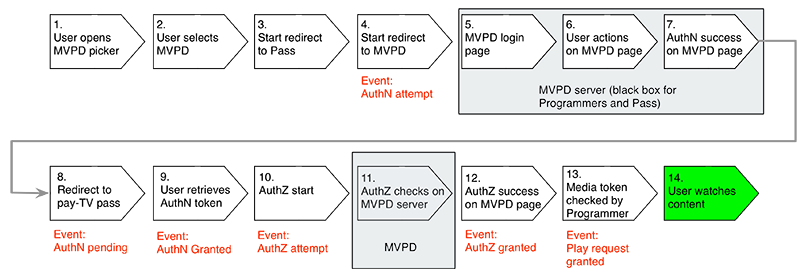

# サーバー側指標について {#understanding-server-side-metrics}

>[!NOTE]
>
>このページのコンテンツは、情報提供の目的でのみ提供されます。 この API を使用するには、Adobeの現在のライセンスが必要です。 不正な使用は許可されていません。

## はじめに {#intro}

このドキュメントでは、Entitlement Service Monitoring(ESM) サービスで生成されるAdobe Primetime認証サーバー側の指標について説明します。 クライアント側の観点から見たのと同じイベント ( ページやアプリケーションにAdobe Analyticsなどの測定サービスを実装する場合、プログラマーには何が表示されるか ) を記述するわけではありません。

## イベントの概要 {#events_summary}

Adobe Primetime認証のサーバー側の観点から、次のイベントが生成されます。

* **認証フローで生成されるイベント**（MVPD を使用した実際のログイン）

   * AuthN の通知 — ユーザーが MVPD ログインサイトに送信されたときに生成されます。
   * AuthN の通知が保留中 — ユーザーが MVPD でのログインに成功した場合、ユーザーが Primetime 認証にリダイレクトされると生成されます。
   * AuthN 付与の通知 — ユーザーがプログラマーのサイトに戻り、Primetime 認証から認証トークンを正常に取得したときに生成されます。
* **認証フロー** （MVPD による認証のチェックのみ）\
  *前提条件：* 有効な AuthN トークン
   * AuthZ 試行の通知
   * AuthZ の通知が付与されました
* **成功した再生リクエスト**\
  *前提条件：* 有効な AuthN および AuthZ トークン
   * Adobe Primetime認証によるチェックの通知
   * 再生リクエストには、付与された認証と付与された認証の両方が必要です

個別ユーザー数の詳細については、 [個別ユーザー数](#unique-users) 」の節を参照してください。 概要として、付与された認証と承認の応答は通常キャッシュされるので、通常、次の式が適用されます。

* AuthN 試行回数\> 許可された AuthN の数
* AuthZ の試行数\> 許可された AuthZ の数
* AuthZ の試行数\> 許可された AuthN の数（通常は）
* 成功した再生リクエストの数\> 付与された AuthZ の数

### 例 {#example}

次の例は、1 つのブランドの 1 ヶ月間のサーバー側指標を示しています。

| 指標 | MVPD 1 | MVPD 2 | … | MVPD n | 合計 |
| -------------------------- | ------ | ------ | - | ------ | ---------------------------------------------- |
| 認証成功 | 1125 | 2892 |   | 2203 | SUM(MVP1+...MVPD n) |
| 認証が成功しました | 2527 | 5603 |   | 5904 | SUM(MVP1+...MVPD n) |
| 成功した再生リクエスト | 4201 | 10518 |   | 10737 | SUM(MVP1+...MVPD n) |
| 個別ユーザー数 | 1375 | 2400 |   | 2890 | 重複を排除したすべての MVPD のすべてのユーザーの合計\* |
| 試行された認証 | 2147 | 3887 |   | 3108 | SUM(MVP1+...MVPD n) |
| 試行された認証 | 2889 | 6139 |   | 6039 | SUM(MVP1+...MVPD n) |

 

この場合の重複除外は、異なる MVPD ユーザーが同じユーザー ID を受け取らないので、影響を受けません。 2 つの異なるブランドに対して合計を行う場合、同じ MVPD に対して重複除外効果ははるかに大きくなります。

## イベントトリガー {#event_triggers}

### 新規ユーザー — フルフロー {#new-user-full-flow}

次の表に、認証トークンのないユーザー（新しいユーザーまたは認証トークンの有効期限が切れたユーザー）のイベントと手順を示します。

このフローでは、認証 (#5から\#7) と認証 (\#11) の両方に対して MVPDs への往復が含まれます。

フローが完了すると、認証および認証トークンがユーザーのデバイス上にキャッシュされます。 認証トークンの有効期間 (TTL) の値は 6 時間～90 日です。 AuthN トークンの有効期限は、AuthZ トークンの有効期限を自動的に強制します。 認証トークンの TTL 値は、通常 24 時間です。

| サーバー側イベントがトリガーされました | <ul><li>認証の試行、認証を保留中、認証を許可</li><li>認証の試行、許可</li><li>成功した再生リクエスト</li></ul> |
|---|---|

### ユーザーを返す — AuthZ と AuthN トークンがキャッシュされました

有効な AuthZ および AuthN トークンをキャッシュしているユーザーの場合は、次の手順が実行されます。

これは、 `getAuthorization()`を使用し、Adobe Primetime認証でのみ確認します。 MVPD はこのフローに関与していません。

| サーバー側イベントがトリガーされました | *再生リクエストが成功しました |
|---|---|

### ユーザーを返す — AuthN トークンがキャッシュされ、AuthZ トークンが期限切れです

有効な AuthN トークンを持つユーザーの場合は、次の手順が実行されます。

このフローは、MVPD への往復を含みます。

| サーバー側イベントがトリガーされました | <ul><li>認証の試行、認証 OK</li><li>成功した再生リクエスト</li> |
|---|---|

## 認証イベント {#authn_events}

### 認証の試行 {#authentication-attempt}

上の図に示すように、認証イベントは、ユーザーが MVPD へのラウンドトリップを行った場合にのみトリガーされます。認証イベントには、キャッシュされたトークン認証は含まれません。

認証の試行イベントは、ユーザーがピッカーから特定の MVPD をクリックした後にトリガーされます。

* これに近い MVPD 側の最初のイベントは、ページの読み込みです。
* Adobe Primetime認証は、MVPD ページにログインするためのユーザーによる繰り返しの試行をカウントしません（パスワードが正しくありません。もう一度試してください）。
* 複数回の試行は 1 回の試行としてカウントされます
* 一部の MVPD は認証ステップで認証を実行し、認証が失敗した場合にユーザーがリダイレクトされません。

### 認証待ち {#authentication-pending}

このイベントは、Adobe Primetime認証へのリダイレクトプロセスが開始したときに発生します。

### 認証が許可されました {#authentication-granted}

ユーザーは MVPD の既知の購読者で、通常は有料テレビの購読を持っていますが、インターネットにのみアクセスできる場合もあります。 ユーザーが MVPD で有効な資格情報を明示的に入力したか、以前に有効な資格情報を入力し、「私を記憶する」チェックをオンにした（かつ前のセッションが期限切れでなかった）ために、認証が成功する場合があります。

したがって、MVPD はAdobe Primetime認証リクエストに対して肯定的な応答を送信し、Adobe Primetime認証は *AuthN トークン*.

* 認証は、通常、長期間（1 ヶ月以上）キャッシュされます。 このため、トークンの期限が切れてフローが再び開始されるまで、認証イベントは存在しなくなります。
* シングルサインオン経由で別のサイト/アプリから入力すると、認証イベントはトリガーされません。

### Comcast 認証 {#comcast-authentication}

Comcast の AuthN フローは他の MVPD とは異なります。

次の機能は、違いを説明します。

* **セッション cookie の動作**：ユーザーがブラウザーを閉じた後、認証トークンが完全に削除されます。 この機能は Web 上にのみ存在します。 主な目的は、安全でない/共有されているコンピューター上で Comcast セッションが持続しないようにすることです。 影響は、残りの MVPD よりも多くの認証試行/付与されたフローが存在することです。

* **requestorID ごとの AuthN**:Comcast では、要求元 ID 間で AuthN 状態をキャッシュできません。 このため、各サイト/アプリは認証トークンを取得するために Comcast に移動する必要があります。 ユーザーエクスペリエンスに関する考慮事項の前に、上記のように、より多くの認証試行/付与されたイベントが生成されるという影響があります。

* **パッシブ認証**：ユーザーエクスペリエンスを向上させながら、requestorID 機能ごとの AuthN を維持するために、非表示の iFrame ではパッシブ認証フローが発生します。 ユーザーには何も表示されませんが、イベントは以前と同様にトリガーされます。

ユーザーが Comcast ログインページで「このページを記憶する」をクリックした場合、その後のこのページへの訪問（2 週間以内）は、すぐにリダイレクトされます。 そうしないと、ユーザーは実際にページで認証する必要があります。

### 認証失敗 {#unsuccessful-authentication}

認証に失敗した場合、Adobe Primetime認証ではイベント自体ではありませんが、試行と成功の違いとして計算できます。

2013 年 5 月のリリースで、Adobe Primetime認証により、システムまたはネットワークのエラーが原因で認証が失敗した場合のエラーコード (DRM エラー（トークンのバインディングに失敗）や LSO エラー（トークンを書き込むためのスペースがないなど）が追加されます。

### 認証コンバージョン率 {#authenitication-conversion-rate}

プログラマーが追跡できる興味深い指標の 1 つは、（AuthN リクエスト/AuthN 付与済み）%として計算された認証コンバージョン率です。

指標に関する注意事項を次に示します。

* これはイベントベースの指標なので、実際にはユニークユーザーのコンバージョン率を反映しているわけではありません。ユーザーが 8 回試みて 9 回目に成功した場合、これは上記のコンバージョン率で非常に正しく反映されません。
* （サーバー側の）Adobe Primetime認証では、一意のベースの認証変換を計算する方法は（まだ）ありません。
* サイト/アプリに自動 AuthN 再試行が存在する場合は、上記の指標にもゆがみが生じます。

## 認証イベント {#authorization_events}

### 認証試行 {#authorization_attempt}

ユーザーは、認証トークンの取得に加えて、コンテンツを再生する前に認証トークンを取得する必要があります。 これは通常、認証後、または認証トークンの有効期限が切れた場合に発生します。 このチェックは、(Adobe Primetime認証サーバーから MVPD サーバーに至るまで ) サーバー側でおこなわれるので、ユーザーは何もする必要はありません。

### 許可済み {#authorization-granted}

「許可された認証」は、認証済みユーザーのサブスクリプションに、要求されたプログラミングが含まれていることを示します。

すべての MVPD が個別の認証ステップをサポートしているわけではありません。一部の認証では、認証が認証と同じになっています。 MVPD はAdobe Primetime認証に対して backchannel AuthZ リクエストへの成功した応答を送信し、Adobe Primetime認証は AuthZ トークンを作成します。

* AuthZ トークンは一定期間キャッシュされます。通常は 24 時間です。この期間中は AuthZ イベントは発生しません。
* 一部の MVPD はアセットレベルの認証で機能し、それ以外はチャネルレベルの認証で機能します。どの認証が使用されているかに応じて、AuthZ イベントが発生する回数も少なくなります。 チャネルレベルの認証でも、キャッシュは実行されているので、24 時間以内に同じアセットがリクエストされた場合、イベントは発生しません。

### 認証が拒否されました {#authorization-denied}

認証が拒否された場合、認証済みユーザは、要求されたプログラミングに対する確認済みの購読を持っていません。 最も可能性の高い原因は、チャネルがユーザーのサブスクリプションパッケージに含まれていないことですが、これは、MVPD からのインターネットアクセスのみを持つユーザーを反映している場合もあります。

一部の MVPD では、MVPD からのインターネットサブスクリプション（有料 TV サブスクリプションなし）しか持っていない場合でも、ユーザーが正常に認証されます。 この場合、ユーザーが認証を要求するチャネルがベースパッケージ内にある場合でも、認証は拒否されます。

一部の MVPD は、パッケージをアップグレードするオファーを含む AuthZ 拒否用のカスタムエラーメッセージを提供します。

### 認証コンバージョン率 {#authorization-conversion-rate}

認証の変換率は（AuthZ リクエスト/AuthZ 付与）%として計算できます。

### 成功した再生リクエスト {#successful-play-request}

認証済みと認証済みの両方を持つユーザーには、保護されたコンテンツの表示が許可されています。

再生リクエストが成功すると、Adobe Primetime認証によって、要求されたビデオを視聴する権利があることを主張する、短時間有効なメディアトークンが生成されます。 プログラマーは、見込み客のさらなる検証に、このメディアトークンを使用します。 メディアトークンは、再生リクエストの成功として追跡されます。

* Adobe Primetime認証 *not* メディアトークンの生成後にビデオの再生が実際に開始されたかどうかを追跡します。 例えば、コンテンツに地域制限がある場合、ストリームが実際に開始しなくても、トランザクションは成功した再生リクエストとしてカウントされます。
* AuthN および AuthZ トークンは一定期間 MVPD 応答をキャッシュするので、成功した再生リクエストイベントは指標で最も頻繁に発生するイベントです。

## 個別ユーザー数 {#unique-users}

### 定義 {#definition}

認証が成功すると、Adobe Primetime認証は返された MVPD User ID 値に基づいて一意のユーザーの存在を追跡します。  この値は、ユーザーのログイン情報に基づきますが、パーソナライズ可能に識別可能な情報は含まれません。

この値は、 sendTrackingData コールバックでサイトまたはアプリにも渡されます。

この値は、デバイス（MVPD がログインの発生場所に関係なく、特定のユーザーに対して同じ値を生成します）または一時的な（ログインごとに）新しい値が生成され、MVPD がバックエンドにマッピングされます。 通常、MVPDs からAdobe Primetime認証に提供される値は、セッションやデバイスをまたいで永続的ですが、永続性は保証も検証もされません。

この値は、個別ユーザー数を計算する方法として使用されます。 報告された値（要求元 ID/要求元 ID/間隔/MVPD ごと）は、特定の間隔で重複排除されます。 したがって、1 日あたりのユニークユーザー数の合計は通常、月別の値とは異なります。月別の値の値は小さくなります。

この数には、Adobe Primetime認証からのすべてのイベントが含まれ、（ユーザー ID を持たない）認証の試行を引いたものの、試行された（場合によっては失敗した）認証も含まれます。

### 例 {#examples}

#### 1 日目 {#day1}

ユーザー XYZ はサイトに移動してビデオを視聴します。

発生したイベント：

* AuthN を試行しました（一意のユーザーがまだありません）
* AuthN が付与されました
   * この時点で、MVPD が返す内容に基づいてユーザーを一意に識別するので、日別ユニークユーザー数が 1 ずつ増えます
   * AuthN トークンが 30 日間キャッシュされます
* AuthZ の試行/イベントの付与
   * 1 日間キャッシュされた AuthZ トークン
* 成功した再生リクエストイベント

#### 1 日目（後日） {#day1-later-on}

ユーザ XYZ が別のビデオを視聴する。

発生したイベント：

* 再生リクエストイベントが成功しました（残りはキャッシュされます）
* 日別または月別のユニーク数は増加しない

#### 3 日目 {#day3}

ユーザ XYZ が別のビデオを視聴する。

発生したイベント：

* AuthZ の試行/イベントの付与
   * 1 日目の 1 日間のキャッシュが期限切れになりました
* 再生リクエストイベントが成功しました（残りはキャッシュされます）
* 日別ユニークユーザー数が 1 増加 — 月別ユニーク訪問者数は 1 増

#### 31 日目 {#day31}

ユーザ XYZ が別のビデオを視聴する。

AuthN キャッシュが期限切れになったので、1 日目と同じです。

同じユーザーが認証に失敗した場合でも、月別ユニークユーザー数は 1 ずつ増加します。これは、ユーザー ID を含む 2 つのイベント（認証が許可され、認証が試行される）があるからです。

### シングルサインオン (SSO) {#single-sign-on-sso}

場合によっては、ユニークユーザーの数が、成功した認証の数より多くなることがあります。 これは、通常、他のサイトやアプリから多くのユーザーが SSO 経由で入ってきて、現在のサイトやアプリでの認証を取得するだけで済む場合に発生します。

### クライアント側とサーバー側の個別ユーザーの比較 {#comparing-client-side-and-server-side-unique-users}

ユーザー ID の値が `sendTrackingData()` がクライアント側で使用されて個別ユーザーがカウントされます。その場合は、クライアント側とサーバー側の数値が一致する必要があります。

違いが大きい場合は、通常、次の理由で違いが考慮されます。

* ビデオ再生のユニーク訪問者数とすべてのイベントのユニーク訪問者数。 既に述べたように、Adobe Primetime認証では、AuthN の試行を除くすべてのイベントで一意のユーザーがカウントされます。 つまり、ユーザーが（ページ上で）認証しただけでビデオを表示しない場合でも、個別ユーザー数の増加がトリガーされます。

* 認証に失敗したユーザーのカウント — Adobe Primetime認証では、これらのユーザーもレポートされた数でカウントされます。

<!--
## Related Information {#related-information}

- [Entitlement Service Monitoring API](/help/authentication/entitlement-service-monitoring-api.md)

-->
