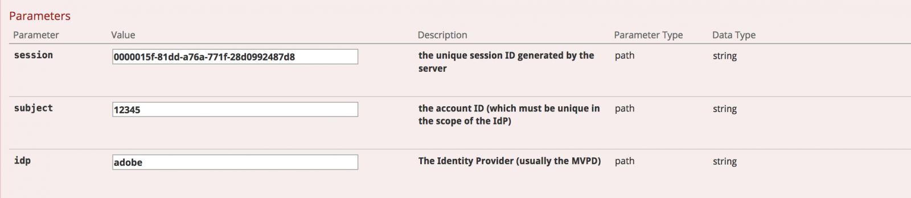

# API の概要 {#api-overview}

次を表示： [オンライン API ドキュメント](http://docs.adobeptime.io/cm-api-v2/) を参照してください。

## 目的と前提条件 {#purpose-prerequisites}

このドキュメントは、アプリケーション開発者が同時実行監視との統合を実装する際に、Swagger API の仕様を使用する際に役立ちます。 このガイドラインに従う前に、読者がサービスで定義された概念に関する以前の理解を持っていることを強くお勧めします。 この理解を得るには、 [製品ドキュメント](/help/concurrency-monitoring/cm-home.md) そして [Swagger API の仕様](http://docs.adobeptime.io/cm-api-v2/).

## はじめに {#api-overview-intro}

開発プロセス中は、Swagger パブリックドキュメントに、API フローの理解とテストに関する参照ガイドラインが示されています。 実際のアプローチを取り入れ、ユーザーの操作の様々なシナリオでの実際のアプリケーションの動作方法に慣れるには、まずこの方法をお勧めします。

次でチケットを送信： [Zendesk](mailto:tve-support@adobe.com) をクリックして、同時実行監視に会社とアプリケーションを登録します。 Adobeは、各エンティティにアプリケーション ID を割り当てます。 このガイドでは、ID を持つ 2 つの参照アプリケーションを使用します **demo-app** および **demo-app-2** これはテナントAdobeの下に

## 使用例 {#api-use-case}

Swagger を使用してフローをテストする最初の手順は、次のようにページの右上にアプリケーション ID を入力することです。

この後、次を押します。 **参照** を使用して、REST API に対するすべての呼び出しで Authorization ヘッダーで使用される id を設定します。  すべての API 呼び出しでは、アプリケーション ID が HTTP 基本認証を介して渡されることを想定しています。 ユーザー名はアプリケーション ID で、パスワードは空です。

### 最初のアプリ {#first-app-use-cases}

ID を持つアプリケーション **demo-app** は、Adobeチームによって、同時ストリームの数を 3 に制限する 1 つのルールを持つポリシーに割り当てられました。 ポリシーは、Zendesk で送信されたリクエストに基づいて特定のアプリケーションに割り当てられます。

#### メタデータの取得 {#retrieve-metadata-use-case}

最初に呼び出すのは、セッションの初期化中にフォームデータとして渡す必要があるメタデータ属性のリストを取得するための、Metadata リソースのためです。 このメタデータは、このアプリケーションに割り当てられたポリシーを評価するために使用されます。

「Try it out」を押した後、ID を持つアプリケーション **demo-app** 次の結果が得られます。

応答本文フィールドで確認できるように、メタデータ属性のリストは空です。 つまり、設計に必要な属性は、このアプリケーションに割り当てられた 3 つのストリームポリシーを評価するのに十分です。 関連トピック： [標準メタデータフィールドドキュメント](/help/concurrency-monitoring/standard-metadata-attributes.md). この呼び出しの後、 Sessions REST リソースで新しいセッションを作成できます。

#### セッションの初期化 {#session-initial}

セッション初期化呼び出しは、実行に必要なすべての情報を取得した後、アプリケーションによって実行されます。

最初の呼び出しで終了コードを指定する必要はありません。他のアクティブなストリームが存在しないためです。 メタデータの取得の呼び出しから何も返されなかったので、メタデータ属性はありません。

The **件名** そして **idp** パラメーターは必須です。これらは URI パス変数として指定されます。 以下を実行すると、 **件名** および **idp** パラメーターを指定するために、 **mvpd** および **upstreamUserID** Adobe Primetime Authentication のメタデータフィールド。 関連トピック： [メタデータ API の概要](https://experienceleague.adobe.com/docs/primetime/authentication/auth-features/user-metadat/user-metadata-feature.html?lang=en#). この例では、値「12345」を件名として、「adobe」を idp として指定します。

セッション初期化呼び出しを実行します。 次の応答が返されます。

必要なデータはすべて、応答ヘッダーに含まれています。 The **場所** ヘッダーは、新しく作成されたセッションの id と **日付** および **有効期限** ヘッダーは、セッションを有効に保つために、次のハートビートを作成するようにアプリケーションをスケジュールするために使用される値を表します。

#### ハートビート {#heartbeat}

ハートビート呼び出しをおこないます。 次を提供： **セッション id** は、セッション初期化呼び出しで取得され、 **件名** および **idp** 使用されるパラメーター。

セッションがまだ有効な場合（期限切れでない、または手動で削除された場合）は、成功した結果が返されます。

最初の例では、 **日付** および **有効期限** ヘッダーを使用して、この特定のセッションで別のハートビートをスケジュールします。 セッションが無効になった場合、この呼び出しは 410 GONE HTTP Status コードで失敗します。

Swagger UI の「Keep the stream alive」オプションを使用すると、特定のセッションで自動ハートビートを実行できます。これにより、タイムリーなセッションハートビートの実行に必要な定型句を気にすることなく、ルールをテストできます。 このボタンは、「Swagger ハートビート」タブの「試す」ボタンと並んで配置されます。 作成したすべてのセッションに対して自動ハートビートを設定するには、各セッションを Web ブラウザータブで開く別の Swagger UI でスケジュールする必要があります。

#### セッションの終了 {#session-termination}

例えば、ユーザーがビデオの視聴を停止した場合に、同時実行監視を使用して特定のセッションを終了する必要が生じる場合があります。 これは、Sessions リソースに対してDELETE呼び出しを行うことで実行できます。

呼び出しには、セッションハートビートと同じパラメーターを使用します。 応答 HTTP ステータスコードは次のとおりです。

* 202 成功応答の許可
* セッションが既に停止している場合は 410 GONE になります。

#### ポリシーの破損 {#breaking-policy-app-first}

割り当てられた 3 つのストリームポリシーが壊れた場合のアプリケーションの動作をシミュレートするには、セッション初期化を 3 回呼び出す必要があります。 ポリシーを有効にするには、ハートビートがないので、セッションの 1 つが期限切れになる前に、呼び出しをおこなう必要があります。 これらの呼び出しはすべて成功したことがわかりますが、4 番目の呼び出しをおこなった場合は、次のエラーで失敗します。

409 CONFLICT 応答と、ペイロード内の評価結果オブジェクトが返されます。 評価結果の完全な説明を [Swagger API の仕様](http://docs.adobeptime.io/cm-api-v2/#evaluation-result).

アプリケーションは、評価結果の情報を使用して、ビデオの停止時に特定のメッセージをユーザに表示し、必要に応じて更なる対応を行うことができます。 1 つは、新しいストリームを開始するために、他の既存のストリームを停止する場合です。 これは、 **terminationCode** に存在する値 **競合** フィールドに含まれる値を指定します。 この値は、新しいセッション初期化の呼び出しで X-Terminate HTTP ヘッダーとして提供されます。

セッションの初期化時に 1 つ以上のターミネーションコードを指定すると、呼び出しが成功し、新しいセッションが生成されます。 次に、リモートで停止したセッションの 1 つでハートビートを行うと、410 GONE 応答が返されます。評価結果のペイロードは、セッションがリモートで終了したことを示します。例：

### 2 つ目のアプリケーション {#second-application}

使用するもう 1 つのサンプルアプリケーションは、ID を持つアプリケーションです **demo-app-2**. このポリシーには、1 つのチャネルで使用できるストリームの数を最大 2 に制限する 1 つのルールが割り当てられています。   このポリシーを評価するには、channel 変数を指定する必要があります。

#### メタデータの取得 {#retrieving-metadata}

ページの右上隅に新しいアプリケーション ID を設定し、メタデータリソースを呼び出します。 次の応答が返されます。

今回は、最初のアプリケーションの例のように、応答本文が空のリストではなくなりました。 次に、同時実行監視サービスが、応答本文に **チャネル** ポリシーを評価するには、セッションの初期化時にメタデータが必要です。

の値を指定せずにを呼び出した場合、 **チャネル** パラメーターを使用すると、次の値が取得されます。

* 応答コード — 400 BAD REQUEST
* 応答本文 — **債務** フィールドに示す値。操作を正常に実行するために、セッション初期化のリクエストで期待される値。

#### セッションの初期化 {#session-init}

次に示すように、必要なメタデータキーに値を割り当て、セッション初期化リクエストの form パラメーターとして設定します。

これで呼び出しが成功し、新しいセッションが生成されます。

#### ポリシーの破損 {#breaking-policy-second-app}

このアプリケーションに割り当てられたポリシー内のルールを破るには、同じチャネル値で 2 回の呼び出しをおこなう必要があります。 最初の例と同様に、生成された最初のセッションが有効な間に、2 回目の呼び出しを実行する必要があります。

新しいセッションを作成するたびにチャネルメタデータに異なる値を使用する場合、2 のしきい値は各値に個別にスコープされるので、すべての呼び出しが成功します。

最初の例と同様に、競合するストリームをリモートで停止するために終了コードを使用するか、ハートビートが操作されないと仮定して、ストリームの 1 つが期限切れになるのを待つことができます。

