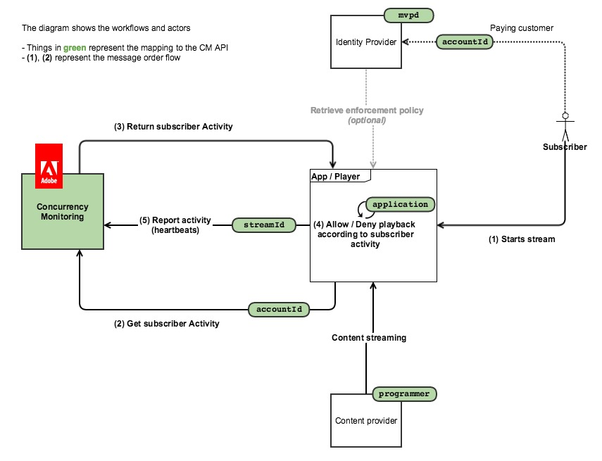

# ポリシー情報ポイント {#pip}

>[!NOTE]
>
>このページは、新しい統合では推奨されなくなった以前のバージョンの API に適用されるので、非推奨（廃止予定）となりました

次の図は、顧客が **ポリシー情報ポイント**（この場合、CM はアクティビティのクエリにのみ使用され、すべてのアクセスロジックがクライアントアプリケーションに埋め込まれます）。

次の図は、2 台のデバイスからのコンテンツを視聴するユーザーに対して、ストリームカウントがどのように機能するかを示しています。

要約すると、通常のメッセージフローは次のようになります。

1. 最初に、サービスを使用したことのないユーザーに対して、Web ページが読み込まれるか、アプリケーションが開き、同時実行監視サービスが実装したアプリケーションでセッション初期化呼び出しが実行されます。
1. 同時実行監視サービスは、ハートビートの新しいストリームリソースと、現在のユーザーアクティビティを返します。
1. ビデオの再生中に、実装されたアプリケーションは、同時実行監視サービスに対してハートビート呼び出しをおこない、ユーザーが現在ビデオを消費していることを示します。
1. その他の機能を備えたアプリケーションは、同時実行監視サービスに対してステータスクエリ呼び出しを実行できます。これにより、現在のユーザーアクティビティが返されます。
1. ビデオの再生終了時に、実装されたアプリケーションは、「event=stop」を使用してハートビート呼び出しをおこなうことができます。これは、ビデオが停止したこと、および現在のストリームがアクティブストリームとしてカウントされなくなったことを示します。

