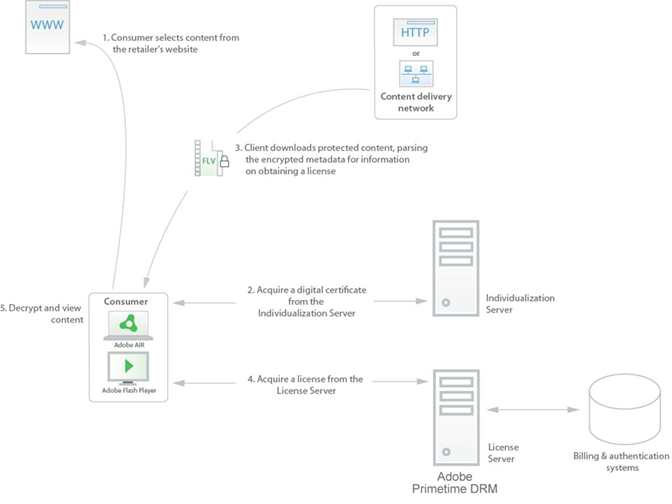

# コンテンツの取得 {#content-acquisition}

消費者が Web サイトまたは CDN から保護されたコンテンツファイルを取得した場合、ビデオを再生する前に、ビデオを復号化するためのキーを含むライセンスを取得する必要があります。 次の手順は、Flash PlayerまたはAdobe AIRを実行しているコンピューターが保護されたコンテンツにアクセスする方法に関する一般的なワークフローを示しています。

1. 消費者が小売業者の Web サイトを訪問し、視聴するビデオを選択します。 コンシューマーは、Flash PlayerまたはAdobe AIRアプリケーションを使用して、保護されたビデオをダウンロードまたはコンピューターにストリーミングしようとします。

   Flash Playerがこの特定のコンピューターを使用して保護されたコンテンツに初めてアクセスする場合は、手順 2 に従って、まずAdobe AIRランタイムまたはコンピューターを個別化する必要があります。 ランタイムクライアントが既に個別化されている場合は、手順 3 に示すように、ライセンスの取得プロセスが実行されます。

1. Flash PlayerまたはAdobe AIRランタイムクライアントが、一意の電子証明書 ( *機械証明書*) をAdobeがホストするサーバーから

   一意の証明書を割り当てるこのプロセスは、と呼ばれます。 *個別化*. 個別化は、コンテンツの再生に使用されるコンピューターとFlash Player、またはAdobe AIRランタイムの両方を一意に識別します。

   個別化プロセスを使用すると、ダウンロードしたライセンスを、クライアントがインストールされている特定のコンピューターに結び付けることができます。 すべてのコンピューターには、固有のコンピューターの資格情報（コンピューターの秘密鍵とコンピューターの証明書）が与えられます。 特定のクライアントが侵害された場合は、そのクライアントを取り消し、新しいコンテンツのライセンス取得を禁止できます。

1. クライアントは、保護されたコンテンツのダウンロードまたは消費者のコンピューターへのストリーミングの開始時に解析し、小売業者のライセンスサーバーの URL を、ファイル内に埋め込まれた DRM メタデータから抽出します。

   通常、DRM メタデータはコンテンツとは別のもので、付属のマニフェストファイルやバイナリ blob に埋め込む場合などがありますが、コンテンツファイル内に埋め込むこともできます。 クライアントは、指定された URL でライセンスサーバにアクセスし、（手順 4 で説明する）ライセンスを取得します。
1. クライアントは、小売業者のライセンスサーバーからライセンスを取得します。

   ライセンスの取得中に、クライアントは要求されたコンテンツ ( *DRM メタデータ*) および（消費者のコンピューターを識別する）マシン証明書を小売業者のライセンスサーバーに送信する場合に使用します。 サーバーに送信されるライセンスリクエストは、トランスポート公開鍵を使用して暗号化されます。この公開鍵は DRM メタデータにも含まれます。

   ライセンスサーバ（小売業者の請求および認証インフラストラクチャに統合できる場合があります）は、ビジネスルールチェックを実行して、要求されたコンテンツを表示する権限がユーザーにあることを確認できます。 ビジネス・ルールが許可する場合、ライセンス・サーバは、コンテンツ暗号化キーを含むライセンスを発行して、そのコンテンツと、そのユーザのアカウントに関連付けられた使用ルールを復号化します。 ライセンス要求を処理するために、License Server は、トランスポート秘密鍵を使用して要求を復号化します。 メタデータ内の CEK は、ライセンスサーバーの秘密鍵を使用して復号化され、再暗号化されて、ライセンスを要求を行うデバイスにバインドします。 ライセンスは、ライセンスサーバーの秘密鍵を使用して署名されます。 ライセンス応答は、トランスポート秘密鍵を使用して署名され、クライアントに返される前に暗号化されます。

   ライセンスで許可されている場合、クライアントはライセンスを保存して有効にします *オフラインアクセス* をライセンスに追加します。 ライセンスキャッシュを使用すると、コンテンツを表示するたびにライセンスを取得することなく、保護されたコンテンツを表示できます。

1. Flash PlayerまたはAdobe AIRランタイムクライアントがライセンスを取得すると、クライアントはライセンスから CEK を抽出し、消費者はアクセスを許可されたコンテンツを表示できます。

   <!---->

   

   前の例は、1 つのワークフローのみを示しています。 または、ライセンスの取得がずっと後でおこなわれる、コンテンツのプロアクティブダウンロードでワークフローを使用することもできます。 もう 1 つのオプションは、コンテンツにアクセスする前にライセンスの獲得がおこなわれる、注文前のワークフローを実装することです。
