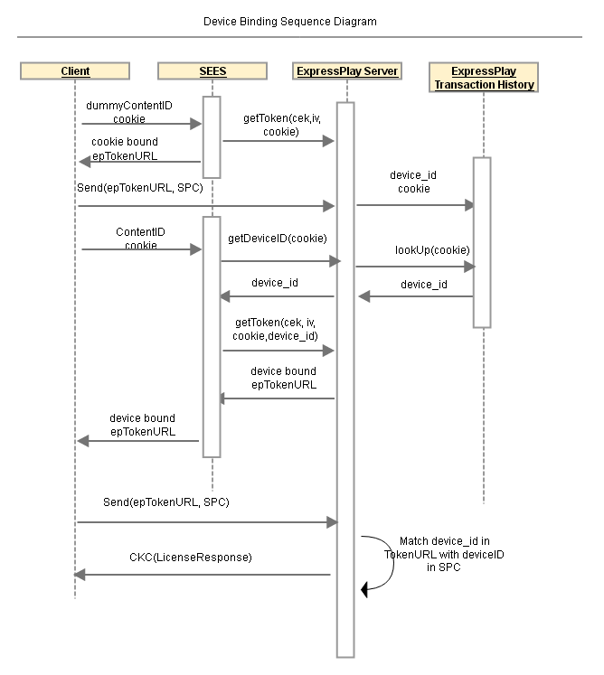

# 参照サービス：デバイスバインディングの使用権限 {#reference-service-device-binding-entitlement}

ExpressPlay を使用してデバイスバインディングのエンタイトルメントサービスを有効にする方法については、 SEES リファレンスサーバーを参照してください。

>[!NOTE]
>
>デバイスバウンドのエンタイトルメントサービスは、時間制限にすることも、レンタル期間を設定することもできます。

をブートストラップするには `device_id` 情報、ダミーの M3U8 コンテンツを再生します。 その後、ExpressPlay トークンに cookie を埋め込み、SPC( `device_id`) をクリックし、 `getToken` を ExpressPlay サーバーに追加します。

このシーケンスは、ダミー M3U8 を再生することから始まります。 Cookie が SEES サーバーに送信され、ExpressPlay トークンの URL が取得されます。 cookie にバインドされた ExpressPlay トークンの URL を受け取ったら、次の手順で SPC を生成し、ExpressPlay サーバーに送信します。 ExpressPlay サーバーは、 `device_id` SPC から、ExpressPlay トークン URL からの Cookie を取得し、Cookie を `device_id` トランザクションログに記録されます。

クライアントは、 SEIES に対して同じ Cookie の送信に対して実際のライセンスリクエストをおこないます。 SEIS では cookie を使用して `device_id` を ExpressPlay サーバーから取得します。

SEES は、デバイスにバインドされた ExpressPlay トークンとタイムバウンドをリクエストし、そのトークンをクライアントに返します。

クライアントが ExpressPlay トークンを使用してライセンスリクエストをおこないます。

ExpressPlay サーバーは、 `device_id` と共に SPC で `device_id` を ExpressPlay トークンに追加します。 ExpressPlay サーバーは、 `device_id` の値が一致します。
