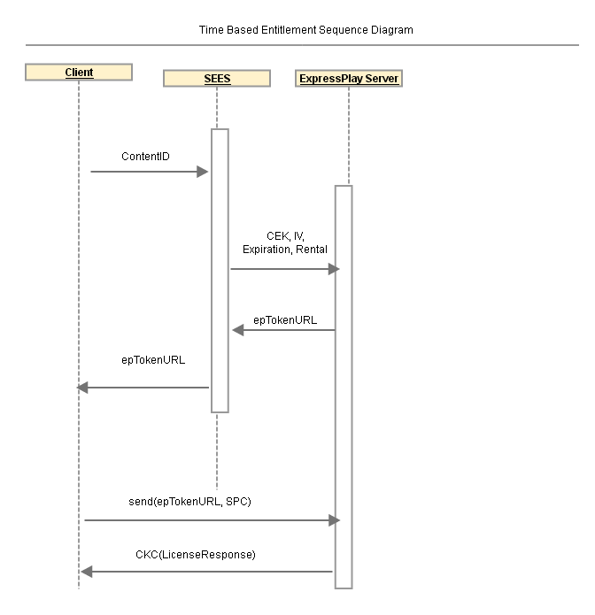

# 参照サービス：時間ベースの使用権限 {#reference-service-time-based-entitlement}

SEES と連携して、ExpressPlay を使用して時間ベースのエンタイトルメントサービスを有効にする方法を確認します。

SEE はクライアントから資格付与リクエスト（パブリック API の節を参照）を受け取ります。 SEES サーバーは、 `contentID`を追加すると、 `expirationTime`、リクエストを ExpressPlay サーバーに転送します。 最終的な ExpressPlay トークンはタイムバインドです。 後述の時間に基づく使用権限のシーケンス図を参照してください。 

**表 1：クライアントから送信されるライセンスパラメータ**

| クエリパラメーター | 説明 | 必須 |
|---|---|---|
| `contentKey` | コンテンツ暗号化キーの 16 バイトの 16 進文字列表現 | はい |
| `iv` | コンテンツ暗号化 IV の 16 バイトの 16 進文字列表現 | はい |
| `rentalDuration` | 秒単位のレンタル期間（デフォルト= 0） | いいえ |

**表 2: SEES サーバーによって追加されたトークン制限パラメータ**

<table id="table_E979FAD7A61A4832A46667301939FAEB">  
 <thead> 
  <tr> 
   <th class="entry"> クエリパラメーター </th> 
   <th class="entry"> 説明 </th> 
   <th class="entry"> 必須？ </th> 
  </tr> 
 </thead>
 <tbody> 
  <tr> 
   <td> expirationTime </td> 
   <td>このトークンの有効期限。 この値は、 <a href="https://www.ietf.org/rfc/rfc3339.txt" format="html" type="external"> RFC 3339</a> 「Z」ゾーン指定子（「ズール時間」）での日付/時刻形式、または前に「+」記号が付いた整数。 RFC 3339 日時の例は次のとおりです。  2006-04-14T12:01:10Z. 
値が RFC 3339 日付/時刻形式の文字列である場合は、トークンの絶対有効期限日時を表します。 値が整数の前に「+」記号が付いた場合、トークンが有効であることを示す相対秒数として解釈されます。 例：  +60 1 分を指定します。 トークンの有効期間の上限（および指定されていない場合のデフォルト）は 30 日です。 「+」記号を指定する場合は、エンコードされた形式「%2B」を使用します。 
 </td> 
   <td> いいえ </td> 
  </tr> 
 </tbody> 
</table>
