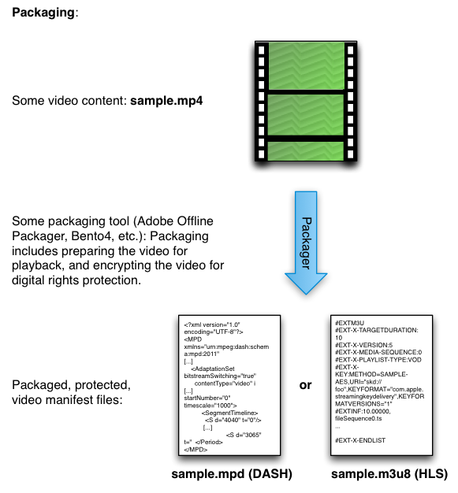

# コンテンツのパッケージ化{#package-your-content}

コンテンツのパッケージ化は、Web上で再生するビデオコンテンツを準備するプロセスです。 パッケージ化には、生のビデオをマニフェストファイルに変換することや、オプションで、デバイスやブラウザーごとに異なるDRMソリューションを使用してコンテンツを暗号化することが含まれます。

コンテンツを準備するには、AdobeのOffline Packagerを使用するか、ExpressPlayのBento4パッケージャーなどの他のツールを使用します。 パッケージャーは、再生するビデオの準備（元のファイルをフラグメント化してマニフェストに含めるなど）と、選択したDRMソリューション（PlayReady、Widevine、FairPlay、Accessなど）でビデオを保護します。:

* [Adobeオフラインパッケージャー](https://helpx.adobe.com/content/dam/help/en/primetime/guides/offline_packager_getting_started.pdf)
* [ExpressPlayパッケージャー](https://www.expressplay.com/developer/packaging-tools/)

<!--<a id="fig_jbn_fw5_xw"></a>-->



1. 設定のテストに使用するコンテンツをパッケージ化するか、取得します。

   パッケージ化に関して覚えておくべき重要なポイントの1つは、このパッケージ化手順で使用するキーID（コンテンツID）が、後続のライセンストークンリクエストで指定する必要のあるものと同じであることです。 キーIDは、CEKを識別する唯一の項目です(CEKは、独自のキー管理データベースに格納することも、[ExpressPlayのキーストレージサービス](https://www.expressplay.com/developer/key-storage/)を使用して格納することもできます)。

   >[!NOTE]
   >
   >Adobeアクセスに詳しい方は、これが各ソリューションの動作方法に関する重要な違いです。 Accessでは、ライセンスキーはDRMメタデータに埋め込まれ、保護されたコンテンツとの間で渡されます。 ここで説明するMulti-DRMシステムでは、実際のライセンスは渡されず、安全に保存され、キーIDを介して取得されます。

<!--<a id="example_52AF76B730174B79B6088280FCDF126D"></a>-->

WidevineにAdobeOffline Packagerを使用したパッケージ化の例を次に示します。 Packagerは設定ファイル（例：[!DNL widevine.xml]）を使用し、次のようになります。

```
<config> 
<in_path>sample.mp4</in_path> 
<out_type>dash</out_type> 
<out_path>dash2</out_path> 
<drm/> 
<drm_sys>widevine</drm_sys> 
<frag_dur>4</frag_dur> 
<target_dur>6</target_dur> 
<key_file_path>keyfile.bin</key_file_path> 
<widevine_content_id>2a</widevine_content_id> 
<widevine_provider>intertrust</widevine_provider> 
<widevine_key_id>7debe705d938c76bfd886f077b8fa5f7</widevine_key_id> 
</config>
```

* `in_path`  — このエントリは、パッケージ化を行うローカルコンピューター上のソースビデオの場所を指します。
* `out_type`  — このエントリでは、パッケージ化された出力のタイプを示します。この場合はDASH（HTML5でのWidevine保護用）です。
* `out_path`  — 出力を送信するローカルマシン上の場所。
* `drm_sys`  — パッケージ化の対象とするDRMソリューション。これは`widevine`、`fairplay`、または`playready`になります。

* `frag_dur` と `target_dur` は、ビデオ再生に関連するDASH固有の期間のエントリです。

* `key_file_path`  — コンテンツ暗号化キー(CEK)の役割を果たすパッケージ化を行ったコンピューター上のライセンスファイルの場所です。Base-64エンコードされた16バイトの16進文字列です。
* `widevine_content_id`  — これはWidevineの「ボイラープレート」です。いつもそう `2a`だ（これを`widevine_key_id`と混同しないでください）。

* `widevine_provider`  — 当社の目的では、常に「」に設定してくだ `intertrust`さい。

* `widevine_key_id`  — これは、 `key_file_path` エントリで指定したライセンスの識別子です。つまり、コンテンツの暗号化に使用するキーを識別します。 このIDは、自分で作成する16バイトの16進文字列です。

[Packagerドキュメント](https://helpx.adobe.com/content/dam/help/en/primetime/guides/offline_packager_getting_started.pdf)に記載されているように、「ベストプラクティスとして、出力の生成に使用する一般的なオプションを含む設定ファイルを作成します。 次に、コマンドライン引数として特定のオプションを指定して、出力を作成します。」 この場合、設定ファイルは完全に完成しているので、次のように出力を作成できます。

```
java -jar OfflinePackager.jar -conf_path widevine.xml -out_path test_dash/ 
```

>[!NOTE]
>
>コマンドラインパラメータは、設定ファイルのパラメータよりも優先されます。 この例では、必要なものはすべてconfigファイルに含まれていますが、設定ファイルで指定された出力パスより`-out_path test_dash/`が優先されます。

