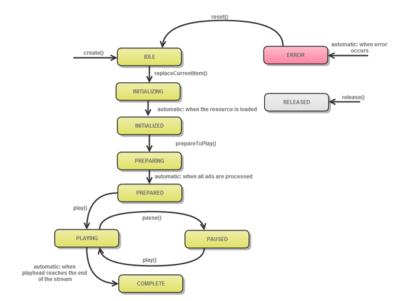

# MediaPlayerオブジェクトのライフサイクル{#mediaplayer-object-lifecycle}

MediaPlayerインスタンスを作成した瞬間から終了（再利用または削除）した瞬間まで、このインスタンスは状態間の一連のトランジションを完了します。

一部の操作は、プレイヤーが特定の状態にある場合にのみ許可されます。 例えば、`IDLE`で`play`を呼び出すことはできません。 このステータスは、プレイヤーが`PREPARED`状態に達した後にのみ呼び出すことができます。

ステータスを操作するには：

* `MediaPlayer.getStatus`を使用して、`MediaPlayer`オブジェクトの現在の状態を取得できます。

   ```java
   PlayerState getStatus() throws IllegalStateException;
   ```

* 状態のリストは`MediaPlayer.PlayerState`で定義されています。

`MediaPlayer`インスタンスのライフサイクルの状態トランジション図：
<!--<a id="fig_1C55DE3F186F4B36AFFDCDE90379534C"></a>-->



次の表に、その他の詳細を示します。

<table id="table_426F0093E4214EA88CD72A7796B58DFD"> 
 <thead> 
  <tr> 
   <th colname="col1" class="entry"> MediaPlayer.PlayerState </th> 
   <th colname="col2" class="entry"> 発生するのは </th> 
  </tr> 
 </thead>
 <tbody> 
  <tr> 
   <td colname="col1"> <span class="codeph"> IDLE  </span> </td> 
   <td colname="col2"> <p>アプリケーションが、<span class="codeph"> DefaultMediaPlayer.create </span>を呼び出して新しいメディアプレイヤーを要求しました。 新しく作成されたプレイヤーは、ユーザーがメディアプレイヤーアイテムを指定するのを待っています。 これは、メディアプレイヤーの初期状態です。 </p> </td> 
  </tr> 
  <tr> 
   <td colname="col1"> <span class="codeph"> 初期化中  </span> </td> 
   <td colname="col2"> <p>アプリケーション名が<span class="codeph"> MediaPlayer.replaceCurrentItem </span>で、メディアプレイヤーが読み込まれています。 </p> </td> 
  </tr> 
  <tr> 
   <td colname="col1"> <span class="codeph"> INITIALIZED  </span> </td> 
   <td colname="col2"> <p>TVSDKは、メディアプレイヤーアイテムを正常に設定しました。 </p> </td> 
  </tr> 
  <tr> 
   <td colname="col1"> <span class="codeph"> 準備中  </span> </td> 
   <td colname="col2"> <p>アプリケーションの名前は<span class="codeph"> MediaPlayer.prepareToPlay </span>です。 メディアプレイヤーは、メディアプレイヤーアイテムと関連付けられたリソースを読み込んでいます。 </p> <p>ヒント： メインメディアのバッファリングが発生する場合があります。 </p> <p>TVSDKは、メディアストリームを準備中で、広告解決と広告挿入を実行しようとしています（有効な場合）。 </p> <p>ヒント： 開始時間をゼロ以外の値に設定するには、<span class="codeph"> prepareToPlay(startTime) </span>を呼び出し、時間をミリ秒単位で指定します。 </p> </td> 
  </tr> 
  <tr> 
   <td colname="col1"> <span class="codeph"> PREPARED  </span> </td> 
   <td colname="col2"> <p>コンテンツが準備され、広告がタイムラインに挿入されているか、広告手順が失敗しています。 バッファリングまたは再生が開始できます。 </p> </td> 
  </tr> 
  <tr> 
   <td colname="col1"> <span class="codeph"> 再生中  </span> </td> 
   <td colname="col2"> <p>アプリケーションが<span class="codeph"> play </span>を呼び出したので、TVSDKはビデオを再生しようとしています。 ビデオが実際に再生される前に、バッファリングが発生する場合があります。 </p> </td> 
  </tr> 
  <tr> 
   <td colname="col1"> <span class="codeph"> PAUSED  </span> </td> 
   <td colname="col2"> <p>アプリケーションがメディアを再生および一時停止すると、メディアプレイヤーはこの状態とPLAYINGの間を移動します。 </p> </td> 
  </tr> 
  <tr> 
   <td colname="col1"> <span class="codeph"> 休止  </span> </td> 
   <td colname="col2"> <p>アプリケーションが再生から離れたり、デバイスをシャットダウンしたり、プレイヤーが再生中または一時停止中にアプリケーションを切り替えたりしました。 メディアプレイヤーが中断され、リソースが解放されました。 続行するには、メディアプレイヤーを復元します。 </p> </td> 
  </tr> 
  <tr> 
   <td colname="col1"> <span class="codeph"> 完了  </span> </td> 
   <td colname="col2"> <p>プレイヤーがストリームの終わりに到達し、再生が停止しました。 </p> </td> 
  </tr> 
  <tr> 
   <td colname="col1"> <span class="codeph"> RELEASED  </span> </td> 
   <td colname="col2"> <p>アプリケーションがメディアプレイヤーをリリースし、関連付けられているリソースもすべて解放します。 このインスタンスは使用できなくなります </p> </td> 
  </tr> 
  <tr> 
   <td colname="col1"> <span class="codeph"> ERROR  </span> </td> 
   <td colname="col2"> <p>プロセス中にエラーが発生しました。 また、エラーは、アプリケーションが次に実行できる操作に影響する可能性があります。 </p> </td> 
  </tr> 
 </tbody> 
</table>

>[!TIP]
>
>この状態を使用して、プロセスに対するフィードバック（例えば、次の状態の変更を待つ間のスピナー）を提供したり、次のメソッドを呼び出す前に適切な状態を待つなど、メディアを再生する次の手順を実行したりできます。

例：

```java
@Override 
public void onStateChanged(MediaPlayer.PlayerState state,  
                           MediaPlayerNotification notification) { 
   switch (state) { 
      // It is recommended that you call prepareToPlay() after receiving  
      // the INITIALIZED state. 
      case INITIALIZED: 
         _mediaPlayer.prepareToPlay(); 
         break; 
      case PREPARING: 
         showBufferingSpinner(); 
         break; 
      case PREPARED: 
         hideBufferingSpinner(); 
      ..... 
    } 
}
```

