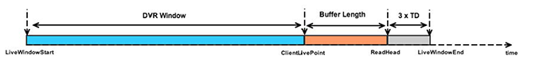

# DVR用に拡張されたコントロールバーの作成{#construct-a-control-bar-enhanced-for-dvr}

VODおよびライブストリーミング用のDVRサポートを備えたコントロールバーを実装できます。 DVRのサポートには、シーク可能な時間枠の概念や、クライアントのライブポイントが含まれます。

* VODの場合、シーク可能な時間の長さは、アセット全体の長さになります。
* ライブストリーミングの場合、DVR（シーク可能な）時間の長さは、ライブ再生時間の開始からクライアントライブポイントの終了までの時間範囲として定義されます。

   クライアントのライブポイントは、バッファされた長さをライブ時間の終わりから引いて計算されます。 ターゲットの期間は、マニフェスト内のフラグメントの最大期間以上の値です。

   デフォルト値は10000 msです。

   ライブ再生用のコントロールバーは、再生を開始する際に、クライアントのライブポイントにサムを最初に配置し、シーク不能な領域をマークする領域を表示することで、DVRをサポートします。

<!--<a id="fig_37A39A28BA714BA5A2C461357ED5BD41"></a>-->

{width=&quot;684&quot;}

1. DVRをサポートするコントロールバーを実装するには、シークスクラブバーを表示する手順に従います。ただし、若干の違いがあります。

   * 再生範囲ではなく、シーク可能な範囲に対してのみマップされるコントロールバーを実装できます。 シーク可能な範囲でユーザーが操作した場合、安全と見なすことができます。
   * 再生範囲にマップされるが、シーク可能な範囲も表示するコントロールバーを実装できます。

      コントロールバーの場合：
   1. 再生範囲を表すコントロールバー追加へのオーバーレイ。
   1. ユーザーがシークする開始がある場合、`MediaPlayer.seekableRange`プロパティを使用して、目的のシーク位置がシーク可能な範囲内にあるかどうかを確認します。

      例：

      ```
      var desiredPosition:Number = // TODO : choose a value 
      
      private function onStatusChange(event:MediaPlayerStatusChangeEvent):void { 
          switch(event.status) { 
              case MediaPlayerStatus.PREPARED: 
                  _mediaPlayer.prepareToPlay(desiredPosition); 
          } 
      }
      ```

      `MediaPlayer.LIVE_POINT`定数を使用して、クライアントライブポイントにシークすることもできます。

      ```
      private function onSeekToLiveClick(event:MouseEvent):void { 
          _player.seek(DefaultMediaPlayer.LIVE_POINT); 
      }
      ```


