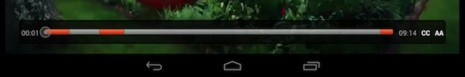

# ビデオの長さ、現在時間および残り時間を表示 {#display-the-duration-current-time-and-remaining-time-of-the-video}

TVSDK を使用して、メディア内でのプレーヤーの位置に関する情報を取得し、シークバーに表示することができます。

1. プレーヤーが少なくとも PREPARED 状態になるのを待ちます。
1. を使用して、現在の再生ヘッド時間を取得します。 `MediaPlayer.getCurrentTime` メソッド。

   仮想タイムライン上の現在の再生ヘッドの位置をミリ秒単位で返します。 時間は、メインストリームにスプライスされる複数の広告や広告の時間など、代替コンテンツの複数のインスタンスを含む可能性がある、解決されたストリームを基準に計算されます。 ライブ/リニアストリームの場合、返される時間は常に再生ウィンドウの範囲にあります。

   ```java
   long getCurrentTime() throws MediaPlayerException;
   ```

1. ストリームの再生範囲を取得し、時間を決定します。
   1. 以下を使用： `MediaPlayer.getPlaybackRange` メソッドを使用して仮想タイムラインの時間範囲を取得します。

      ```java
      TimeRange getPlaybackRange() throws MediaPlayerException;
      ```

   1. 以下を使用： `MediaPlayer.getPlaybackRange` メソッドを使用して仮想タイムラインの時間範囲を取得します。

      * VOD の場合、範囲は常に 0 で始まり、終了値は、メインコンテンツの時間と、ストリーム（広告）内の追加コンテンツの時間の合計に等しくなります。
      * リニア/ライブアセットの場合、範囲は再生ウィンドウの範囲を表します。 この範囲は再生中に変更されます。

         TVSDK が `ITEM_Updated` メディアアイテムが更新され、再生範囲を含むその属性が更新されたことを示すコールバック。

1. で使用可能なメソッドを使用します。 `MediaPlayer` そして `SeekBar` Android SDK のクラスを使用して、シークバーパラメーターを設定します。

   例えば、次に、シークバーと 2 つの `TextView` 要素。

   ```xml
   <LinearLayout 
    android:id="@+id/controlBarLayout" 
    android:layout_width="match_parent" 
    android:layout_height="wrap_content" 
    android:layout_alignParentBottom="true" 
    android:background="@android:color/black" 
    android:orientation="horizontal" > 
    <TextView 
       android:id="@+id/playerCurrentTimeText" 
       android:layout_width="wrap_content" 
       android:layout_height="wrap_content" 
       android:layout_margin="7dp" 
       android:text="00:00" 
       android:textColor="@android:color/white" /> 
    <SeekBar 
       android:id="@+id/playerSeekBar" 
       android:layout_width="wrap_content" 
       android:layout_height="wrap_content" 
       android:layout_weight="1" /> 
    <TextView 
       android:id="@+id/playerTotalTimeText" 
       android:layout_width="wrap_content" 
       android:layout_height="wrap_content" 
       android:layout_margin="7dp" 
       android:text="00:00" 
       android:textColor="@android:color/white" /> 
   </LinearLayout>
   ```

1. タイマーを使用して、現在の時間を定期的に取得し、次の図に示すように、シークバーを更新します。

   <!--<a id="fig_689CEDDD02094C0C8E91C5195F8EAD3F"></a>-->

   {width="477.000pt"}

   次の例では、 `Clock.java` ヘルパークラス。 `ReferencePlayer`をタイマーとして使用します。 このクラスはイベントリスナーを設定し、トリガーを `onTick` イベントを 1 秒ごと、または指定可能な別のタイムアウト値。

   ```java
   playbackClock = new Clock(PLAYBACK_CLOCK, CLOCK_TIMER); 
   playbackClockEventListener = new Clock.ClockEventListener() { 
       @Override 
       public void onTick(String name) { 
           // Timer event is received. Update the seek bar here. 
       } 
   }; 
   playbackClock.addClockEventListener(playbackClockEventListener);
   ```

   この例では、時計のたびに、メディアプレーヤーの現在の位置を取得し、シークバーを更新します。 これは、2 つの `TextView` 現在の時間と再生範囲の終了位置を数値で示す要素

   ```java
   @Override 
   public void onTick(String name) { 
       if (mediaPlayer != null &&  
         mediaPlayer.getStatus() == MediaPlayerStatus.PLAYING) { 
           handler.post(new Runnable() { 
               @Override 
               public void run() { 
                   seekBar.setProgress((int) mediaPlayer.getCurrentTime()); 
                   currentTimeText.setText(timeStampToText(mediaPlayer.getCurrentTime())); 
                   totalTimeText.setText(timeStampToText(mediaPlayer.getPlaybackRange().getEnd())); 
               } 
           }); 
       } 
   } 
   ```
